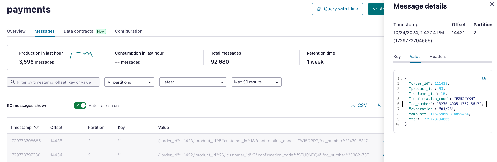
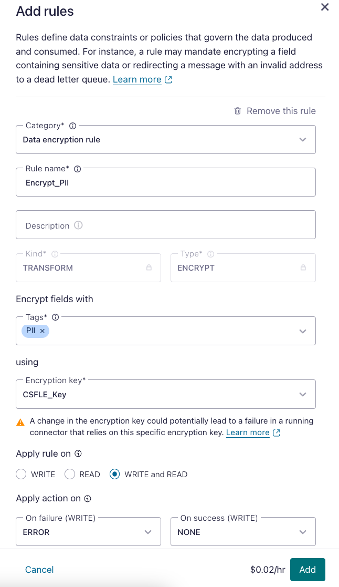
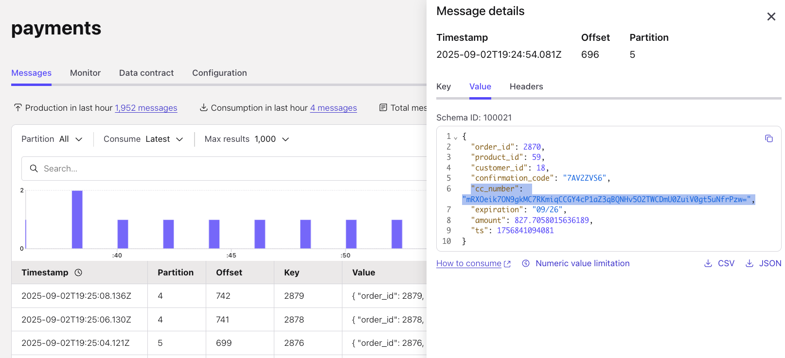

# 🎯 Bonus: Data Contracts and Encryption (Extra Credit)

> **⚠️ This lab is completely optional.** Only proceed if you've completed LAB2 and want to explore advanced Stream Governance features like Client-Side Field Level Encryption.

In this bonus lab, you'll learn how to:
- Encrypt sensitive fields automatically using Client-Side Field Level Encryption (CSFLE)
- Implement governance policies without changing application code

Analytics teams are focused on general sales trends, so they don't need access to PII. Instead of relying on central teams to write ETL scripts for data encryption and quality validation, we're shifting this process left. Central governance teams set data protection and quality rules, which are pushed to the client for enforcement—**no code changes required on the client side**.

---

## Part 1: Client-Side Field Level Encryption (CSFLE)

[Client-Side Field Level Encryption (CSFLE)](https://docs.confluent.io/cloud/current/security/encrypt/csfle/client-side.html) protects sensitive data like credit card numbers by encrypting fields at the client before they reach Kafka. The encryption rules are defined in Schema Registry and enforced automatically using AWS KMS keys.

### Step 1: Verify Credit Card Data is Currently Unencrypted

1. Navigate to the [`payments`](https://confluent.cloud/go/topics) topic in Confluent Cloud

2. Click the **Messages** tab

3. Inspect a few recent records—you'll see the `cc_number` field is in plain text

   

This is a security risk! Let's fix it by adding encryption.

---

### Step 2: Tag the Field as PII

To enable encryption, we first need to tag the `cc_number` field so our encryption rule can identify it.

1. In the `payments` topic, click the **Data Contracts** tab

2. Click **Evolve** to modify the schema

3. In the schema editor, switch to **Tree View** (if not already in tree view)

4. Locate the `cc_number` field in the tree

5. Click the **+ (plus sign)** next to the `cc_number` field

6. Select **Create Tag**

7. In the tag dialog:
   * **Tag name:** `PII`
   * **Description:** `Personally Identifiable Information`

8. Click **Add** or **Save** to apply the tag

9. Click **Validate schema** to ensure the schema change is backward compatible

10. Click **Save** to register the new schema version

The `cc_number` field is now tagged as PII. Next, we'll create an encryption rule that targets this tag.

---

### Step 3: Create the Encryption Rule

Now we'll create a rule that encrypts any field tagged with `PII`.

1. Still in the **Data Contracts** tab for the `payments` topic, click the **Rules** section

2. Click **+ Add rules**

   > [!NOTE]
   > **No "Add rules" Button**
   >
   > You may need to click **Evolve** to see the **Add rules** button.

3. Configure the encryption rule:
   * **Category:** Data Encryption Rule
   * **Rule name:** `Encrypt_PII`
   * **Description:** `Encrypt all fields with the PII tag`
   * **Encrypt fields with:** `PII`
   * **using:** Select the AWS KMS key created by Terraform (likely named `CSFLE_Key`)

4. Keep default selections for the remaining sections

5. Click **Add** and then **Save**

   

**What this rule does:**
* Instructs the Avro serializer to encrypt any field tagged as `PII`
* Uses the AWS KMS symmetric key for encryption
* Applies automatically to all producers without code changes

---

### Step 4: Restart the Payment Producer

For the changes to take effect, we need to restart the payment producer application so it picks up the new schema and encryption rules.

1. Get the ECS restart command from Terraform:
   ```bash
   terraform output ecs-service-restart-command
   ```

   Copy the output value within the double quotes

2. Run the command (it will look similar to this):
   ```bash
   aws ecs update-service --cluster <ECS_CLUSTER_NAME> --service payment-app-service --force-new-deployment
   ```

3. Wait 1-2 minutes for the new task to start and begin producing encrypted data

---

### Step 5: Verify Encryption is Working

1. Return to the `payments` topic in Confluent Cloud

2. Click the **Messages** tab

3. Look at newly produced messages (they'll have recent timestamps)

4. The `cc_number` field should now display encrypted data instead of plain text

   

5. Compare this with older messages (before the restart) which still show unencrypted credit card numbers

**What happened:**
* Schema Registry pushed the encryption rule to the producer client
* The producer's Avro serializer automatically encrypts the `cc_number` field before sending to Kafka
* The encryption happens client-side using AWS KMS—the data never reaches Kafka unencrypted
* Authorized consumers with KMS permissions can decrypt the field; unauthorized consumers see encrypted bytes
* **Zero code changes** were required in the payment application

---

## Key Takeaways

In this bonus lab, you learned:

1. **Data Quality Rules:** Validate data at the source without custom code or interceptors
2. **Dead Letter Queues:** Automatically route invalid data for debugging and compliance
3. **Client-Side Encryption:** Protect sensitive fields before they reach Kafka
4. **Tag-Based Policies:** Use schema tags to apply governance rules declaratively
5. **Zero Code Changes:** Stream Governance pushes rules to clients automatically

All of this is managed through Schema Registry and Stream Governance—no application code modifications required!

---

## ⚠️ Important: Cleanup Instructions

If you completed this bonus lab and want to clean up your infrastructure later, the schema changes you made will conflict with Terraform. You must manually **delete the payments schema from Schema Registry** before running destroy scripts.

### Delete the Payments Schema

1. In Confluent Cloud, navigate to your environment

2. Click **Schema Registry** in the left sidebar

3. Click on the **Data contracts** tab

4. Find the `payments-value` schema in the list

5. Click on the schema to open it

6. Click the **Delete** button (trash icon or delete option)

7. Confirm the deletion

8. Now you can proceed with the normal [cleanup instructions](../README.md#clean-up)

---

## Topics

**🔙 Previous topic:** [Lab 2 - Payment Validation and Tableflow Deep Dive](../LAB2/LAB2-README.md)

**➡️ Next topic:** [Lab 3 - Analyze Data in Snowflake](../LAB3/LAB3-README.md)

**🏁 Finished?** [Cleanup](../README.md#clean-up)

---

## 🆘 Need Help?

Running into issues? Check the [**Troubleshooting Guide**](../TROUBLESHOOTING.md) for common problems and solutions, or ask a workshop instructor!
