# Payment Validation and Tableflow Deep Dive

In this lab, we'll use Confluent Cloud and Apache Flink to validate payments, create completed orders, and then explore Tableflow's capabilities for making streaming data analytics-ready. You'll learn how Tableflow converts Kafka topics into Apache Iceberg tables with zero code, enabling seamless querying from multiple analytics engines.

[Tableflow](https://www.confluent.io/product/tableflow/) eliminates the need for complex ETL pipelines by automatically converting topics into Iceberg tables. It handles schema mapping, evolution, compaction, and optimization—all managed by Confluent's infrastructure.

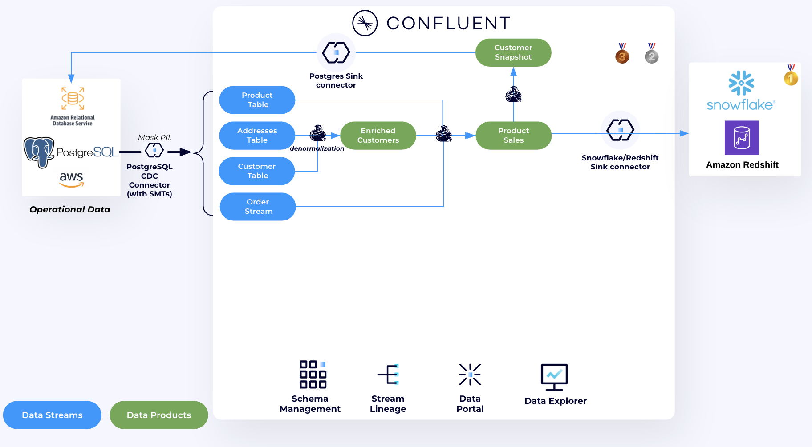

---

## Part 1: Data Governance

Before we start processing payments with Flink, let's set up data governance rules. We'll create a Data Quality Rule to validate confirmation codes and encrypt sensitive credit card data using Client-Side Field Level Encryption (CSFLE). Both rules are defined in Schema Registry and enforced automatically—**no code changes required on the client side**.

### 🎯 [CHALLENGE] Data Quality Rules

Every payment event needs a **valid `confirmation_code`**—no exceptions!

We make sure of this with **[Data Quality Rules](https://docs.confluent.io/cloud/current/sr/fundamentals/data-contracts.html#data-quality-rules)**, defined in **Schema Registry** and automatically enforced for all clients.

1. Navigate to the *Schema Registry* in your workshop *Environment*

2. Click on the **Data contracts** tab

3. Search for `payments-value` Data Contract and click on it

4. Click the **Evolve** button

5. Click on the **Rules** tab

6. Click **Add rules**

7. Input these values into the *Add rules* form:
   * **Category**: `Data quality rule`
   * **Rule name**: `validateConfirmationCode`
   * **Description**: Validate that the confirmation code is uppercase alphanumeric and only 8 characters
   * **Rule expression**: `message.confirmation_code.matches('^[A-Z0-9]{8}$')`
   * **On failure**: `DLQ`
   * **Parameters**:
      * `dlq.topic` = `error-payments`
      * `dlq.auto.flush` = `true`

8. Click **Add**

9. Click **Save**

   > **What this rule does:** Validates that `confirmation_code` is exactly 8 uppercase alphanumeric characters (e.g., `ABC12345`). Invalid payments are routed to the `error-payments` dead letter queue.

---

### Client-Side Field Level Encryption (CSFLE)

[Client-Side Field Level Encryption (CSFLE)](https://docs.confluent.io/cloud/current/security/encrypt/csfle/client-side.html) protects sensitive data like credit card numbers by encrypting fields at the client before they reach Kafka. The encryption rules are defined in Schema Registry and enforced automatically using AWS KMS keys.

#### Step 1: Verify Credit Card Data is Currently Unencrypted

1. Navigate to the [`payments`](https://confluent.cloud/go/topics) topic in Confluent Cloud

2. Click the **Messages** tab

3. Inspect a few recent records—you'll see the `cc_number` field is in plain text

   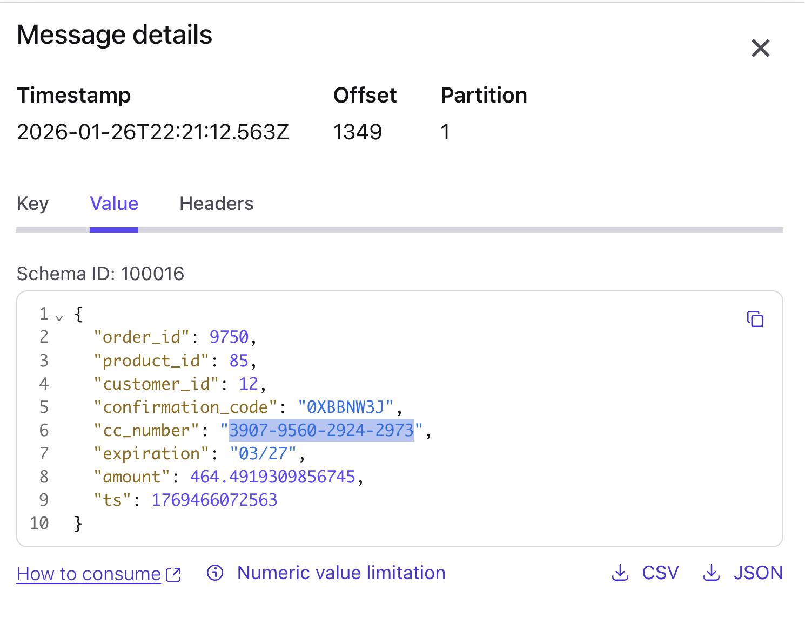

This is a security risk! Let's fix it by adding a PII tag and an encryption rule.

---

#### Step 2: Tag the Field as PII and Create the Encryption Rule

We'll tag the `cc_number` field as PII and create an encryption rule in a single schema evolution.

1. In the `payments` topic, click the **Data Contracts** tab

2. Click **Evolve** to modify the schema

3. In the schema editor, switch to **Tree View** (if not already in tree view)

4. Locate the `cc_number` field in the tree

5. Click the **+ (plus sign)** next to the `cc_number` field

6. Select **Create Tag**

7. In the tag dialog:
   * **Tag name:** `PII`
   * **Description:** `Personally Identifiable Information`

8. Click **Create** to apply the tag

9. Now click the **Rules** section

10. Click **+ Add rules**

11. Configure the encryption rule:
    * **Category:** `Field level encryption rule`
    * **Rule name:** `Encrypt_PII`
    * **Description:** `Encrypt all fields with the PII tag`
    * **Encrypt fields with:** `PII`
    * **using:** Select the AWS KMS key created by Terraform (likely named `CSFLE_Key`)

    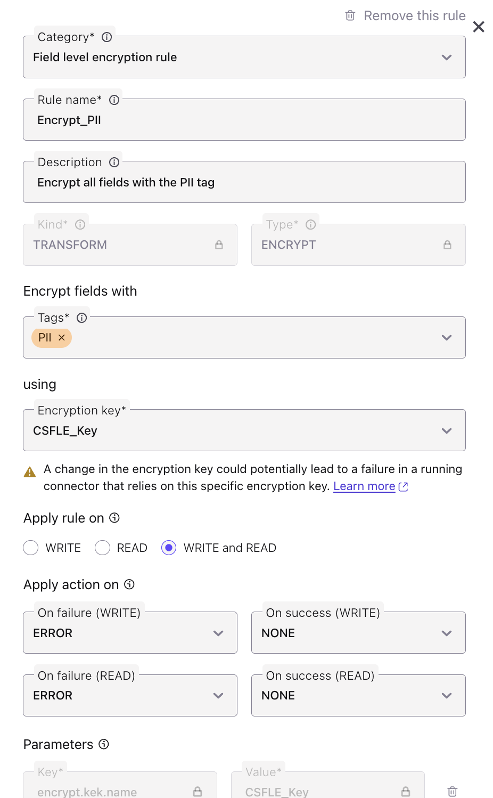

12. Keep default selections for the remaining sections

13. Click **Add**

14. Click **Save**

Your *Domain Rules* section should look like this:

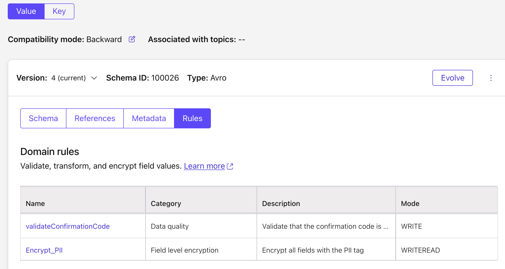

**What this rule does:**
* Tags `cc_number` as PII so governance policies can identify it
* Instructs the Avro serializer to encrypt any field tagged as `PII`
* Uses the AWS KMS symmetric key for encryption
* Applies automatically to all producers without code changes

---

### Restart & Verify

For the CSFLE encryption rule and Data Quality rule to take effect, we need to restart the payment producer application so it picks up the new schema and rules.

1. Get the ECS restart command from Terraform:
   ```bash
   terraform output ecs-service-restart-command
   ```

2. Copy the output value within the double quotes

3. Run the command (it will look similar to this):
   ```bash
   aws ecs update-service --cluster <ECS_CLUSTER_NAME> --service payment-app-service --force-new-deployment
   ```

4. Wait 1-2 minutes for the new task to start and begin producing data with the new rules applied.

#### Verify Data Quality Rule

1. Navigate back to your workshop cluster and check the `error-payments` topic for any non-compliant payments. What `confirmation_code` values do you see there?

> [!NOTE]
> **Invalid Confirmation Codes**
>
> You should see records with invalid confirmation codes (e.g., `0` or other non-compliant values) being routed to the `error-payments` dead letter queue.

#### Verify CSFLE Encryption

1. Return to the `payments` topic in Confluent Cloud

2. Click the **Messages** tab

3. Look at newly produced messages (they'll have recent timestamps)

4. The `cc_number` field should now display encrypted data instead of plain text

   

5. Compare this with older messages (before the restart) which still show unencrypted credit card numbers

**What happened:**
* Schema Registry pushed the encryption rule to the producer client
* The producer's Avro serializer automatically encrypts the `cc_number` field before sending to Kafka
* The encryption happens client-side using AWS KMS—the data never reaches Kafka unencrypted
* Authorized consumers with KMS permissions can decrypt the field; unauthorized consumers see encrypted bytes
* **Zero code changes** were required in the payment application

---

## Part 2: Payment Processing with Flink

### Get Started with Flink SQL

1. Navigate to the [Flink UI](https://confluent.cloud/go/flink) in Confluent Cloud and select your demo environment (prefixed with `shiftleft` by default)

2. Click on the **Compute Pools** tab

3. Click **Open SQL Workspace**

4. On the top right corner, select your cluster as the database

5. The code editor allows you to query existing Flink tables (which represent Kafka topics) and create new data products

6. Each Kafka topic is automatically represented as a table in the Flink catalog. List all available tables:

   ```sql
   SHOW TABLES;
   ```

7. You should see these tables:
   * `error-payments`
   * `payments`
   * `shiftleft.public.customers`
   * `shiftleft.public.addresses`
   * `shiftleft.public.products`
   * `shiftleft.public.orders`
   * `shiftleft.public.order_items`

> [!NOTE]
> **Change Data Capture (CDC) Tables**
>
> Notice the tables prefixed with `shiftleft` correspond to your PostgreSQL CDC topics.

---

### Payment Deduplication

Before joining payment and order streams, we need to ensure there are no duplicate payments.

> [!TIP]
> **Add a new Flink cell for each SQL statement**
>
> Each time you need to run a SQL statement in Flink, you can create a new cell editor to use.
>
> 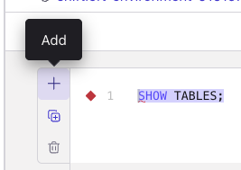

1. Check for the number of duplicates in the `payments` table:

   ```sql
   SELECT COUNT(*) num_duplicate_payments FROM
   ( SELECT order_id, count(*) total
   FROM `payments`
   GROUP BY order_id)
   WHERE total > 1;
   ```

> [!IMPORTANT]
> **Duplicate payments**
>
> Notice that there are duplicate payment entries, which throws off our analytics.
>
> Let's remove them in the next step.

2. Create a deduplicated payments table:

   ```sql
   SET 'client.statement-name' = 'unique-payments-maintenance';
   SET 'sql.state-ttl' = '1 hour';

   CREATE TABLE unique_payments (
   order_id INT NOT NULL,
   product_id INT,
   customer_id INT,
   confirmation_code STRING,
   cc_number STRING,
   expiration STRING,
   amount DOUBLE,
   ts TIMESTAMP_LTZ(3),
   WATERMARK FOR ts AS ts - INTERVAL '5' SECOND
   )
   AS SELECT
   COALESCE(order_id, 0) AS order_id,
   product_id,
   customer_id,
   confirmation_code,
   cc_number,
   expiration,
   amount,
   ts
   FROM (
   SELECT *,
            ROW_NUMBER() OVER (PARTITION BY order_id ORDER BY ts ASC) AS rownum
   FROM payments
   )
   WHERE rownum = 1;
   ```

3. Validate deduplication worked:

   ```sql
   SELECT order_id, COUNT(*) AS count_total
   FROM `unique_payments`
   GROUP BY order_id
   HAVING COUNT(*) > 1;
   ```

   **Success = No rows returned.** If deduplication worked correctly, this query won't produce any output because no `order_id` appears more than once.

---

### 🎯 [CHALLENGE] Creating Completed Orders with Interval Joins

Now let's validate order completions by joining payments with orders. Our business rule is straightforward: an order is complete if we receive valid payment within **96** hours of the order timestamp. This scenario is perfect for Flink's interval joins, powerful feature designed specifically for correlating time-bounded events in streaming data.

1. Replace the placeholders below (`<ENTER_FIELD>` and `<NUMBER_OF_HOURS>`) with the appropriate values, run the statement to create the `completed_orders` table.

   ```sql
   SET 'client.statement-name' = 'completed-orders-materializer';
   CREATE TABLE completed_orders (
      order_id INT NOT NULL,
      amount DOUBLE,
      confirmation_code STRING,
      ts TIMESTAMP_LTZ(3),
      WATERMARK FOR ts AS ts - INTERVAL '5' SECOND,
      PRIMARY KEY (order_id) NOT ENFORCED
   ) AS
   SELECT
      pymt.order_id,
      pymt.amount,
      pymt.confirmation_code,
      pymt.ts
   FROM unique_payments pymt, `shiftleft.public.orders` ord
   WHERE pymt.order_id = ord.<ENTER_FIELD>
   AND orderdate BETWEEN pymt.ts - INTERVAL '<NUMBER_OF_HOURS>' HOUR AND pymt.ts;
   ```

> [!NOTE]
> **Upsert Support**
>
> The `PRIMARY KEY (order_id) NOT ENFORCED` enables upsert semantics.
>
> Subsequent INSERT statements, which we'll explore further into this lab, will update existing records instead of creating duplicates.

This join ensures we only capture payments that have a matching order in the system, creating a validated data product for analytics.

2. Verify the results

```sql
SELECT *
  FROM `completed_orders`
  LIMIT 20;
```

You should see 20 rows with values for `order_id`, `amount`, `confirmation_code`, and `ts` (for timestamp).

> [!NOTE]
> **Invalid Confirmation Codes**
>
> You may notice that some of the records contain a `0` for their confirmation code. These messages were written before we applied the DQR rule in Part 1. All new messages will have a valid confirmation code — any payment with an invalid confirmation code will now get routed to the `error-payments` Dead Letter Queue (DLQ).

---

## Part 3: Setting up Tableflow

### Setting Up Tableflow Infrastructure

Now that we have a clean, validated data product from Flink, we'll make it analytics-ready using Tableflow.

Instead of writing complex connectors or ETL jobs, Tableflow automatically materializes topics as Iceberg tables.

First, we'll configure the storage and catalog integrations that Tableflow will use.

#### Configure Custom Storage (S3)

1. Navigate to the Tableflow main page: **Environments > {Your Environment} > Clusters > {Your Cluster} > Tableflow**

   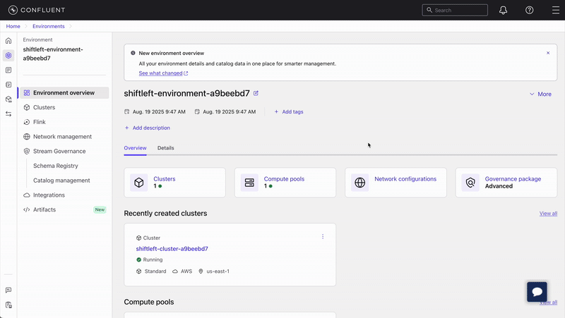

#### Configure Glue Data Catalog Integration

Now we'll connect Tableflow to AWS Glue Data Catalog so our Iceberg tables are discoverable by Athena and other query engines.

1. In the Tableflow page, scroll to **External Catalog Integrations** and click **+ Add integration**

2. Configure the integration:
   * **Integration type:** AWS Glue
   * **Name:** `my-glue-integration`
   * **Supported format:** Iceberg
   * Click **Continue**

   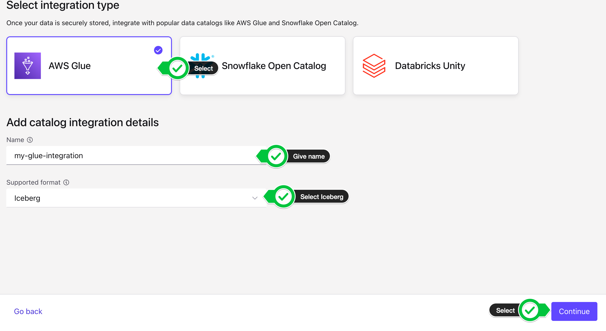

3. Select the provider integration created by Terraform (you can find it in `terraform output resource-ids`)

4. Click **Continue**

5. Click **Launch**

6. The status will show **Pending** at first, but will eventually update to **Connected**. Do not wait for it to change, proceed to the next step.

   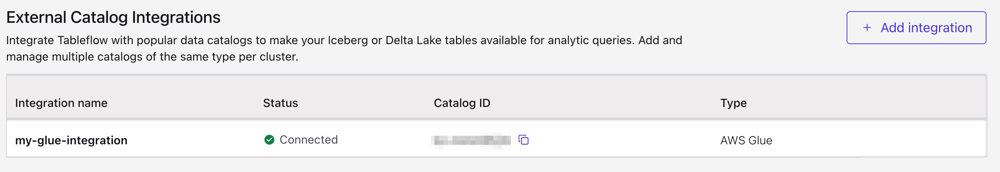

### Enabling Tableflow on `completed_orders`

Now we'll enable Tableflow to automatically materialize the `completed_orders` topic as an Iceberg table.

1. Navigate to the [`completed_orders`](https://confluent.cloud/go/topics) topic
2. Click **Enable Tableflow**
3. Click **Configure Custom Storage**

   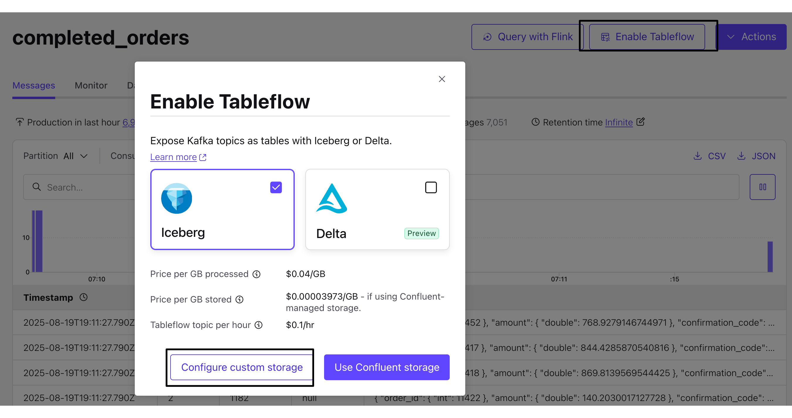

4. Select your provider integration and S3 bucket (format: `shiftleft-tableflow-bucket-...`)

   You can find your S3 bucket name:

   ```bash
   terraform output resource-ids | grep tableflow-bucket
   ```

5. Click **Continue**

6. Click **Launch**

7. Wait for Tableflow status to show **Syncing**

> [!IMPORTANT]
> **Key Point:** Tableflow automatically infers the schema from Schema Registry. No manual schema mapping required!

> [!NOTE]
> **Grab a coffee and take a 10 min break!** ☕
>
> After enabling Tableflow, it may take 5-15 minutes for data to become available for querying.

---

## Part 4: Tableflow Deepdive

<details>
<summary>Optional: Initial Setup for Querying with Snowflake</summary>

If you'd like to query your Iceberg tables from Snowflake in addition to (or instead of) Amazon Athena, complete this one-time setup first. Snowflake needs access to both your AWS Glue catalog (for table metadata) and your S3 bucket (for data files).

### Prerequisites
- Snowflake account with ACCOUNTADMIN privileges

### Step 1: Configure Snowflake Catalog Integration (Glue access)

1. Open the Snowflake UI and create a new worksheet.
2. Run the following SQL to create a catalog integration with Glue. Replace the placeholders with your actual values (available from `terraform output resource-ids`):

   ```sql
   CREATE CATALOG INTEGRATION glueCatalogInt
     CATALOG_SOURCE = GLUE
     CATALOG_NAMESPACE = '<cluster-id>'
     TABLE_FORMAT = ICEBERG
     GLUE_AWS_ROLE_ARN = 'arn:aws:iam::<account-id>:role/<role-name>'
     GLUE_CATALOG_ID = '<aws-account-id>'
     GLUE_REGION = '<region>'
     ENABLED = TRUE;
   ```

   - **cluster-id**: Your Kafka Cluster ID (found in Confluent Cloud under Cluster Settings)
   - **role-name**: The Provider Integration Role ARN from `terraform output resource-ids`
   - **aws-account-id**: Your AWS Account ID (also the Glue Catalog ID)
   - **region**: Your AWS region (e.g., `us-east-1`)

3. Verify the integration and copy the values we'll need for IAM configuration:

   ```sql
   DESCRIBE CATALOG INTEGRATION glueCatalogInt;
   ```

4. From the output, copy these two values:
   - **GLUE_AWS_IAM_USER_ARN**
   - **GLUE_AWS_EXTERNAL_ID**

   

5. Navigate to the IAM Role in the AWS Console (search for the role name from `terraform output resource-ids`)

6. Under the Role page, click the **Trust Relationships** tab and click **Edit Trust Policy**

7. Add the following trust entry after the existing entries (replace placeholders with values from step 4):

   ```json
   {
       "Effect": "Allow",
       "Principal": {
           "AWS": "<<GLUE_AWS_IAM_USER_ARN>>"
       },
       "Action": "sts:AssumeRole",
       "Condition": {
           "StringEquals": {
               "sts:ExternalId": "<<GLUE_AWS_EXTERNAL_ID>>"
           }
       }
   }
   ```

8. Click **Update Policy**

### Step 2: Create External Volume (S3 access)

1. Create an external volume in Snowflake that points to your S3 bucket:

   ```sql
   CREATE OR REPLACE EXTERNAL VOLUME iceberg_external_volume
   STORAGE_LOCATIONS = (
     (
        NAME = 'my-iceberg-external-volume'
        STORAGE_PROVIDER = 'S3'
        STORAGE_BASE_URL = 's3://<your-s3-bucket>'
        STORAGE_AWS_ROLE_ARN = '<<ROLE-ARN-FROM-STEP-1>>'
        STORAGE_AWS_EXTERNAL_ID = '<<EXTERNAL-ID-FROM-STEP-1>>'
     )
   );
   ```

2. Verify the external volume and copy the values:

   ```sql
   DESC EXTERNAL VOLUME iceberg_external_volume;
   ```

3. From the output, copy:
   - **STORAGE_AWS_IAM_USER_ARN**
   - **STORAGE_AWS_EXTERNAL_ID**

4. Navigate back to the same IAM role and **Edit Trust Policy** again

5. Add another trust entry with the storage values:

   ```json
   {
       "Effect": "Allow",
       "Principal": {
           "AWS": "<<STORAGE_AWS_IAM_USER_ARN>>"
       },
       "Action": "sts:AssumeRole",
       "Condition": {
           "StringEquals": {
               "sts:ExternalId": "<<STORAGE_AWS_EXTERNAL_ID>>"
           }
       }
   }
   ```

6. Click **Update Policy**. Your final trust policy should have entries for Confluent Cloud, the Glue catalog integration, and the storage volume:

   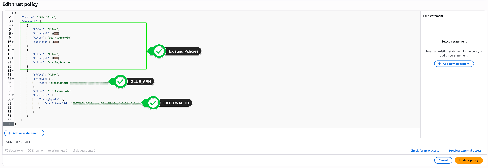

7. Optionally, test the connection:

   ```sql
   SELECT SYSTEM$VERIFY_EXTERNAL_VOLUME('iceberg_external_volume');
   ```

   You should see `{success: true}`.

### Step 3: Create Iceberg Table

Create the Iceberg table for `completed_orders` in Snowflake:

```sql
CREATE OR REPLACE ICEBERG TABLE completed_orders
  EXTERNAL_VOLUME = 'iceberg_external_volume'
  CATALOG = 'glueCatalogInt'
  CATALOG_TABLE_NAME = 'completed_orders';
```

You're now ready to query your Tableflow-managed Iceberg tables from Snowflake!

</details>

---

### Querying Your Data

<details>
<summary>Query with Amazon Athena</summary>

1. Navigate to the [AWS Glue Data Catalog Tables page](https://console.aws.amazon.com/glue/home#/v2/data-catalog/tables)

2. Search for your cluster ID database, then find the `completed_orders` table

3. Click **Table data** under the *View data* column. This opens Amazon Athena.

   

4. In the *Data* left panel, select your Confluent Cloud Cluster ID from the **Database** dropdown

   

5. Run a basic query to verify data is flowing:

   > **Athena Query Output Location:** You may need to supply an output location for your Athena query if you haven't configured this before. Instructions can be found [here](https://docs.aws.amazon.com/athena/latest/ug/creating-databases-prerequisites.html). Feel free to use the same S3 bucket we are using for Tableflow data.

   ```sql
   SELECT *
   FROM "completed_orders"
   LIMIT 10;
   ```

</details>

<details>
<summary>Query with Snowflake</summary>

> Make sure you've completed the [Snowflake initial setup](#part-4-tableflow-deepdive) (collapsible section above) before proceeding.

Query your Iceberg table in Snowflake:

```sql
SELECT *
FROM completed_orders
LIMIT 10;
```

</details>

> [!NOTE]
> **0 Results Returned**
>
> If 0 results are returned from the query above, you may need to wait a few more minutes for Tableflow to materialize the data into S3.

---

### Analyzing Sales Trends

Now let's perform some real analytics on our streaming data.

<details>
<summary>Query with Amazon Athena</summary>

1. Calculate hourly sales trends:
   ```sql
   SELECT
      date_trunc('hour', ts) AS window_start,
      date_trunc('hour', ts) + INTERVAL '1' hour AS window_end,
      COUNT(*) AS total_orders,
      SUM(amount) AS total_revenue
   FROM "completed_orders"
   GROUP BY date_trunc('hour', ts)
   ORDER BY window_start;
   ```

2. Find the highest value orders:
   ```sql
   SELECT
      order_id,
      amount,
      confirmation_code,
      ts
   FROM "completed_orders"
   ORDER BY amount DESC
   LIMIT 10;
   ```

3. Calculate total revenue:
   ```sql
   SELECT
      COUNT(*) as total_orders,
      SUM(amount) as total_revenue,
      AVG(amount) as avg_order_value,
      MIN(amount) as min_order,
      MAX(amount) as max_order
   FROM "completed_orders";
   ```

</details>

<details>
<summary>Query with Snowflake</summary>

1. Calculate hourly sales trends:
   ```sql
   SELECT
      DATE_TRUNC('hour', ts) AS window_start,
      DATEADD('hour', 1, DATE_TRUNC('hour', ts)) AS window_end,
      COUNT(*) AS total_orders,
      SUM(amount) AS total_revenue
   FROM completed_orders
   GROUP BY DATE_TRUNC('hour', ts)
   ORDER BY window_start;
   ```

2. Find the highest value orders:
   ```sql
   SELECT
      order_id,
      amount,
      confirmation_code,
      ts
   FROM completed_orders
   ORDER BY amount DESC
   LIMIT 10;
   ```

3. Calculate total revenue:
   ```sql
   SELECT
      COUNT(*) as total_orders,
      SUM(amount) as total_revenue,
      AVG(amount) as avg_order_value,
      MIN(amount) as min_order,
      MAX(amount) as max_order
   FROM completed_orders;
   ```

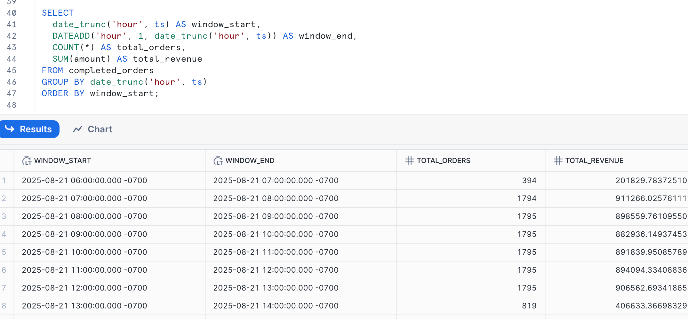

</details>

---

### Schema Evolution with Tableflow

One of Tableflow's powerful features is automatic schema evolution. Let's see it in action.

#### Add a New Field to Completed Orders

We'll add a `payment_method` field to track how customers pay. We'll evolve the schema in Schema Registry first, then update the Flink table to match.

##### Step 1: Stop the Flink Statement

1. Navigate back to the **[Flink UI](https://confluent.cloud/go/flink)**
2. Click on the **Flink Statements** tab
3. Click on `completed-orders-materializer`
4. Click the **Stop** button
5. Click **Confirm**

##### Step 2: Evolve the Schema in Schema Registry

1. Navigate to your `completed_orders` topic in Confluent Cloud
2. Click the **Data contract** tab.
3. Click **Evolve** to evolve the schema.
4. You'll see the current schema. Replace it with the following JSON that includes the new `payment_method` field:

   ```json
   {
     "type": "record",
     "name": "completed_orders_value",
     "namespace": "org.apache.flink.avro.generated.record",
     "fields": [
       {
         "name": "amount",
         "type": ["null", "double"],
         "default": null
       },
       {
         "name": "confirmation_code",
         "type": ["null", "string"],
         "default": null
       },
       {
         "name": "payment_method",
         "type": ["null", "string"],
         "default": null
       },
       {
         "name": "ts",
         "type": ["null", {"type": "long", "logicalType": "timestamp-millis"}],
         "default": null
       }
     ]
   }
   ```

5. Click **Validate schema** to ensure the schema is backward compatible
6. Click **Save**

The new schema version is now registered. Schema Registry validates it's compatible with existing data.

##### Step 3: Start Writing Data with the New Schema

Now we'll start a new Flink statement that writes data including the `payment_method` field. The existing table will automatically pick up the evolved schema.

1. In the Flink SQL workspace, start a new INSERT statement:
   ```sql
   SET 'client.statement-name' = 'completed-orders-v2-materializer';
   SET 'sql.state-ttl' = '1 hour';

   INSERT INTO completed_orders
   SELECT
      pymt.order_id,
      pymt.amount,
      pymt.confirmation_code,
      CASE
         WHEN pymt.amount > 1000 THEN 'WIRE_TRANSFER'
         WHEN pymt.amount > 500 THEN 'CREDIT_CARD'
         WHEN MOD(pymt.order_id, 5) = 0 THEN 'PAYPAL'
         WHEN MOD(pymt.order_id, 5) = 1 THEN 'APPLE_PAY'
         WHEN MOD(pymt.order_id, 5) = 2 THEN 'GOOGLE_PAY'
         WHEN MOD(pymt.order_id, 5) = 3 THEN 'VENMO'
         WHEN pymt.cc_number IS NOT NULL THEN 'CREDIT_CARD'
         ELSE 'DEBIT_CARD'
      END AS payment_method,
      pymt.ts
   FROM unique_payments pymt, `shiftleft.public.orders` ord
   WHERE pymt.order_id = ord.orderid
   AND orderdate BETWEEN pymt.ts - INTERVAL '96' HOUR AND pymt.ts;
   ```

> [!IMPORTANT]
> **Key Point:** We didn't need to drop and recreate the table! Since we evolved the schema in Schema Registry first, Flink automatically writes data with the new schema. Tableflow stays enabled and will automatically detect the schema change.

##### Step 4: Verify Schema Evolution

Wait 2-3 minutes for the schema to propagate to Glue.

1. Go to AWS Glue Console > **Data Catalog** > **Tables**
2. Find the `completed_orders` table in your cluster database
3. Verify the `payment_method` column appears in the schema

Now query the updated data:

<details>
<summary>Query with Amazon Athena</summary>

Open [Amazon Athena](https://console.aws.amazon.com/athena) and query the updated table:

```sql
SELECT
   payment_method,
   COUNT(*) as order_count,
   SUM(amount) as total_revenue
FROM "completed_orders"
GROUP BY payment_method
ORDER BY total_revenue DESC;
```

You'll see records with diverse payment methods: PAYPAL, APPLE_PAY, CREDIT_CARD, WIRE_TRANSFER, VENMO, GOOGLE_PAY, and DEBIT_CARD.

</details>

<details>
<summary>Query with Snowflake</summary>

In your Snowflake worksheet, refresh the table metadata and query:

```sql
ALTER ICEBERG TABLE completed_orders REFRESH;

SELECT
   payment_method,
   COUNT(*) as order_count,
   SUM(amount) as total_revenue
FROM completed_orders
GROUP BY payment_method
ORDER BY total_revenue DESC;
```

You'll see records with diverse payment methods: PAYPAL, APPLE_PAY, CREDIT_CARD, WIRE_TRANSFER, VENMO, GOOGLE_PAY, and DEBIT_CARD.

</details>

**What happened:**
* Schema Registry was the source of truth - we evolved the schema there first
* Tableflow automatically detected the schema change and updated the Iceberg table
* No manual DDL changes were needed in Glue or Athena

---

### Time Travel Queries

Iceberg tables support querying historical snapshots. Let's explore this capability.

#### Query Snapshot History

<details>
<summary>Query with Amazon Athena</summary>

You can query the Iceberg metadata tables. In AWS Glue, find your `completed_orders` table and note its exact name. Then query snapshots:

```sql
SELECT
   committed_at,
   snapshot_id,
   parent_id,
   operation,
   summary
FROM "completed_orders$snapshots"
ORDER BY committed_at DESC
LIMIT 10;
```

> **Note:** If you get "table not found" errors, the Glue catalog may not have synced the metadata tables yet. Wait 2-3 minutes and try again, or use the Confluent Cloud UI to verify the table location.

#### Query Historical Data

Once you have snapshot IDs from the query above, you can query historical data:

1. Query data as it existed at a specific snapshot (use a snapshot_id from the previous query):

   ```sql
   SELECT COUNT(*) as record_count, SUM(amount) as total_revenue
   FROM "completed_orders"
   FOR VERSION AS OF <<snapshot-id>>;
   ```

2. Compare current vs. historical state:

   ```sql
   -- Current count
   SELECT COUNT(*) as current_count
   FROM "completed_orders";

   -- Count from a specific snapshot
   SELECT COUNT(*) as past_count
   FROM "completed_orders"
   FOR VERSION AS OF <<snapshot-id>>;
   ```

> 💡 **Snapshot Timestamp:** Use timestamps from the `committed_at` column in the `$snapshots` query above to see exactly when each snapshot was created.

</details>

<details>
<summary>Query with Snowflake</summary>

Snowflake supports time travel for Iceberg tables using timestamp-based syntax:

```sql
-- Query data as it existed 30 minutes ago
SELECT COUNT(*) as record_count, SUM(amount) as total_revenue
FROM completed_orders
AT(OFFSET => -60*30);
```

```sql
-- Query data as it existed at a specific timestamp
SELECT COUNT(*) as record_count, SUM(amount) as total_revenue
FROM completed_orders
AT(TIMESTAMP => '2025-01-15 10:00:00'::TIMESTAMP_TZ);
```

> ℹ️ **Snowflake Iceberg Metadata Tables:** The `$snapshots` metadata table syntax is not available for externally managed Iceberg tables in Snowflake. Use the timestamp-based or offset-based time travel syntax shown above instead.

</details>

> [!NOTE]
> **Key Insight:** Time travel enables:
> * Auditing and compliance (see exactly what data looked like at any point)
> * Reproducing historical analysis
> * Debugging data quality issues
> * Comparing current vs. past states

---

### Understanding Partitioning and File Layout

Tableflow automatically partitions data for optimal query performance. Apache Iceberg uses **hidden partitioning**, which means you cannot use traditional Hive-style commands like `SHOW PARTITIONS`. Instead, you inspect partitions by querying the table's metadata tables using standard SQL.

<details>
<summary>Query with Amazon Athena</summary>

#### Viewing Partition Information

To see the list of partitions, their record counts, and file counts, append `$partitions` to your table name:

```sql
SELECT *
FROM "completed_orders$partitions"
LIMIT 10;
```

This returns:
* **record_count**: Total number of rows in that partition
* **file_count**: Total number of data files in that partition
* **spec_id**: The partition spec ID (useful if partition schema evolves)

#### Other Useful Iceberg Metadata Tables

Iceberg manages its own state via metadata files. You can inspect other internal details using similar syntax:

| Metadata Table | Purpose |
|----------------|---------|
| `$files` | Lists all current data files, their paths, formats, and partition assignments |
| `$history` | Shows the history of table changes and associated snapshot IDs |
| `$snapshots` | Displays details about every snapshot, including creation time and manifest paths |
| `$manifests` | Shows the manifest files that track data files for the current snapshot |

**Example - View file layout:**

```sql
SELECT file_path, record_count, file_size_in_bytes
FROM "completed_orders$files"
LIMIT 10;
```

</details>

#### Testing File Pruning with Column Statistics

<details>
<summary>Query with Amazon Athena</summary>

First, run a full table scan to establish a baseline:

```sql
SELECT COUNT(*), SUM(amount)
FROM "completed_orders";
```

Now run a query with a narrow time window using range predicates:

```sql
SELECT COUNT(*), SUM(amount)
FROM "completed_orders"
WHERE ts >= CURRENT_TIMESTAMP - INTERVAL '45' MINUTE;
```

Compare the **"Data scanned"** metrics in Athena—the time-windowed query should scan significantly less data. Athena uses min/max statistics on `ts` from each Iceberg file to skip files outside your time range.

> 💡 **Range Predicates:** Use range predicates (`ts >= ... AND ts < ...`) instead of functions like `date_trunc()`. Range predicates can be pushed down to Iceberg's column statistics for file pruning.

</details>

<details>
<summary>Query with Snowflake</summary>

First, run a full table scan to establish a baseline:

```sql
SELECT COUNT(*), SUM(amount)
FROM completed_orders;
```

Now run a query with a narrow time window:

```sql
SELECT COUNT(*), SUM(amount)
FROM completed_orders
WHERE ts >= DATEADD('minute', -45, CURRENT_TIMESTAMP());
```

Snowflake handles micro-partition pruning internally. You can check the query profile in the Snowflake UI to see how many partitions were scanned vs. pruned.

</details>

---

### Monitoring Tableflow Operations

Tableflow performs background tasks like compaction and optimization. Let's see what's happening.

1. In the Confluent Cloud UI, navigate to the **Topics** for your cluster

2. Click on the `completed_orders` topic

3. Click on the **Monitor** panel

4. Observe
   * Files Compacted
   * Rows Rejected
   * Rows written

<details>
<summary>Query compaction history with Amazon Athena</summary>

```sql
SELECT
   committed_at,
   snapshot_id,
   operation,
   summary
FROM "completed_orders$snapshots"
ORDER BY committed_at DESC
LIMIT 20;
```

> 💡 **Query Not Working?** If this query doesn't work, the Glue catalog may not have synced the snapshot metadata tables. Refer to the "Time Travel Queries" section above for alternative methods to access snapshot information, or simply monitor compaction metrics in the Confluent Cloud UI instead.

Look for operations like `append`, `replace`, and `overwrite` which indicate compaction activities.

</details>

> [!IMPORTANT]
> **Compaction May Not Occur Yet**
>
> Compaction may not run in the duration of the workshop, but can be monitored via Tableflow monitoring tab in addition to the operations within $snapshots.

---

## Key Takeaways

In this lab, you learned:

1. **Client-Side Encryption:** Protect sensitive fields at the source with zero code changes using CSFLE
2. **Data Quality Rules:** Validate data at the source and route invalid records to a Dead Letter Queue
3. **Eliminates ETL Complexity:** No custom connectors or transformation jobs needed
4. **Handles Schema Evolution:** Automatically adapts to schema changes without breaking queries
5. **Enables Time Travel:** Query historical data states for auditing and analysis
6. **Optimizes Storage:** Automatic partitioning and compaction improve query performance
7. **Works with Any Engine:** Standard Iceberg format works with Athena, Snowflake, Spark, and more

All of this happens automatically—Confluent manages the infrastructure, compaction, and optimization for you.

---

## Topics

**🔙 Previous topic:** [Demo Introduction and Setup](../README.md)

**⏱️ Next topic:** [Lab 2 - Product Sales and Customer360 Aggregation (Optional)](../LAB2/LAB2-README.md)

**🏁 Finished?** [Cleanup](../README.md#clean-up)

---

## 🆘 Need Help?

Running into issues? Check the [**Troubleshooting Guide**](../TROUBLESHOOTING.md) for common problems and solutions, or ask a workshop instructor!
