# Product Sales and Customer360 Aggregation

## Summary

In this use case, we build a core data product called `enriched_customers` by joining two input streams — `customers` and `addresses` — from our operational database to create a unified customer profile. This enriched data is then used to create two derived data products.

The first is `product_sales`, which joins `enriched_customers`, `products`, `order_items`, and `orders` to generate a detailed view of product-level order data. This output is sent to a data warehouse for analytics.

Then from `product_sales` we will create `thirty_day_customer_snapshot` view that provides daily aggregated metrics per customer. This data product will be written back to the operational PostgreSQL database.

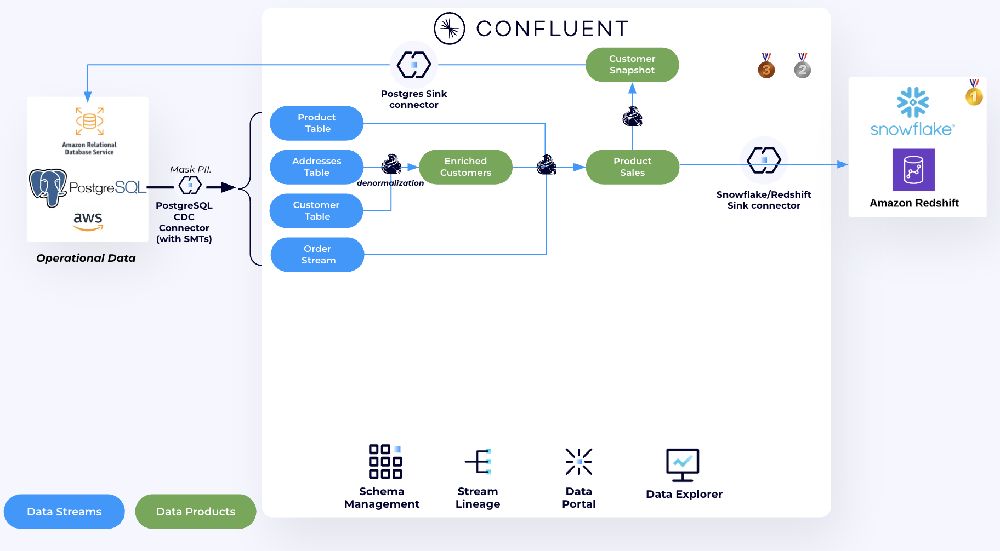

## Data Masking

We are using *Confluent Cloud CDC Debezium* connector to source data from the Postgres DB to Confluent Cloud.

Follow these steps to review this connector and verify that data masking is occurring.

1. [Navigate](https://confluent.cloud/go/connectors) to your Postgres connector
2. Select your workshop environment and cluster from the dropdowns - both should start with a prefix like `shiftleft`
3. Click on your *PostgresCdcSourceConnector* tile

  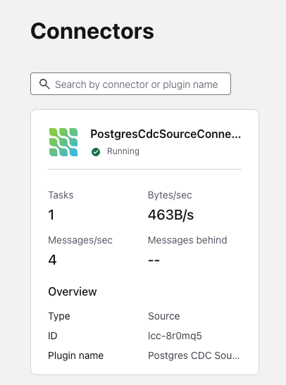

4. Verify that the Connector is running and data is flowing into your cluster
5. Click on the **Settings** tab and scroll down to the *Transforms* section. You will find the SMT used to mask PII information before sending the data to Confluent Cloud. This SMT replaces to email field value with `****`.

   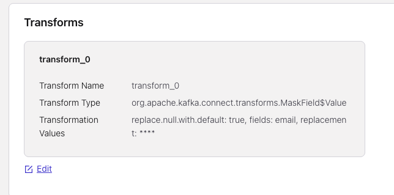

## Stream Processing

The follow sections of instructions will guide you through enriching raw data streams with *Confluent Cloud for Apache Flink*!

### Flink Workspace

1. Navigate to [Flink UI](https://confluent.cloud/go/flink) in Confluent Cloud and select the demo environment
2. Click on **Open SQL Workspace** in your workshop computer pool tile - it should also have a prefix like `shiftleft`

  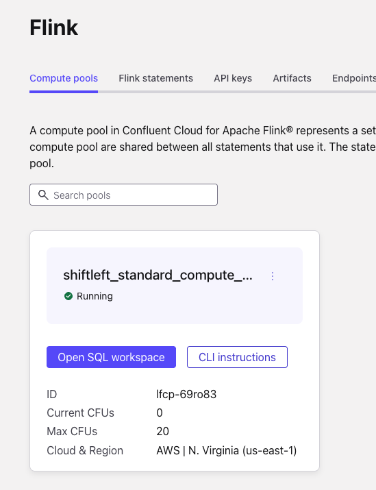

3. On the top right corner of your workspace select the cluster as your database.

> [!TIP]
> **Flink SQL Editor**
>
> In Confluent Cloud, each topic is represented as a table within the Apache Flink catalog. When you create a table in Apache Flink, a corresponding topic and schema are automatically generated to back the table.
>
> You will use the code editor to query existing Flink tables (Kafka topics) and to write new queries.
>
> You can browse the Flink tables and explore their properties in the left navigation menu.

4. Execute this statement to see which tables are available in Flink

```sql
SHOW TABLES;
```

5. Verify that the connector SMT is in fact working and that it is masking the `email` field value:

```sql
SELECT
    customername,
    email
FROM
    `shiftleft.public.customers`
```

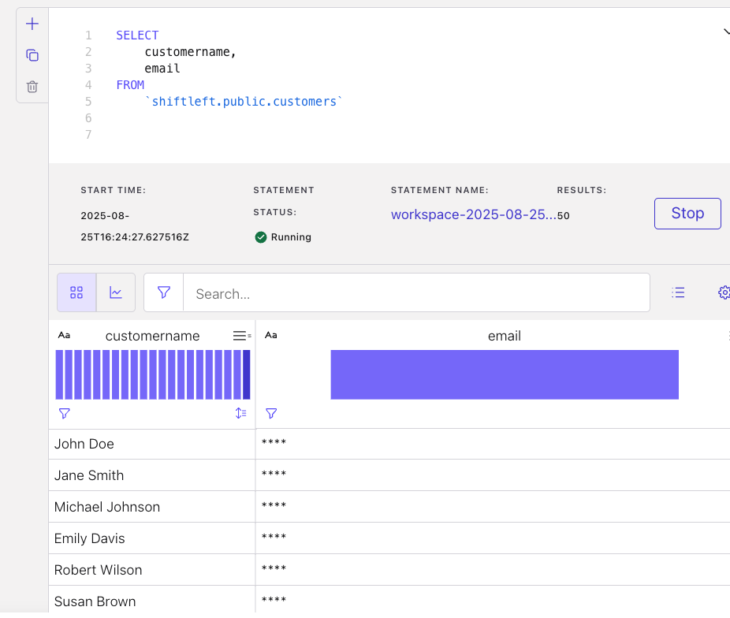

### De-normalization - preparing Customer data

Now we need to denormalise customer information.

Let's preview Customer data:

```sql
SELECT * FROM `shiftleft.public.customers`;
```

Notice that Customer data includes references to the address table. To create our customer data product, we will denormalize the customer information by joining it with the address table.

```sql
SET 'client.statement-name' = 'enriched-customer-materializer';
CREATE TABLE enriched_customers (
  customerid INT,
  customername STRING,
  email STRING,
  segment STRING,
  shipping_address ROW<
    street STRING,
    city STRING,
    state STRING,
    postalcode STRING,
    country STRING
  >,
  billing_address ROW<
    street STRING,
    city STRING,
    state STRING,
    postalcode STRING,
    country STRING
  >,
  event_time TIMESTAMP_LTZ(3),
  WATERMARK FOR event_time AS event_time - INTERVAL '5' SECOND,
  PRIMARY KEY (customerid) NOT ENFORCED
)
AS
  SELECT
  c.customerid,
  c.customername,
  c.email,
  c.segment,
  ROW(
    sa.street,
    sa.city,
    sa.state,
    sa.postalcode,
    sa.country
  ) AS shipping_address,
  ROW(
    ba.street,
    ba.city,
    ba.state,
    ba.postalcode,
    ba.country
  ) AS billing_address,

  c.`$rowtime` AS event_time

FROM `shiftleft.public.customers` c

LEFT JOIN `shiftleft.public.addresses` sa
  ON c.shipping_address_id = sa.addressid
  AND (sa.__deleted IS NULL OR sa.__deleted <> 'true')

LEFT JOIN `shiftleft.public.addresses` ba
  ON c.billing_address_id = ba.addressid
  AND (ba.__deleted IS NULL OR ba.__deleted <> 'true')

WHERE c.__deleted IS NULL OR c.__deleted <> 'true';
```

The new data product holds a single entry for each customer and the key is `customerid`.

### 1a: Product Sales Data Product

1. Flink jobs can measure time using either the system clock (processing time), or timestamps in the events (event time). For the ```orders``` table, notice that each order has ```orderdate```, this is a timestamp for each order created.

   ```sql
    SHOW CREATE TABLE `shiftleft.public.orders`;
   ```

2. We want to set the ```orderdate``` field as the event time for the table, enabling Flink to use it for accurate time-based processing and watermarking:

    ```sql
    ALTER TABLE `shiftleft.public.orders` MODIFY WATERMARK FOR `orderdate` AS `orderdate`;
    ```

3. To perform a temporal join with ```products``` table, the ```products``` table needs to have a ```PRIMARY KEY```. Which is not defined at the moment. Create a new table that has the same schema as ```products``` table but with a PRIMARY KEY constraint

    ```sql
    SET 'client.statement-name' = 'products-with-pk-materializer';
    CREATE TABLE `products_with_pk` (
        `productid` INT NOT NULL,
        `brand` STRING NOT NULL,
        `productname` STRING NOT NULL,
        `category` STRING NOT NULL,
        `description` STRING,
        `color` STRING,
        `size` STRING,
        `price` INT NOT NULL,
        PRIMARY KEY (`productid`) NOT ENFORCED
    )
    AS
    SELECT  `productid`,
        `brand`,
        `productname`,
        `category`,
        `description`,
        `color`,
        `size`,
        CAST(price AS INT) AS price
    FROM `shiftleft.public.products`;
    ```

4. Join all relevant tables to gain insights into each order's contents, including product details, brand, quantity purchased, and the total amount for each order item, along with customer information. The query applies filters to ensure that only valid products with non-empty names and positive prices are included in the result set.

    This analysis is useful for understanding product sales trends, calculating revenue, and generating reports on order compositions.

   Create a new Apache Flink table ```product_sales``` to represent the new data product.

   ```sql
   SET 'sql.state-ttl' = '1 DAYS';
   SET 'client.statement-name' = 'product-sales-materializer';
   CREATE TABLE product_sales (
        orderdate TIMESTAMP_LTZ(3),
        orderid INT,
        productid INT,
        orderitemid INT,
        brand STRING,
        productname STRING,
        price INT,
        customerid INT,
        customername STRING,
        shipping_address_city STRING,
        shipping_address_state STRING,
        billing_address_state STRING,
        quantity INT,
        total_amount INT,
        WATERMARK FOR orderdate AS orderdate - INTERVAL '5' SECOND
    )
    AS
    SELECT
        o.orderdate,
        o.orderid,
        p.productid,
        oi.orderitemid,
        p.brand,
        p.productname,
        p.price,
        c.customerid,
        c.customername,
        c.shipping_address.city as shipping_address_city,
        c.shipping_address.`state` as shipping_address_state,
        c.billing_address.`state` as billing_address_state,
        oi.quantity,
        oi.quantity * p.price AS total_amount
    FROM
        `shiftleft.public.orders` o
    JOIN
        `shiftleft.public.order_items` oi ON oi.orderid = o.orderid
    JOIN
        `products_with_pk` FOR SYSTEM_TIME AS OF o.orderdate AS p ON p.productid = oi.productid
    JOIN
        `enriched_customers` FOR SYSTEM_TIME AS OF o.orderdate AS c ON c.customerid = o.customerid
    WHERE
        p.productname <> ''
        AND p.price > 0;
   ```

  The join uses the `FOR SYSTEM_TIME AS OF` keyword, making it a temporal join. Temporal joins are more efficient than regular joins because they use the time-based nature of the data, enriching each order with product information available at the order's creation time. If product details change later, the join result remains unchanged, reflecting the original order context. Additionally, temporal joins are preferable as regular joins would require Flink to keep the state indefinitely.

5. Now let's sink the new data product to our data warehourse.

<details>
<summary>Click to expand Amazon Redshift instructions</summary>

We will sink data to Amazon Redshift using the Confluent Cloud Redshift Sink Connector.

1. Navigate to the [Connectors UI](https://confluent.cloud/go/connectors)
2. Click on the **+ Add Connector** button
3. Search for *redshift sink* and click on the tile

  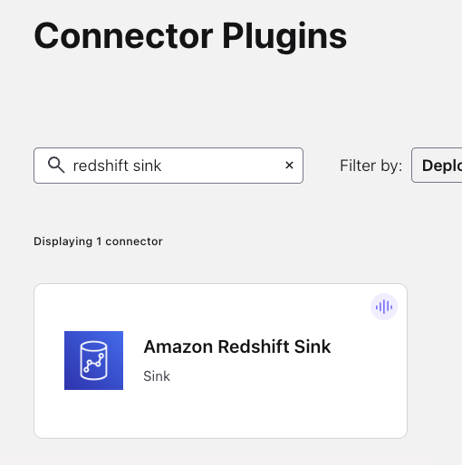

4. Select the `product_sales` topic and click **Continue**
5. Select **Service account**
6. Under **Existing account**, search for `shift-left` and find the prefix matches that of your environment and cluster

   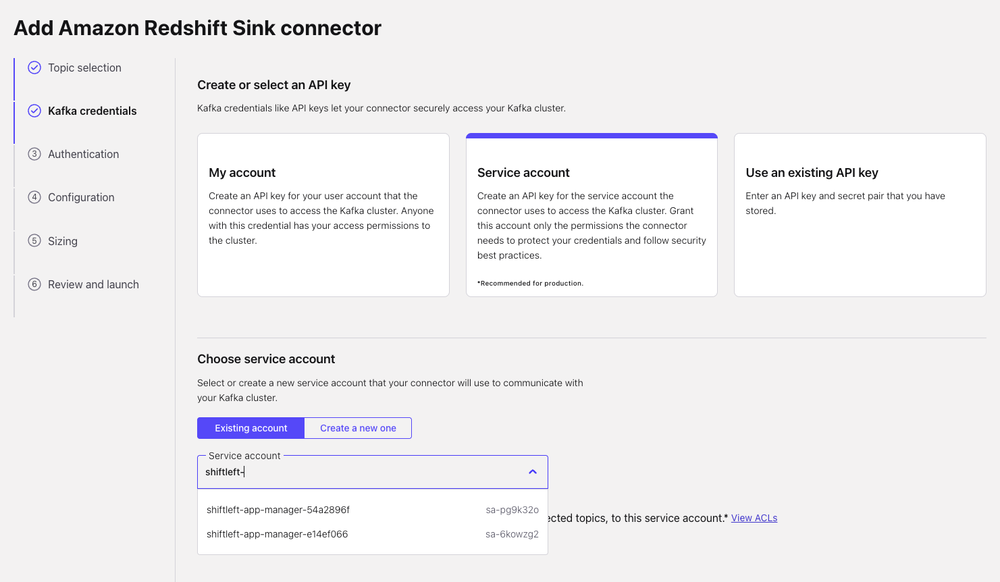

7. Check the box to *Add all required ACLs*
8. Click **Continue**
9.  Enter Redshift details
    1. **AWS Redshift Domain**: Get it by running `terraform output redshift-output`
    2. **AWS Redshift Port**: `5439`
    3. **Connection user**: `admin`
    4. **Database name**: `mydb`
    5. **Authentication Method**: `Password`
    6. **Connection password**: `Admin123456!`
    7. Click **Continue**

    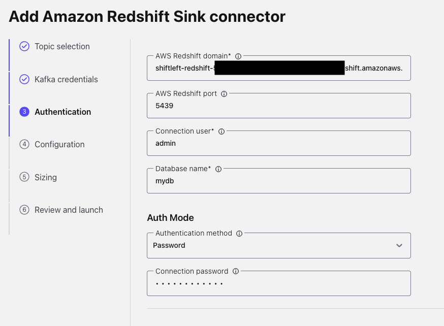

> [!NOTE]
> **Admin user for demo only**
>
> It's not recommended to use the ADMIN user for data ingestion in production. We are using it here for demo purposes only.

11. Select `AVRO` under the *Input Kafka record value format* section
12. Expand the **Show advanced configurations** section
13. Set **Auto create table** to `True`.

  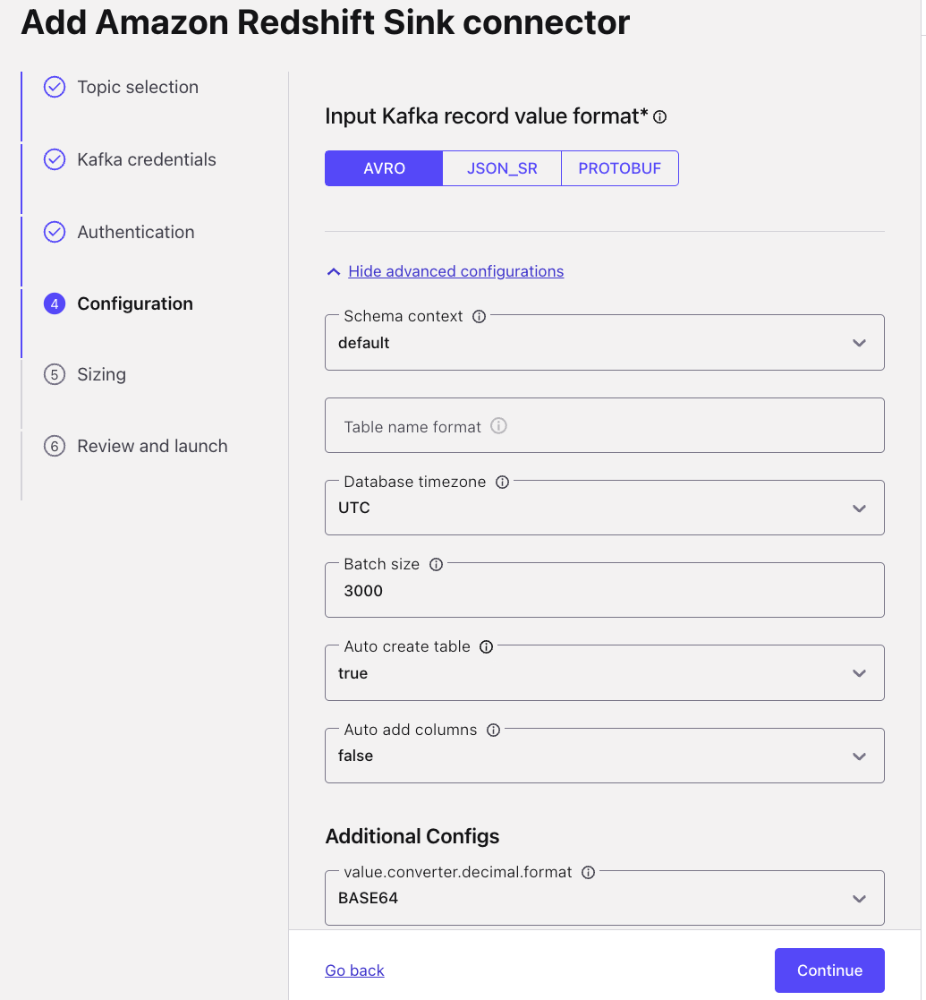

14. Click **Continue**
15. Keep the default *Sizing* selections and click **Continue**
16. Under *Review and Launch* click **Continue**
17. Verify that you see both the Postgres and Redshift connectors

  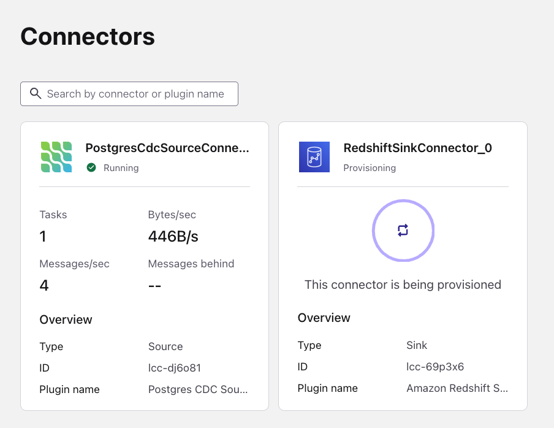

18. Navigate to the [Amazon Redshift Query V2 Editor page](https://console.aws.amazon.com/sqlworkbench/home)
  - Ensure that you select the same cloud region you specified in your `terraform.tfvars` file

  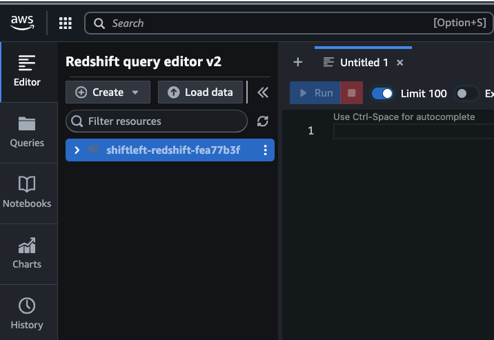

19. Select the Cluster and enter the same connection parameters from the previous step to establish a connection with the database:

    - **Database name**: `mydb`
    - **Connection user**: `admin`
    - **Connection password**: `Admin123456!`

  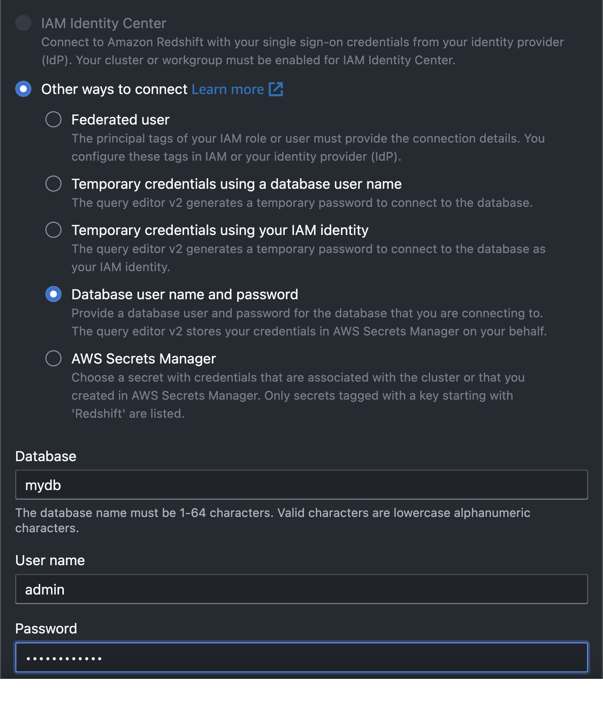

20.  Run the follwing SQL Statement to preview the new table.

```sql
  SELECT *
  FROM
    "mydb"."public"."product_sales";
```

> [!NOTE]
> **3-5 Minutes Data Sync**
>
> The connector will take less than a minute to run, **but the data will be available for querying in Snowflake after 3-5 minutes.**

21. Verify that you see results similar to this:

  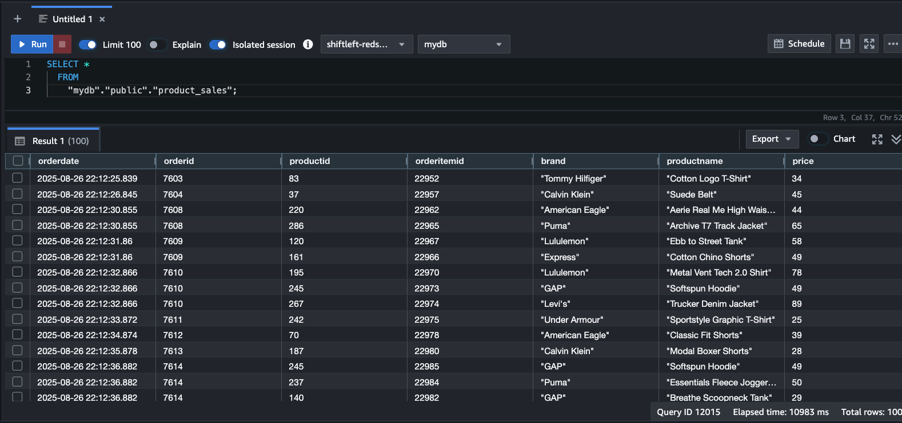

</details>


<details>
<summary>Click to expand Snowflake instructions</summary>

We will sink data to Snowflake using the Confluent Cloud Snowflake Sink Connector.

1. In the [Connectors UI](https://confluent.cloud/go/connectors), add a new Snowflake Sink Connector.
2. Choose ```product_sales``` topic and click **Continue**
3. Enter Confluent Cluster credentials, you can use API Keys generated by Terraform
     1.   In CMD run ```terraform output resource-ids``` you will find the API Keys in a section that looks like this:
            ```
                Service Accounts and their Kafka API Keys (API Keys inherit the permissions granted to the owner):
                    shiftleft-app-manager-d217a8e3:                     sa-*****
                    shiftleft-app-manager-d217a8e3's Kafka API Key:     "SYAKE*****"
                    shiftleft-app-manager-d217a8e3's Kafka API Secret:  "rn7Y392xM49c******"
            ```
4.  Enter Snowflake details
    1.  **Snowflake locator URL**: Get it under Admin --> Accounts in (Snowflake Console)[https://app.snowflake.com/]. It should look like this: *https://<snowflake_locator>.<cloud_region>.aws.snowflakecomputing.com*
    2.  **Connection username**: ```confluent```
    3.  **Private Key**: In CMD run ```terraform output resource-ids``` and copy the PrivateKey from there.
    4.  **Snowflake role**: `ACCOUNTADMIN`
    5.  **Database name**: ```PRODUCTION```
    6.  **Schema name**: ```PUBLIC```

    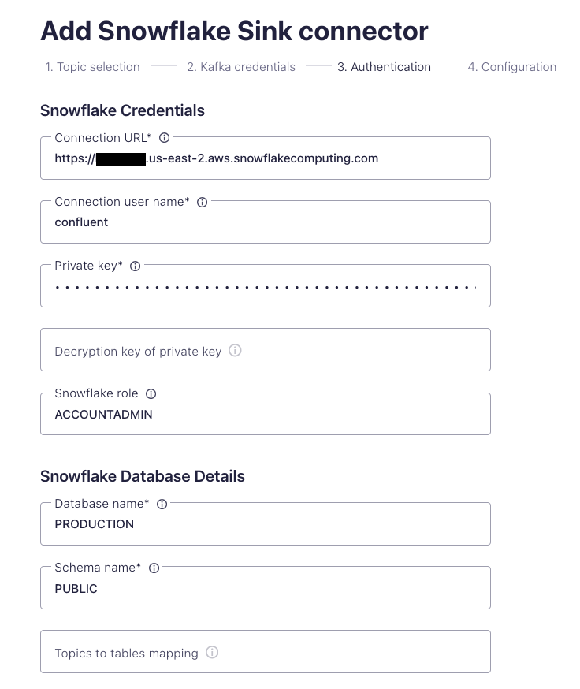

    >**NOTE: It's not recommended to use ACCOUNTADMIN role for data ingestion. We are using it here for demo purposes only.**


18. Choose:
    * ```AVRO``` as **Input Kafka record value format**.
    *  ```SNOWPIPE_STREMAING``` as **Snowflake Connection**.
    *  Set **Enable Schemitization** to `True`. Doing this will allow the connector to infer schema from Schema registry and write the data to Snowflake with the correct schema.
    *  Then follow the the wizard to create the connector.


18. In Snowflake UI, go to Worksheets and run the follwing SQL Statement to preview the new table.
    > Note: The connector will take less than a minute to run, **but the data will be available for querying in Snowflake after 3-5 minutes.**
    ```
    SELECT * FROM PRODUCTION.PUBLIC.PRODUCT_SALES
    ```
     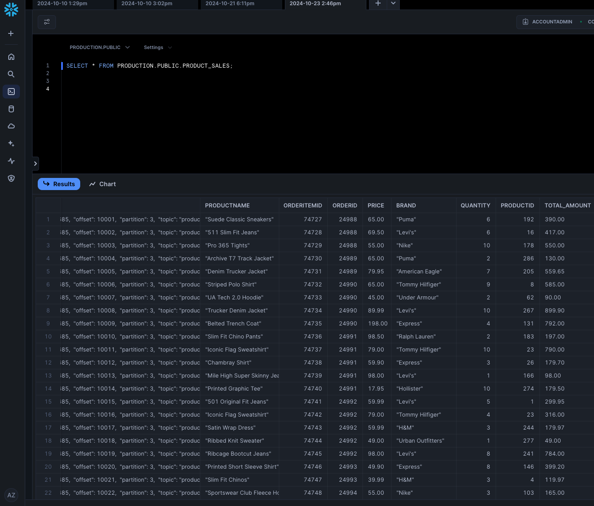


</details>


### 1b: Customer 360 Snapshot

Using the `product_sales` data product, we create a new data product to support the Customer Services team: `thirty_day_customer_snapshot`. This product aggregates the past 30 days of activity for each customer, summarizing the total number of orders and total revenue generated. It provides a quick snapshot of customer behavior over the last month, enabling faster insights and support.

Navigate back to the [Flink workspace](https://confluent.cloud/go/flink) if needed.

Run this SQL in a new cell:

```sql
SET 'client.statement-name' = 'customer-snapshot-materializer';
CREATE TABLE thirty_day_customer_snapshot (
  customerid INT,
  customername STRING,
  total_amount INT,
  number_of_orders BIGINT,
  updated_at TIMESTAMP,
  PRIMARY KEY (customerid) NOT ENFORCED
)
AS
WITH agg_per_customer_30d AS (
  SELECT
    customerid,
    customername,
    SUM(total_amount) OVER w AS total_amount,
    COUNT(DISTINCT orderid) OVER w AS number_of_orders,
    orderdate
  FROM product_sales
  WINDOW w AS (
    PARTITION BY customerid
    ORDER BY orderdate
    RANGE BETWEEN INTERVAL '30' DAY PRECEDING AND CURRENT ROW
  )
)
SELECT
  COALESCE(customerid, 0) AS customerid,
  customername,
  total_amount,
  number_of_orders,
  orderdate AS updated_at
FROM agg_per_customer_30d;
```

The above query creates the `thirty_day_customer_snapshot` table, which aggregates customer data over the last 30 days. It calculates the total amount spent and the number of distinct orders placed by each customer, updating the snapshot with the most recent order date. The table provides valuable insights into customer behavior by summarizing key metrics for each customer within a rolling 30-day window.

### Sinking Data Products back to the Operational DB

After creating the new data product for the Customer Services team, we’ll sink this data into their existing PostgreSQL database, which was provisioned via Terraform.

Follow these steps to accomplish this with the *Confluent Cloud PostgreSQL Sink Connector*:

1. In the [Connectors UI](https://confluent.cloud/go/connectors), click on **+ Add connector**
2. Search and select *Postgres Sink* Connector.

  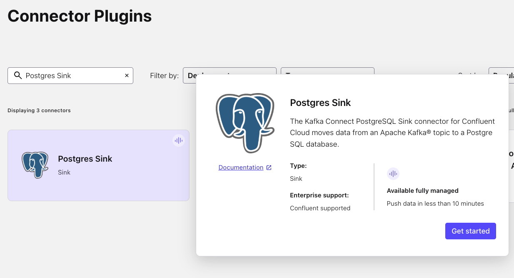

3. Select the `thirty_day_customer_snapshot` topic and click **Continue**

  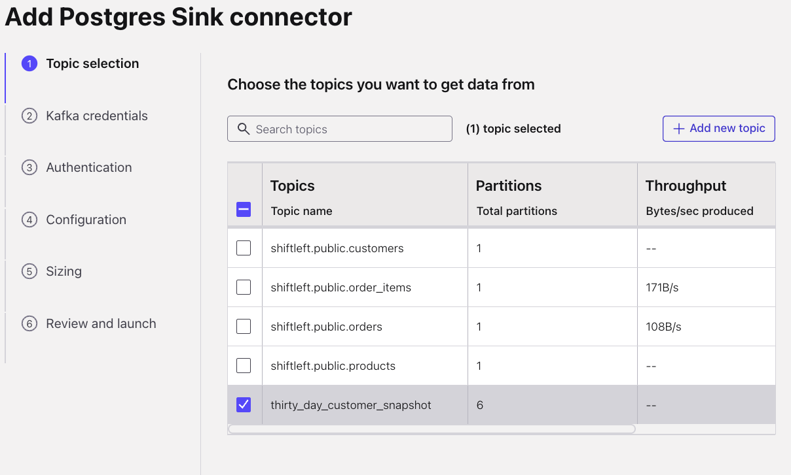

4. Select **Service account**
5. Under **Existing account**, search for `shift-left` and find the prefix matches that of your environment and cluster
6. Under **Existing account**, search for `shift-left` and verify that the `sa-******` value in the right side of the dropdown matches the value in the previous step
7. Check the box to *Add all required ACLs*
8. Click **Continue**
9. Enter Postgres details
    1. **Connection Host**: Get it by running `terraform output resource-ids | grep "RDS Endpoint"` and then copy the value of `RDS Endpoint` **but remove the `:5432` from the end**
    2. **Connection port**: `5432`
    3. **Connection user**: `postgres` (unless you changed this in the terraform variables file)
    4. **Connection password**: `Admin123456!!` (unless you changed this in the terraform variables file)
    5. **Database name**: `onlinestoredb`

    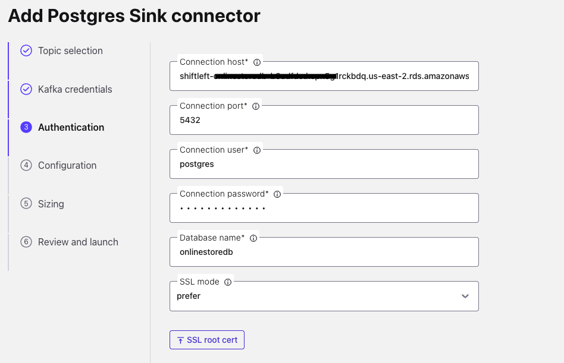

    6. Click **Continue**

> [!TIP]
> **ADMIN User for Demo Only**
>
> We recommend using the *ADMIN* user for data ingestion for demo purposes only. This usage pattern is not meant for production.

10. Choose:
    * `AVRO` as **Input Kafka record value format**.
      Set **Insert mode** to `UPSERT`.
    * (ADVANCED CONFIGURATION) Set **Auto create Table** to `true`.
    * (ADVANCED CONFIGURATION) Set **PK mode** to `record_key`
    * (ADVANCED CONFIGURATION) Select `AVRO` as **Input Kafka record key format**.
    * Click **Continue**
11. Keep default selection for *Sizing* and click **Continue**
12. Review the configuration and click **Continue**

#### [OPTIONAL] Validate that data is in Postgres

Follow these steps to view the `thirty_day_customer_snapshot` data in Postgres:

1. **Connection Host**: Get it by running `terraform output resource-ids | grep "RDS Endpoint"` and then copy the value of `RDS Endpoint:` **but remove the `:5432` from the end**
2. Run this command in your shell:

```sh
psql -h <RDS_ENDPOINT> -p 5432 -U postgres -d onlinestoredb
```

3. When prompted copy and paste the password `Admin123456!!` and press enter
4. Once logged in, execute this query:

```sql
SELECT customername, total_amount, number_of_orders, customerid
FROM thirty_day_customer_snapshot;
```

You should see a result like this:

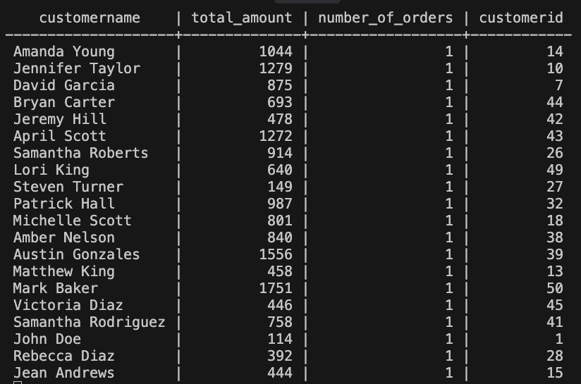

## Topics

**Next topic:** [Usecase 2 - Daily Sales Trends](../LAB2/LAB2-README.md)

**Previous topic:** [Demo Introduction and Setup](../README.md)
