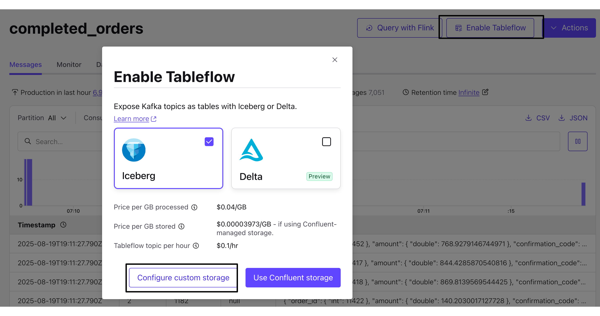

# Product Sales and Customer360 Aggregation

> [!NOTE]
> **⏱️ Optional — Time Permitting**
>
> This lab is optional. If you're running short on time during the workshop, you can skip this lab and complete it later on your own. The infrastructure will remain available until you run the cleanup steps.

In this lab, we'll build core data products using Confluent Cloud for Apache Flink by joining multiple data streams from our operational database. These data products will form the foundation for analytics use cases in later labs.

We'll create `enriched_customers` by joining customer and address data, then use this to build `product_sales` (detailed order analytics) and `thirty_day_customer_snapshot` (customer behavior metrics).


---

## Building the Enriched Customer Data Product

Customer data in the operational database is normalized—addresses are stored in a separate table. For analytics, we want a denormalized view that includes all customer information in one place.

### Preview the Source Data

1. Navigate to the [Flink UI](https://confluent.cloud/go/flink) in Confluent Cloud and select your demo environment (prefixed with `shiftleft` by default)

2. View customer data:

   ```sql
   SELECT * FROM `shiftleft.public.customers` LIMIT 10;
   ```

3. Notice the `shipping_address_id` and `billing_address_id` fields—these reference the `addresses` table

4. View address data:

   ```sql
   SELECT * FROM `shiftleft.public.addresses` LIMIT 10;
   ```

### Create the Enriched Customer Table

Now we'll join customers with their shipping and billing addresses to create a denormalized customer profile.

```sql
SET 'client.statement-name' = 'enriched-customer-materializer';
CREATE TABLE enriched_customers (
  customerid INT,
  customername STRING,
  email STRING,
  segment STRING,
  shipping_address ROW<
    street STRING,
    city STRING,
    state STRING,
    postalcode STRING,
    country STRING
  >,
  billing_address ROW<
    street STRING,
    city STRING,
    state STRING,
    postalcode STRING,
    country STRING
  >,
  event_time TIMESTAMP_LTZ(3),
  WATERMARK FOR event_time AS event_time - INTERVAL '5' SECOND,
  PRIMARY KEY (customerid) NOT ENFORCED
)
AS
  SELECT
  c.customerid,
  c.customername,
  c.email,
  c.segment,
  ROW(
    sa.street,
    sa.city,
    sa.state,
    sa.postalcode,
    sa.country
  ) AS shipping_address,
  ROW(
    ba.street,
    ba.city,
    ba.state,
    ba.postalcode,
    ba.country
  ) AS billing_address,

  c.`$rowtime` AS event_time

FROM `shiftleft.public.customers` c

LEFT JOIN `shiftleft.public.addresses` sa
  ON c.shipping_address_id = sa.addressid
  AND (sa.__deleted IS NULL OR sa.__deleted <> 'true')

LEFT JOIN `shiftleft.public.addresses` ba
  ON c.billing_address_id = ba.addressid
  AND (ba.__deleted IS NULL OR ba.__deleted <> 'true')

WHERE c.__deleted IS NULL OR c.__deleted <> 'true';
```

**Key Points:**
* Uses `ROW` type to include address fields
* Filters out deleted records using CDC metadata (`__deleted` field)
* Creates a changelog stream keyed by `customerid`
* Defines a watermark for time-based operations


> [!IMPORTANT]
> **Understanding Streaming Results**
>
> When querying streaming tables, you're viewing the **changelog stream**, not a static snapshot. You may see:
>
> - **Duplicate keys**: Updates appear as retraction (`-U`) + insert (`+U`) pairs
> - **More rows than LIMIT**: Each changelog event counts toward the limit
> - **NULL values**: LEFT JOINs may not match if timing differs
>
> This is expected behavior! The underlying Kafka topic maintains the correct final state.

### Verify the Data Product

Query the new enriched customer table:
```sql
SELECT
  customerid,
  customername,
  shipping_address.city,
  billing_address.state
FROM enriched_customers
LIMIT 10;
```

Notice how addresses are now included within each customer record—perfect for analytics!

---

## Building the Product Sales Data Product

Now we'll create a comprehensive view of product sales by joining orders, order items, products, and customers.

### Configure Event Time for Orders

Orders have an `orderdate` timestamp that we want to use for time-based processing.

1. View the current table structure:
   ```sql
   SHOW CREATE TABLE `shiftleft.public.orders`;
   ```

2. Configure the watermark to use `orderdate` as event time:
   ```sql
   ALTER TABLE `shiftleft.public.orders`
   MODIFY WATERMARK FOR `orderdate` AS `orderdate`;
   ```

### Create Products with Primary Key

For temporal joins (joining streams at a point in time), the dimension table needs a primary key.

```sql
SET 'client.statement-name' = 'products-with-pk-materializer';
CREATE TABLE `products_with_pk` (
    `productid` INT NOT NULL,
    `brand` STRING NOT NULL,
    `productname` STRING NOT NULL,
    `category` STRING NOT NULL,
    `description` STRING,
    `color` STRING,
    `size` STRING,
    `price` INT NOT NULL,
    PRIMARY KEY (`productid`) NOT ENFORCED
)
AS
SELECT
    `productid`,
    `brand`,
    `productname`,
    `category`,
    `description`,
    `color`,
    `size`,
    CAST(price AS INT) AS price
FROM `shiftleft.public.products`;
```

### Create Product Sales Table

Now we'll join all relevant streams to create a detailed product sales view.

```sql
SET 'sql.state-ttl' = '1 DAYS';
SET 'client.statement-name' = 'product-sales-materializer';
CREATE TABLE product_sales (
    orderdate TIMESTAMP_LTZ(3),
    orderid INT,
    productid INT,
    orderitemid INT,
    brand STRING,
    productname STRING,
    price INT,
    customerid INT,
    customername STRING,
    shipping_address_city STRING,
    shipping_address_state STRING,
    billing_address_state STRING,
    quantity INT,
    total_amount INT,
    WATERMARK FOR orderdate AS orderdate - INTERVAL '5' SECOND
)
AS
SELECT
    o.orderdate,
    o.orderid,
    p.productid,
    oi.orderitemid,
    p.brand,
    p.productname,
    p.price,
    c.customerid,
    c.customername,
    c.shipping_address.city as shipping_address_city,
    c.shipping_address.`state` as shipping_address_state,
    c.billing_address.`state` as billing_address_state,
    oi.quantity,
    oi.quantity * p.price AS total_amount
FROM
    `shiftleft.public.orders` o
JOIN
    `shiftleft.public.order_items` oi ON oi.orderid = o.orderid
JOIN
    `products_with_pk` FOR SYSTEM_TIME AS OF o.orderdate AS p ON p.productid = oi.productid
JOIN
    `enriched_customers` FOR SYSTEM_TIME AS OF o.orderdate AS c ON c.customerid = o.customerid
WHERE
    p.productname <> ''
    AND p.price > 0;
```

**Key Concepts:**

* **Temporal Joins** (`FOR SYSTEM_TIME AS OF`): Enrich each order with product/customer data as it existed when the order was placed, even if those entities change later
* **State TTL**: Keeps state for 1 day to manage memory (older state is purged)
* **Calculated Fields**: `total_amount` is computed from quantity × price
* **Data Quality Filters**: Excludes invalid products (empty names, zero prices)

### Query Product Sales

```sql
SELECT
    brand,
    productname,
    COUNT(*) as order_count,
    SUM(total_amount) as revenue
FROM product_sales
GROUP BY brand, productname
ORDER BY revenue DESC
LIMIT 10;
```

---

## Building the Customer 360 Snapshot

From `product_sales`, we'll create a customer-centric view showing 30-day rolling metrics for each customer.

```sql
SET 'client.statement-name' = 'customer-snapshot-materializer';

CREATE TABLE thirty_day_customer_snapshot (
  customerid INT,
  customername STRING,
  total_amount INT,
  number_of_orders BIGINT,
  updated_at TIMESTAMP,
  PRIMARY KEY (customerid) NOT ENFORCED
) WITH (
  'changelog.mode' = 'upsert'
)
AS
WITH agg_per_customer_30d AS (
  SELECT
    customerid,
    customername,
    SUM(total_amount) OVER w AS total_amount,
    COUNT(DISTINCT orderid) OVER w AS number_of_orders,
    orderdate
  FROM product_sales
  WINDOW w AS (
    PARTITION BY customerid
    ORDER BY orderdate
    RANGE BETWEEN INTERVAL '30' DAY PRECEDING AND CURRENT ROW
  )
)
SELECT
  COALESCE(customerid, 0) AS customerid,
  customername,
  total_amount,
  number_of_orders,
  orderdate AS updated_at
FROM agg_per_customer_30d;
```

**Key Concepts:**

* **Window Functions**: `SUM() OVER` and `COUNT() OVER` compute rolling aggregations
* **Range Window**: `RANGE BETWEEN INTERVAL '30' DAY PRECEDING AND CURRENT ROW` creates a 30-day sliding window
* **Continuous Updates**: As new orders arrive, customer metrics update automatically
* **Primary Key**: Maintains one record per customer (changelog stream)

### Query Customer Metrics

```sql
SELECT
  customername,
  number_of_orders,
  total_amount,
  updated_at
FROM thirty_day_customer_snapshot
ORDER BY total_amount DESC
LIMIT 20;
```

---

## Part 2: Setting up Tableflow

If you skipped [configuring Tableflow in LAB 1](../LAB1/LAB1-README.md#setting-up-tableflow-infrastructure), then expand the *Configure Tableflow* section below and follow the steps.

<details>
<summary>Configure Tableflow</summary>

### Setting Up Tableflow Infrastructure

Now that we have clean, validated data products from Flink, we'll make them analytics-ready using Tableflow.

Instead of writing complex connectors or ETL jobs, Tableflow automatically materializes topics as Iceberg tables.

First, we'll configure the storage and catalog integrations that Tableflow will use.

#### Configure Custom Storage (S3)

1. Navigate to the Tableflow main page: **Environments > {Your Environment} > Clusters > {Your Cluster} > Tableflow**

   

#### Configure Glue Data Catalog Integration

Now we'll connect Tableflow to AWS Glue Data Catalog so our Iceberg tables are discoverable by Athena and other query engines.

1. In the Tableflow page, scroll to **External Catalog Integrations** and click **+ Add integration**

2. Configure the integration:
   * **Integration type:** AWS Glue
   * **Name:** `my-glue-integration`
   * **Supported format:** Iceberg
   * Click **Continue**

   

3. Select the provider integration created by Terraform (you can find it in `terraform output resource-ids`)

4. Click **Continue**

5. Click **Launch**

6. The status will show **Pending** at first but will update to **Connected**

   

</details>

---

### Enabling Tableflow on `thirty_day_customer_snapshot` and `product_sales`

Now we'll enable Tableflow to automatically materialize the `completed_orders` topic as an Iceberg table.

1. Navigate to the [`thirty_day_customer_snapshot`](https://confluent.cloud/go/topics) topic
2. Click **Enable Tableflow**
3. Click **Configure Custom Storage**
     
4. Select your provider integration and S3 bucket (format: `shiftleft-tableflow-bucket-...`)

   You can find your S3 bucket name:

   ```bash
   terraform output resource-ids | grep tableflow-bucket
   ```

5. Click **Continue**

6. Click **Launch**

7. Repeat steps 1-6 for the `product_sales` topic

8. Verify that the Tableflow status changes to **Syncing**

---

### Exploring Iceberg Tables in AWS Glue

Let's see what Tableflow created in our data catalog.

1. Open the AWS Glue Console and navigate to **Data Catalog > Databases**

2. Find your database (it's named after your Confluent Cloud cluster ID). You can get the cluster ID from:

   ```bash
   terraform output resource-ids
   ```

   Look for the `Cluster ID` value under "Environment & Cluster Info"

3. Click into the database and you should see the `product_sales` and `thirty_day_customer_snapshot` tables.

4. Click on `thirty_day_customer_snapshot` to view its schema. Notice:
   * The schema exactly matches what's in Schema Registry
   * Metadata includes Iceberg table properties
   * Storage location points to your S3 bucket

## Querying with Amazon Athena

Now let's perform some analytics on our new data products.

> [!NOTE]
> **5-15 minutes for Data Materialization**
>
> After enabling Tableflow, it may take 5-15 minutes for data to become available in Athena.

Navigate back to Amazon Athena and run these queries:

1. Geographic sales distribution (from `product_sales`):

   ```sql
   SELECT
      shipping_address_state AS state,
      COUNT(DISTINCT orderid) AS orders,
      COUNT(DISTINCT customerid) AS unique_customers,
      SUM(total_amount) AS revenue
   FROM "product_sales"
   GROUP BY shipping_address_state
   ORDER BY revenue DESC
   LIMIT 10;
   ```

2. Customer spending maximum, minimum, and average (from `thirty_day_customer_snapshot`):

   ```sql
   SELECT
      COUNT(*) AS total_customers,
      ROUND(AVG(total_amount), 2) AS avg_spend,
      ROUND(MIN(total_amount), 2) AS min_spend,
      ROUND(MAX(total_amount), 2) AS max_spend,
      ROUND(AVG(number_of_orders), 1) AS avg_orders
   FROM thirty_day_customer_snapshot;
   ```

---

## What We've Built

You now have three production-ready data products powered by Flink:

1. **enriched_customers**: Unified customer profiles with denormalized addresses
2. **product_sales**: Detailed order analytics enriched with customer and product data, with Tableflow enabled
3. **thirty_day_customer_snapshot**: Rolling 30-day customer behavior metrics, with Tableflow enabled

All three tables are:

* **Real-time**: Update continuously as source data changes
* **Governed**: Schemas are tracked in Schema Registry
* **Scalable**: Flink handles the stream processing infrastructure
* **Materialized**: Backed by Kafka topics for downstream consumption

---

## Topics

**🔙 Previous topic:** [Lab 1 - Payment Validation and Tableflow Deep Dive](../LAB1/LAB1-README.md)

**🎯 Bonus (Optional):** [Data Contracts and Encryption](../BONUS/BONUS-README.md)

**🏁 Finished?** [Cleanup](../README.md#clean-up)

---

## 🆘 Need Help?

Running into issues? Check the [**Troubleshooting Guide**](../TROUBLESHOOTING.md) for common problems and solutions, or ask a workshop instructor!
