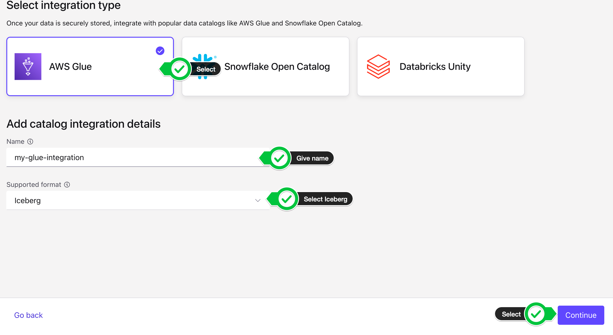

## Payment Validation and Tableflow Deep Dive

In this lab, we'll use Confluent Cloud and Apache Flink to validate payments, create completed orders, and then explore Tableflow's capabilities for making streaming data analytics-ready. You'll learn how Tableflow converts Kafka topics into Apache Iceberg tables with zero code, enabling seamless querying from multiple analytics engines.

[Tableflow](https://www.confluent.io/product/tableflow/) eliminates the need for complex ETL pipelines by automatically converting topics into Iceberg tables. It handles schema mapping, evolution, compaction, and optimization—all managed by Confluent's infrastructure.


---

## Part 1: Payment Processing with Flink

### Payment Deduplication

Before joining payment and order streams, we need to ensure there are no duplicate payments.

1. Check for duplicates in the `payments` table:
   ```sql
   SELECT * FROM
   ( SELECT order_id, amount, count(*) total
    FROM `payments`
    GROUP BY order_id, amount )
   WHERE total > 1;
   ```
   If this query returns results, duplicates exist.

2. Create a deduplicated payments table:
   ```sql
   SET 'client.statement-name' = 'unique-payments-maintenance';
   SET 'sql.state-ttl' = '1 hour';

   CREATE TABLE unique_payments (
   order_id INT NOT NULL,
   product_id INT,
   customer_id INT,
   confirmation_code STRING,
   cc_number STRING,
   expiration STRING,
   amount DOUBLE,
   ts TIMESTAMP_LTZ(3),
   WATERMARK FOR ts AS ts - INTERVAL '5' SECOND
   )
   AS SELECT
   COALESCE(order_id, 0) AS order_id,
   product_id,
   customer_id,
   confirmation_code,
   cc_number,
   expiration,
   amount,
   ts
   FROM (
   SELECT *,
            ROW_NUMBER() OVER (PARTITION BY order_id ORDER BY ts ASC) AS rownum
   FROM payments
   )
   WHERE rownum = 1;
   ```

3. Update watermarks for both payment tables:
   ```sql
   ALTER TABLE payments
   MODIFY WATERMARK FOR ts AS ts;
   ```
   ```sql
   ALTER TABLE unique_payments
   MODIFY WATERMARK FOR ts AS ts;
   ```

4. Validate deduplication worked:
   ```sql
   SELECT order_id, COUNT(*) AS count_total
   FROM `unique_payments`
   GROUP BY order_id
   HAVING COUNT(*) > 1;
   ```
   This should return zero results.

---

### Creating Completed Orders with Joins

Now we'll create a table that joins payments with orders to validate that each payment has a matching order.

1. Create the `completed_orders` table:
   ```sql
   SET 'client.statement-name' = 'completed-orders-materializer';
   CREATE TABLE completed_orders (
      order_id INT,
      amount DOUBLE,
      confirmation_code STRING,
      ts TIMESTAMP_LTZ(3),
      WATERMARK FOR ts AS ts - INTERVAL '5' SECOND
   ) AS
   SELECT
      pymt.order_id,
      pymt.amount,
      pymt.confirmation_code,
      pymt.ts
   FROM unique_payments pymt, `shiftleft.public.orders` ord
   WHERE pymt.order_id = ord.orderid;
   ```

This join ensures we only capture payments that have a matching order in the system, creating a validated data product for analytics.

---

## Part 2: Tableflow Deep Dive

Now that we have clean, validated data products from Flink, we'll make them analytics-ready using Tableflow. Instead of writing complex connectors or ETL jobs, Tableflow automatically materializes topics as Iceberg tables.

### Setting Up Tableflow Infrastructure

First, we'll configure the storage and catalog integrations that Tableflow will use.

#### Configure Custom Storage (S3)

> **Important:** For Lab 3 compatibility, you must use your own S3 storage (not Confluent Managed Storage).

1. Navigate to the Tableflow main page: **Environments > {Your Environment} > Clusters > {Your Cluster} > Tableflow**

   

#### Configure Glue Data Catalog Integration

Now we'll connect Tableflow to AWS Glue Data Catalog so our Iceberg tables are discoverable by Athena and other query engines.

1. In the Tableflow page, scroll to **External Catalog Integrations** and click **+ Add integration**

2. Configure the integration:
   * **Integration type:** AWS Glue
   * **Name:** `my-glue-integration`
   * **Supported format:** Iceberg
   * Click **Continue**

   

3. Select the provider integration created by Terraform (you can find it in `terraform output resource-ids`)

4. Click **Continue and Launch**

5. Wait for the status to change from **Pending** to **Connected**

   

---

### Enabling Tableflow on `completed_orders`

Now we'll enable Tableflow to automatically materialize the `completed_orders` topic as an Iceberg table.

1. Navigate to the [`completed_orders`](https://confluent.cloud/go/topics) topic
2. Click **Enable Tableflow** > **Configure Custom Storage**
3. Select your provider integration and S3 bucket (format: `shiftleft-tableflow-bucket-...`)

   You can find your S3 bucket name:
   ```bash
   terraform output resource-ids | grep tableflow-bucket
   ```

4. Click **Continue** and **Launch**

   

5. Wait for Tableflow status to show **Active**

> **Key Point:** Tableflow automatically infers the schema from Schema Registry. No manual schema mapping required!

---

### Exploring Iceberg Tables in AWS Glue

Let's see what Tableflow created in our data catalog.

1. Open the [AWS Glue Console](https://console.aws.amazon.com/glue) and navigate to **Data Catalog > Databases**

2. Find your database (it's named after your Confluent Cloud cluster ID). You can get the cluster ID from:
   ```bash
   terraform output resource-ids
   ```
   Look for the `Cluster ID` value under "Environment & Cluster Info"

3. Click into the database and you should see the `completed_orders` table

4. Click on `completed_orders` to view its schema. Notice:
   * The schema exactly matches what's in Schema Registry
   * Metadata includes Iceberg table properties
   * Storage location points to your S3 bucket

---

### Querying with Amazon Athena

> **Note:** After enabling Tableflow, it may take 5-10 minutes for data to become available in Athena.

1. Navigate to the [AWS Glue Data Catalog Tables page](https://console.aws.amazon.com/glue/home#/v2/data-catalog/tables)

2. Search for your cluster ID database, then find the `completed_orders` table

3. Click **View Data** under the Actions column. This opens Amazon Athena.

   

4. Run a basic query to verify data is flowing:
   ```sql
   SELECT *
   FROM "AwsDataCatalog"."<<cluster-id>>"."completed_orders"
   LIMIT 10;
   ```

> **Note:** You may need to supply an output location for your Athena query if you haven't configured this before. Instructions can be found [here](https://docs.aws.amazon.com/athena/latest/ug/creating-databases-prerequisites.html). Feel free to use the same S3 bucket we are using for Tableflow data.

---

### Analyzing Sales Trends

Now let's perform some real analytics on our streaming data.

1. Calculate hourly sales trends:
   ```sql
   SELECT
      date_trunc('hour', ts) AS window_start,
      date_trunc('hour', ts) + INTERVAL '1' hour AS window_end,
      COUNT(*) AS total_orders,
      SUM(amount) AS total_revenue
   FROM "AwsDataCatalog"."<<cluster-id>>"."completed_orders"
   GROUP BY date_trunc('hour', ts)
   ORDER BY window_start;
   ```

2. Find the highest value orders:
   ```sql
   SELECT
      order_id,
      amount,
      confirmation_code,
      ts
   FROM "AwsDataCatalog"."<<cluster-id>>"."completed_orders"
   ORDER BY amount DESC
   LIMIT 10;
   ```

3. Calculate total revenue:
   ```sql
   SELECT
      COUNT(*) as total_orders,
      SUM(amount) as total_revenue,
      AVG(amount) as avg_order_value,
      MIN(amount) as min_order,
      MAX(amount) as max_order
   FROM "AwsDataCatalog"."<<cluster-id>>"."completed_orders";
   ```

---

### Schema Evolution with Tableflow

One of Tableflow's powerful features is automatic schema evolution. Let's see it in action.

#### Add a New Field to Completed Orders

We'll add a `payment_method` field to track how customers pay. We'll evolve the schema in Schema Registry first, then update the Flink table to match.

##### Step 1: Stop the Flink Statement

1. Go to **Flink Console** > **Statements**
2. Find `completed-orders-materializer`
3. Click **Stop**

##### Step 2: Evolve the Schema in Schema Registry

1. Navigate to your `completed_orders` topic in Confluent Cloud
2. Click the **Data Contracts** tab.
3. Click **Evolve** to evolve the schema.
4. You'll see the current schema. Add the new `payment_method` field to the fields array (insert it after `confirmation_code` and before `ts`):

   ```json
   {
     "type": "record",
     "name": "completed_orders_value",
     "namespace": "org.apache.flink.avro.generated.record",
     "fields": [
       {
         "name": "order_id",
         "type": ["null", "int"],
         "default": null
       },
       {
         "name": "amount",
         "type": ["null", "double"],
         "default": null
       },
       {
         "name": "confirmation_code",
         "type": ["null", "string"],
         "default": null
       },
       {
         "name": "payment_method",
         "type": ["null", "string"],
         "default": null
       },
       {
         "name": "ts",
         "type": ["null", {"type": "long", "logicalType": "timestamp-millis"}],
         "default": null
       }
     ]
   }
   ```

5. Click **Validate** to ensure the schema is backward compatible
6. Click **Save**

The new schema version is now registered. Schema Registry validates it's compatible with existing data.

##### Step 3: Start Writing Data with the New Schema

Now we'll start a new Flink statement that writes data including the `payment_method` field. The existing table will automatically pick up the evolved schema.

1. In the Flink SQL workspace, start a new INSERT statement:
   ```sql
   SET 'client.statement-name' = 'completed-orders-v2-materializer';
   SET 'sql.state-ttl' = '1 hour';

   INSERT INTO completed_orders
   SELECT
      pymt.order_id,
      pymt.amount,
      pymt.confirmation_code,
      CASE
         WHEN pymt.amount > 1000 THEN 'WIRE_TRANSFER'
         WHEN pymt.amount > 500 THEN 'CREDIT_CARD'
         WHEN MOD(pymt.order_id, 5) = 0 THEN 'PAYPAL'
         WHEN MOD(pymt.order_id, 5) = 1 THEN 'APPLE_PAY'
         WHEN MOD(pymt.order_id, 5) = 2 THEN 'GOOGLE_PAY'
         WHEN MOD(pymt.order_id, 5) = 3 THEN 'VENMO'
         WHEN pymt.cc_number IS NOT NULL THEN 'CREDIT_CARD'
         ELSE 'DEBIT_CARD'
      END AS payment_method,
      pymt.ts
   FROM unique_payments pymt, `shiftleft.public.orders` ord
   WHERE pymt.order_id = ord.orderid;
   ```

> **Key Point:** We didn't need to drop and recreate the table! Since we evolved the schema in Schema Registry first, Flink automatically writes data with the new schema. Tableflow stays enabled and will automatically detect the schema change.

##### Step 4: Verify in AWS Glue and Athena

Wait 2-3 minutes for the schema to propagate to Glue.

1. Go to [AWS Glue Console](https://console.aws.amazon.com/glue) > **Data Catalog** > **Tables**
2. Find the `completed_orders` table in your cluster database
3. Verify the `payment_method` column appears in the schema

4. Open [Amazon Athena](https://console.aws.amazon.com/athena) and query the updated table:
   ```sql
   SELECT
      payment_method,
      COUNT(*) as order_count,
      SUM(amount) as total_revenue
   FROM "AwsDataCatalog"."<<cluster-id>>"."completed_orders"
   GROUP BY payment_method
   ORDER BY total_revenue DESC;
   ```

You'll see records with diverse payment methods: PAYPAL, APPLE_PAY, CREDIT_CARD, WIRE_TRANSFER, VENMO, GOOGLE_PAY, and DEBIT_CARD.

**What happened:**
* Schema Registry was the source of truth - we evolved the schema there first
* Tableflow automatically detected the schema change and updated the Iceberg table
* No manual DDL changes were needed in Glue or Athena

---

### Time Travel Queries

Iceberg tables support querying historical snapshots. Let's explore this capability.

#### Query Snapshot History

You can query the Iceberg metadata tables. There are two ways:

**Method 1: Using AWS Glue table name (recommended)**

In AWS Glue, find your `completed_orders` table and note its exact name. Then query snapshots:

```sql
SELECT
   committed_at,
   snapshot_id,
   parent_id,
   operation,
   summary
FROM "AwsDataCatalog"."<<cluster-id>>"."completed_orders$snapshots"
ORDER BY committed_at DESC
LIMIT 10;
```

**Method 2: Direct inspection (if above doesn't work)**

If the Glue metadata tables aren't syncing, check the Confluent Cloud UI:
* Go to your `completed_orders` topic → **Tableflow** tab
* View snapshot history and metadata directly in the UI
* Use this information to verify time travel queries are working

> **Note:** If you get "table not found" errors, the Glue catalog may not have synced the metadata tables yet. Wait 2-3 minutes and try again, or use the Confluent Cloud UI to verify the table location.

#### Time Travel Queries

Once you have snapshot IDs from the query above, you can query historical data:

1. Query data as it existed at a specific snapshot (use a snapshot_id from the previous query):
   ```sql
   SELECT COUNT(*) as record_count, SUM(amount) as total_revenue
   FROM "AwsDataCatalog"."<<cluster-id>>"."completed_orders"
   FOR VERSION AS OF <<snapshot-id>>;
   ```

3. Compare current vs. historical state:
   ```sql
   -- Current count
   SELECT COUNT(*) as current_count
   FROM "AwsDataCatalog"."<<cluster-id>>"."completed_orders";

   -- Count from a specific snapshot
   SELECT COUNT(*) as past_count
   FROM "AwsDataCatalog"."<<cluster-id>>"."completed_orders"
   FOR VERSION AS OF <<snapshot-id>>;
   ```

   > **Tip:** Use timestamps from the `committed_at` column in the `$snapshots` query above to see exactly when each snapshot was created.

> **Key Insight:** Time travel enables:
> * Auditing and compliance (see exactly what data looked like at any point)
> * Reproducing historical analysis
> * Debugging data quality issues
> * Comparing current vs. past states

---

### Understanding Partitioning and File Layout

Tableflow automatically partitions data for optimal query performance. Apache Iceberg uses **hidden partitioning**, which means you cannot use traditional Hive-style commands like `SHOW PARTITIONS`. Instead, you inspect partitions by querying the table's metadata tables using standard SQL.

#### Viewing Partition Information

To see the list of partitions, their record counts, and file counts, append `$partitions` to your table name:

```sql
SELECT *
FROM "AwsDataCatalog"."<<cluster-id>>"."completed_orders$partitions"
LIMIT 10;
```

This returns:
* **#**: The actual partition values (e.g., a struct containing timestamp-based partitions)
* **record_count**: Total number of rows in that partition
* **file_count**: Total number of data files in that partition
* **spec_id**: The partition spec ID (useful if partition schema evolves)

#### Other Useful Iceberg Metadata Tables

Iceberg manages its own state via metadata files. You can inspect other internal details using similar syntax:

| Metadata Table | Purpose |
|----------------|---------|
| `$files` | Lists all current data files, their paths, formats, and partition assignments |
| `$history` | Shows the history of table changes and associated snapshot IDs |
| `$snapshots` | Displays details about every snapshot, including creation time and manifest paths |
| `$manifests` | Shows the manifest files that track data files for the current snapshot |

**Example - View file layout:**
```sql
 SELECT file_path, record_count, file_size_in_bytes
FROM "AwsDataCatalog"."lkc-6r9vn6"."completed_orders$files"
LIMIT 10;
```


#### Testing Partition Pruning

Run a partition-pruned query to see performance benefits:

```sql
SELECT COUNT(*), SUM(amount)
FROM "AwsDataCatalog"."<<cluster-id>>"."completed_orders"
WHERE date_trunc('day', ts) = DATE '2026-01-05';
```

Compare with a full table scan:

```sql
SELECT COUNT(*), SUM(amount)
FROM "AwsDataCatalog"."<<cluster-id>>"."completed_orders";
```

Check the **"Data scanned"** metric in Athena's query results—the partitioned query should scan significantly less data, demonstrating how Iceberg's hidden partitioning works behind the scenes.

---

### Monitoring Tableflow Operations

Tableflow performs background tasks like compaction and optimization. Let's see what's happening.

1. In the Confluent Cloud UI, navigate to **Tableflow** for your cluster

2. Click on the `completed_orders` topic

3. Observe the **Monitor** panel:
   * Files Compacted
   * Rows Rejected
   * Rows written

4. Check compaction history in Athena:
   ```sql
   SELECT
      committed_at,
      snapshot_id,
      operation,
      summary
   FROM "AwsDataCatalog"."<<cluster-id>>"."completed_orders$snapshots"
   ORDER BY committed_at DESC
   LIMIT 20;
   ```

   Look for operations like `append`, `replace`, and `overwrite` which indicate compaction activities. Compaction may not run in the duration of the workshop, but can be monitored via Tableflow monitoring tab in addition to the operations within $snapshots.

   > **Note:** If this query doesn't work, the Glue catalog may not have synced the snapshot metadata tables. Refer to the "Time Travel Queries" section above for alternative methods to access snapshot information, or simply monitor compaction metrics in the Confluent Cloud UI instead.

---

## Key Takeaways

In this lab, you learned how Tableflow:

1. **Eliminates ETL Complexity:** No custom connectors or transformation jobs needed
2. **Handles Schema Evolution:** Automatically adapts to schema changes without breaking queries
3. **Enables Time Travel:** Query historical data states for auditing and analysis
4. **Optimizes Storage:** Automatic partitioning and compaction improve query performance
5. **Works with Any Engine:** Standard Iceberg format works with Athena, Snowflake, Spark, etc.

All of this happens automatically—Confluent manages the infrastructure, compaction, and optimization for you.

---

## Topics

**🔙 Previous topic:** [Lab 1 - Product Sales and Customer360 Aggregation](../LAB1/LAB1-README.md)

**🏁 Finished?** [Cleanup](../README.md#clean-up)

---

## 🆘 Need Help?

Running into issues? Check the [**Troubleshooting Guide**](../TROUBLESHOOTING.md) for common problems and solutions, or ask a workshop instructor!
