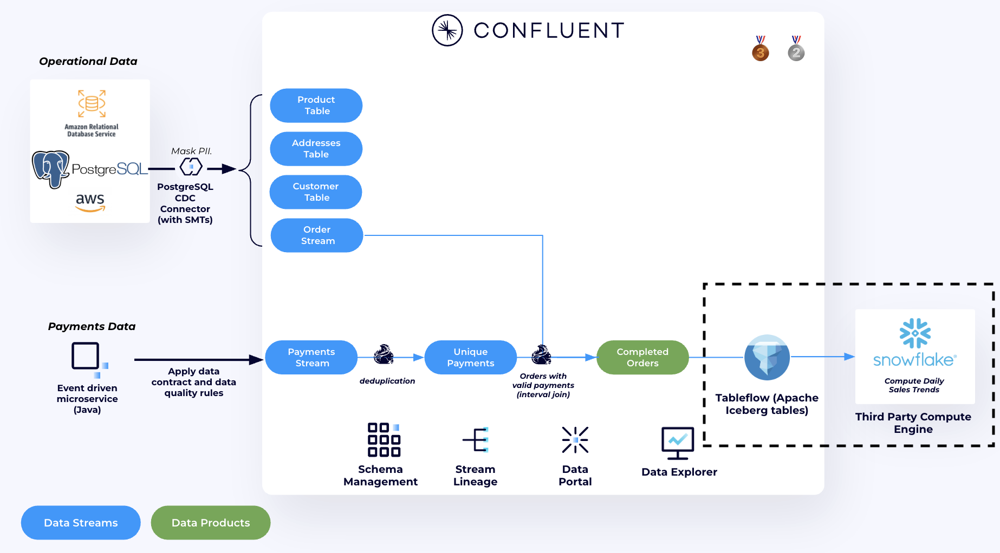
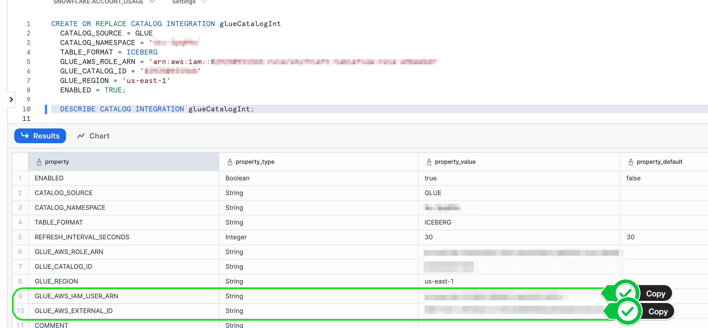
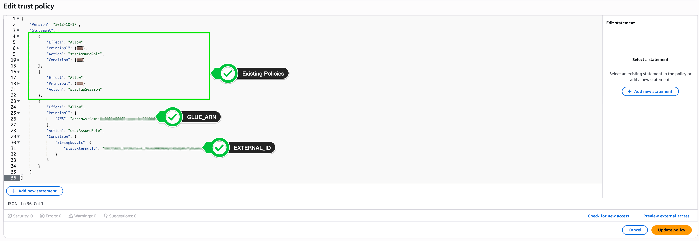
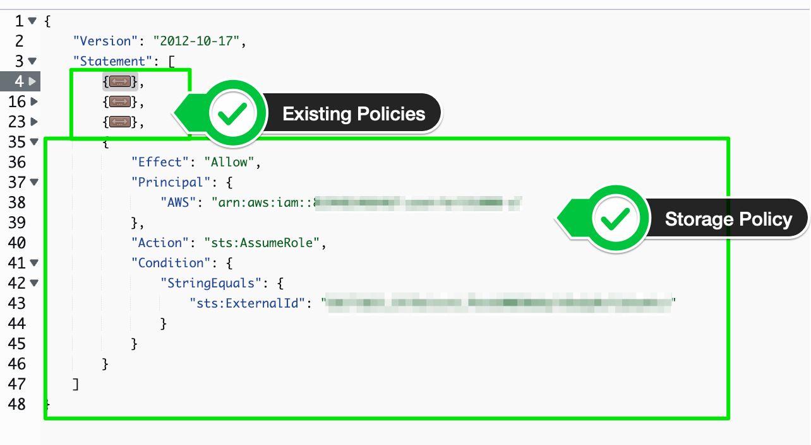
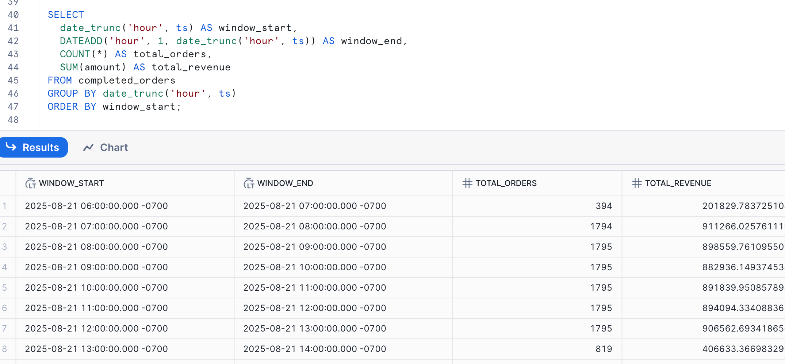

# Accessing Iceberg Tables in Snowflake via Glue Data Catalog

> **Note:** If you have not completed [Lab 2](../LAB2/LAB2-README.md), please do so before proceeding.

In this lab, you will learn how to access your Iceberg tables—created and managed by Confluent Tableflow—in Snowflake using the AWS Glue Data Catalog. This enables your analytics and AI teams to seamlessly query streaming data in Snowflake, leveraging the same open table format used throughout your data platform.




### Important: If you would like to complete Lab 3, you must have enabled Bring your own Storage (Amazon S3) in Lab 2.


---

## Overview

After using Tableflow to convert your Kafka topics into Iceberg tables and syncing metadata to Glue, you can now make these tables available in Snowflake. This is especially useful for organizations that use Snowflake for analytics, reporting, or AI workloads.

The following steps will guide you through configuring Snowflake to read Iceberg tables via the Glue Data Catalog and S3.

---

## Step 1: Configure Snowflake Catalog Integration

1. Open the Snowflake UI and create a new worksheet.
2. Run the following SQL to create a catalog integration with Glue. Replace the placeholders with your actual values:
	```sql
	CREATE CATALOG INTEGRATION glueCatalogInt
	  CATALOG_SOURCE = GLUE
	  CATALOG_NAMESPACE = '<cluster-id>' -- Kafka Cluster ID
	  TABLE_FORMAT = ICEBERG
	  GLUE_AWS_ROLE_ARN = 'arn:aws:iam::<account-id>:role/<role-name>' -- get this from Provider Integration Role in Resource IDs
	  GLUE_CATALOG_ID = '<catalog-id>' -- AWS Account Number
	  GLUE_REGION = '<region>'
	  ENABLED = TRUE;
	```

- You can find the Kafka Cluster ID in Confluent Cloud under Cluster Settings
- You can find the Glue AWS Role ARN under the `terraform output resource-ids` output we used for Provider Integration (We will reuse the same role)
- The Glue Catalog ID will be the same as your AWS account ID
- Make sure to change the Glue Region to match the region you selected

3. Verify the integration:
	```sql
	DESCRIBE CATALOG INTEGRATION glueCatalogInt;
	```
4. The Output of the Describe Command will have important info we need to save off to the clipboard:
    - GLUE_AWS_IAM_USER_ARN
    - GLUE_AWS_EXTERNAL_ID

Copy the values for both of these so we can modify your IAM Role to allow Snowflake to access the same resources.



5. Navigate to your AWS IAM Role (found in `terraform output resource-ids` command) by searching for IAM in the AWS management Console and clicking on Roles. Then search for your role name and select it.
6. Under the Role page, click on the `Trust Relationships` tab and click **Edit Trust Policy**.
7. There will already be some policy entries there, but after the last `}` in the policy, add the following, filling in the placeholders that we identified in the above output:

    ```json
            {
                "Effect": "Allow",
                "Principal": {
                    "AWS": "<<GLUE_AWS_IAM_USER_ARN>>"
                },
                "Action": "sts:AssumeRole",
                "Condition": {
                    "StringEquals": {
                        "sts:ExternalId": "<<GLUE_AWS_EXTERNAL_ID>>"
                    }
                }
            }
    ```
8. Click on Update Policy.

At the end, your policy page should look something like this:




---

## Step 2: Create an External Volume for Iceberg Data

1. Create an external volume in Snowflake that points to your S3 bucket:
	```sql
	CREATE OR REPLACE EXTERNAL VOLUME iceberg_external_volume
	STORAGE_LOCATIONS = (
	  (
		 NAME = 'my-iceberg-external-volume'
		 STORAGE_PROVIDER = 'S3'
		 STORAGE_BASE_URL = 's3://<your-s3-bucket>'
		 STORAGE_AWS_ROLE_ARN = '<<ROLE-FROM-STEP-1>>'
		 STORAGE_AWS_EXTERNAL_ID = '<<EXTERNAL-ID-FROM-STEP-1>>'
	  )
	);
	```


2. Verify the external volume:
	```sql
	DESC EXTERNAL VOLUME iceberg_external_volume;
	```


4. Just like in Step 1, we will need to update the trust policy again with these values. 

5. Navigate back to the IAM role from the previous step and **Open the Trust Relationships** tab, click **Edit Trust Policy**

6. From here, we will add another entry into our trust policies that should look like this:
```json
        {
            "Effect": "Allow",
            "Principal": {
                "AWS": "<<STORAGE_AWS_IAM_USER_ARN>>"
            },
            "Action": "sts:AssumeRole",
            "Condition": {
                "StringEquals": {
                    "sts:ExternalId": "<<STORAGE_AWS_EXTERNAL_ID>>"
                }
            }
        }
```

Filling in the placeholders from before. Your final trust policy should resemble this:




3. Optionally, test the connection:
	```sql
	SELECT SYSTEM$VERIFY_EXTERNAL_VOLUME('iceberg_external_volume');
	```

You should see a note with `{success: true}` signifying the connection is working.

---

## Step 3: Create Iceberg Tables in Snowflake

1. Register your Iceberg table for completed orders in Snowflake using the Glue catalog and external volume. Replace the placeholders with your actual table names:
	```sql
	CREATE OR REPLACE ICEBERG TABLE completed_orders
	  EXTERNAL_VOLUME = 'iceberg_external_volume'
	  CATALOG = 'glueCatalogInt'
	  CATALOG_TABLE_NAME = "completed_orders";

	```

---

## Step 4: Query Your Data

1. Query your Iceberg tables directly in Snowflake:
    ```sql
    SELECT * FROM completed_orders LIMIT 100;
    ```

2. We can also run a similar query to Lab 2 in Snowflake:
    ```sql
    SELECT
    date_trunc('hour', ts) AS window_start,
    DATEADD('hour', 1, date_trunc('hour', ts)) AS window_end,
    COUNT(*) AS total_orders,
    SUM(amount) AS total_revenue
    FROM completed_orders
    GROUP BY date_trunc('hour', ts)
    ORDER BY window_start;
    ```




Congratulations, you have now completed Lab 3!

---


**Next topic:** [Cleanup](../README.md#clean-up)  
**Previous topic:** [Lab 2 - Daily Sales Trends](../LAB2/LAB2-README.md)