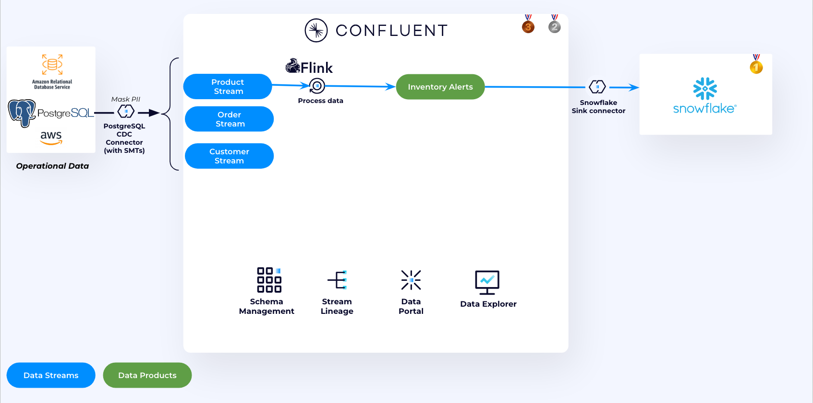
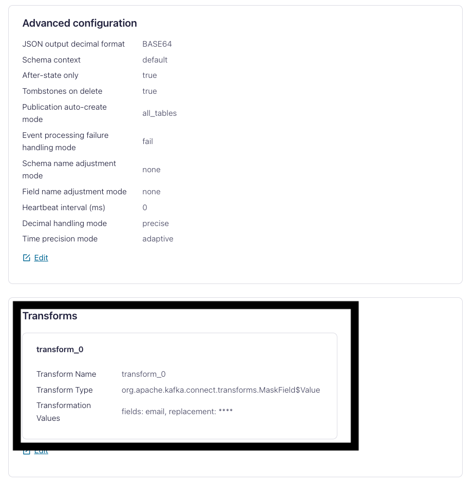
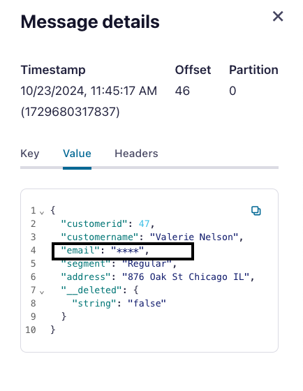
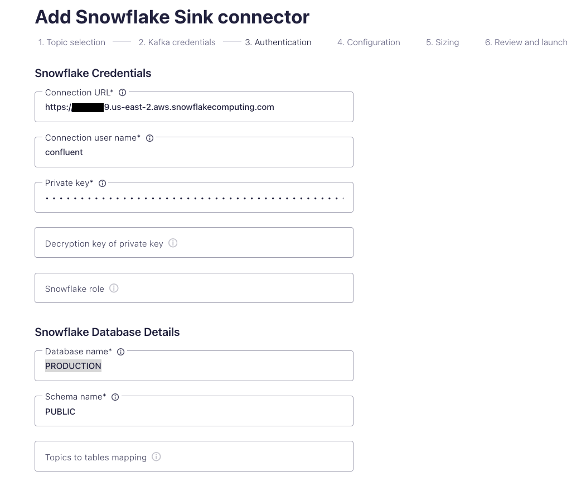
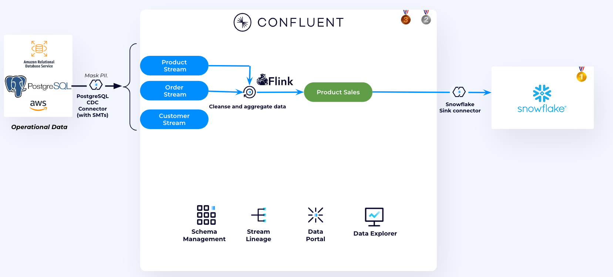
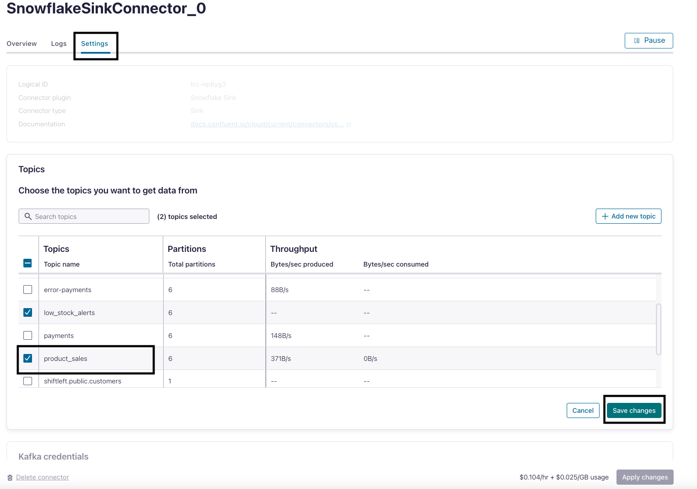
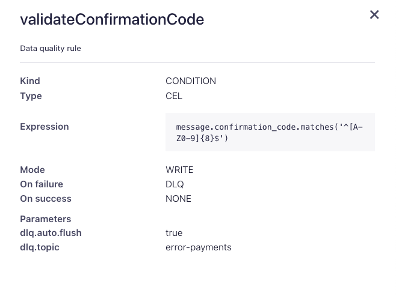
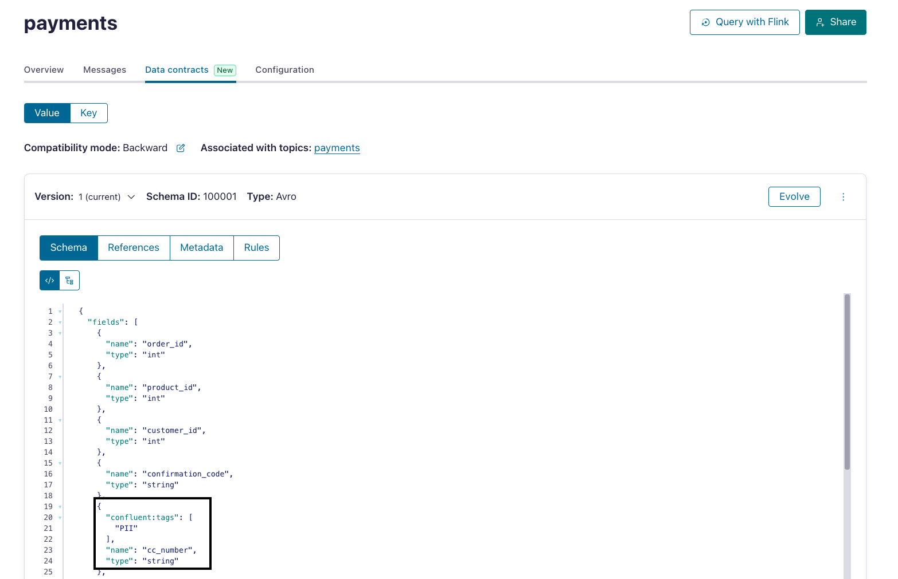
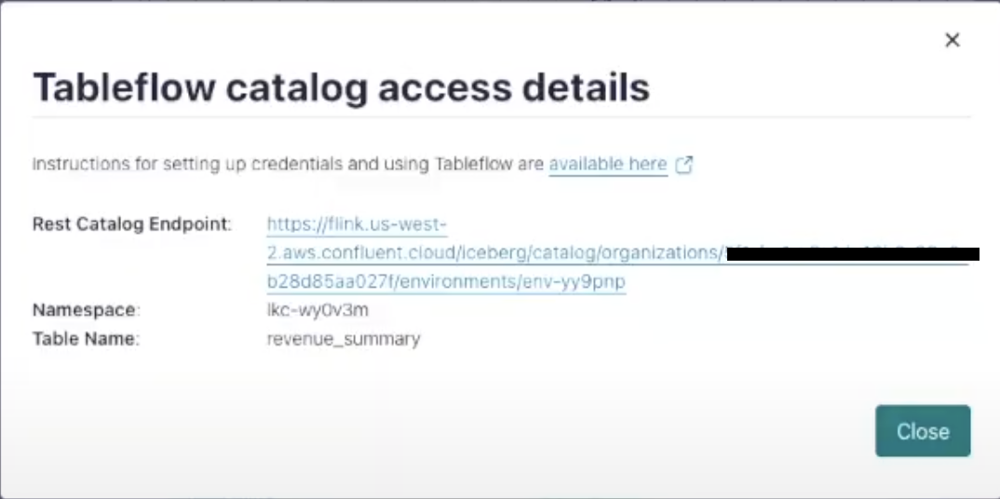

#  Online Retailer Stream Processing Demo using Confluent for Apache Flink

This repository showcases a demo for an online retailer that leverages Confluent Cloud to process sales orders in real-time, compute sales trends, and pre-process data for advanced analytics in Amazon Athena and Snowflake. 

It shows harness the power of a Data Streaming Platform (DSP) to clean and govern data at the time it is created, and deliver fresh trustworthy data to your data warehouse and data lake to maximize the ROI of your Snowflake

We use Terraform to deploy all the necessary resources. The script deploys the following:

1. Confluent Cloud Infrastructure components:
   1. Environment
   2. Cluster
   3. Topics and Schemas
   4. RBAC role-bindings
   5. Debezium CDC Connector and Data Qaulity Rules.
2. AWS Infrastructure components:
   1. Amazon RDS for PostgreSQL Database - holds information about Product, Orders and Customers
   2. AWS KMS Semmetric key - used for Client Side Field Level Encryption
   3. Two Amazon ECS Services
      * DB Feeder to populate Postgres DB
      * Payments Java Application
3. Snowflake Infrastructure components:
   1. Database and Schema
   2. User with 2048 Public and Private key and the associated Role

```bash
├── assets                                <-- Directory that holds demo assests
│   ├── usecase1.png                      <-- Architecture Diagram for use case 1
│   ├── usecase2.png                      <-- Architecture Diagram for use case 2
│   ├── usecase3.png                      <-- Architecture Diagram for use case 3
└── Code                                  <-- Directory that holds demo code and dockerfile
│   ├── payments-app                      <-- Payments App code and dockerfile
│   ├── postgres-data-feeder              <-- DB Feeder code and dockerfile
└── terraform                             <-- Demo terraform script and artifacts
│   ├── aws.tf                            <-- Terraform for AWS resources
│   ├── confluent.tf                      <-- Terraform for Confluent resources
│   ├── snowflake.tf                      <-- Terraform for Snowflake resources
│   ├── apps.tf                           <-- Terraform for the 2 AWS ECS Services (payments and DB feeder) 
│   ├── outputs.tf                        <-- Terraform output file
│   ├── providors.tf                      <-- Terraform providors file
│   ├── variables.tf                      <-- Terraform variables file
│   ├── terraform.tfvars                  <-- UPDATE THIS FILE TO DEFINE YOUR VARIABLES
│   ├── schemas                           <-- Directory that holds payments topic avro schema
└── README.md
```

## Demo Video

This is a [video](https://www.confluent.io/resources/demo/shift-left-dsp-demo/) showcases how to run the demo. To deploy the demo follow this repo.


## General Requirements

* **Confluent Cloud API Keys** - [Cloud API Keys](https://docs.confluent.io/cloud/current/security/authenticate/workload-identities/service-accounts/api-keys/overview.html#resource-scopes) with Organisation Admin permissions are needed to deploy the necessary Confluent resources.
* **Terraform (v1.9.5+)** - The demo resources is automatically created using [Terraform](https://www.terraform.io). Besides having Terraform installed locally, will need to provide your cloud provider credentials so Terraform can create and manage the resources for you.
* **AWS account** - This demo runs on AWS
* **Snowflake Account** -  Sign-up to Snowflake [here](https://signup.snowflake.com/).
* **AWS CLI** - Terraform script uses AWS CLI to manage AWS resources
* **Docker** - Make sure is Docker installed locally. If not installed, follow [this](https://docs.docker.com/desktop/)
* **Unix machine** - The Terraform script requires a Unix environment. If you're using a Windows machine, consider deploying an EC2 instance with CentOS and run the deployment steps from there.

## Setup

> Estimated time: 25 mins

1. Clone the repo onto your local development machine using `git clone https://github.com/confluentinc/online-retailer-flink-demo`.
2. Change directory to demo repository and terraform directory.

```
cd online-retailer-flink-demo/terraform

```
3. Update the ```terraform.tfvars```:

4. Use Terraform CLI to deploy solution

```
terraform init

terraform plan

terraform apply --auto-approve

```

>Note: The terraform script will take around 20 minutes to deploy.

## Demo
> Estimated time: 20 minutes


In this demo we will implement 3 use cases:
1. Use case 1 - [Low inventory stock alerts](#low-inventory-stock-alerts): Use Confluent Cloud for Apache Flink to compute low inventory stocks and use Snowflake Sink Connector to sink the data to Snowflake
2. Use case 2 - [Product Sales Aggregation](#product-sales-aggregation): Use Confluent Cloud for Apache Flink to clean and aggrgate Product Sales Data and sink the results to Snowflake
3. Use case 3 - [Daily Sales Trends](#daily-sales-trends): Use Confluent Cloud for Apache Flink for Payment Validation and compute daily sales trends. The results are stored in a topic that has Tableflow enabled - which materializes the topic as Iceberg data. We then use Amazon Athena for further Analysis.

### Low inventory stock alerts




1. We are using Confluent Cloud CDC Debezium connector to source data from the Postgres DB to Confluent Cloud. Navigate to [Connectors UI](https://confluent.cloud/go/connectors) in Confluent Cloud and select the demo environment and cluster. They both have the same prefix, by defualt they start with ```shiftleft```.
2. Click on the Connector then **Settings**. Under transforms you will find the SMT used to mask PII information before sending the data to Confluent Cloud. This SMT replaces to email field value with ```****```.
   
3. Make sure that the SMT is working by showing the output events in the Customer Topic.
   
   

4. Navigate to [Flink UI](https://confluent.cloud/go/flink) in Confluent Cloud and select the demo environment
5. Click on **Open SQL Workspace**.
6. On the top right corner of your workspace select the cluster as your database.
7. You will use the code editor to query existing Flink tables (Kafka topics) and to write new queries.
8. In Confluent Cloud, every topic is accessible as an Apache Flink table and every Apache Flink table is available as a topic. Therefore we can start querying Apache Flink SQL. Run the below statement to show all tables in the cluster.
   ```
   SHOW TABLES;
   ```
9.  Create ```low_stock_alerts``` table.
   ```
   CREATE TABLE low_stock_alerts (
    productid INT,
    productname STRING,
    stock INT,
    alert_message STRING
   ); 
   ```
10. Run the Apache Flink SQL Statement below to find out low quantity stocks
   ```
    SELECT
        productid,
        productname,
        stock,
        'Low stock: Quantity below 50!' AS alert_message
    FROM
        `shiftleft.public.products`
    WHERE
        stock < 50;

   ```
11. The output will run continously run until terminated, to materialiaze the data into the output topic we need to use ``` INSERT INTO SELECT ```.
   ```
   INSERT INTO low_stock_alerts
    SELECT
        productid,
        productname,
        stock,
        'Low stock: Quantity below 50!' AS alert_message
    FROM
        `shiftleft.public.products`
    WHERE
        stock < 50;

   ```

12. The output table is a Kafka topic with an avro schema that holds stocks that are below 50 in the inventory. 
13. Now let's ingest data from ```low_stock_alerts``` topic to Snowflake using the Confluent Cloud Snowflake Sink Connector. In the [Connectors UI](https://confluent.cloud/go/connectors), add a new Snowflake Sink Connector.
14.  Choose ```low_stock_alerts``` topic and click **Continue**
15.  Enter Confluent Cluster credentials, you can use API Keys generated by Terraform
     1.   In CMD run ```terraform output resource-ids``` you will find the API Keys in a section that looks like this:
        ```
        Service Accounts and their Kafka API Keys (API Keys inherit the permissions granted to the owner):
            shiftleft-app-manager-d217a8e3:                     sa-*****
            shiftleft-app-manager-d217a8e3's Kafka API Key:     "SYAKE*****"
            shiftleft-app-manager-d217a8e3's Kafka API Secret:  "rn7Y392xM49c******"
        ```
16. Enter Snowflake details
    1.  **Connection URL**: Get it under Admin --> Accounts in (Snowflake Console)[https://app.snowflake.com/]. It should look like this: *https://<snowflake_locator>.<cloud_region>.aws.snowflakecomputing.com*
    2.  **Connection username**: ```confluent```
    3.  **Private Key**: In CMD run ```terraform output resource-ids``` and copy the PrivateKey from there.
    4.  **Snowflake role**: `ACCOUNTADMIN`
    5.  **Database name**: ```PRODUCTION```
    6.  **Schema name**: ```PUBLIC```
    

    >**NOTE: It's not recommended to use ACCOUNTADMIN role for data ingestion. We are using it here for demo purposes only.**


17. Choose:
    * ```AVRO``` as **Input Kafka record value format**.
    *  ```SNOWPIPE_STREMAING``` as **Snowflake Connection**.\
    *  Set **Enable Schemitization** to `True`. Doing this will allow the connector to infer schema from Schema registry and write the data to Snowflake with the correct schema. 
    *  Then follow the the wizard to create the connector.
  
    > Note: The connector will take less than a minute to run

18. In Snowflake UI, go to Worksheets and run the follwing SQL Statement to preview the new table.
    ```
    SELECT * FROM PRODUCTION.PUBLIC.LOW_STOCK_ALERTS
    ```
    

### Product Sales Aggregation



In this usecase we will create a new Data Product ```Product_Sales``` by joining, cleaning and aggregating the ```PRODUCT``` and ```ORDERS``` data streams.

1. Back in the SQL Workspace**, Lets join three tables—`products`, `order_items`, and `orders`—to generate a detailed view of orders and their associated products. The query below selects key fields from these tables to provide insights into each order's contents, including the product details, brand, quantity purchased, and the total amount for each order item. The query applies filters to ensure only valid products with non-empty names and positive prices are included in the result set.

    This analysis is useful for understanding product sales trends, calculating revenue, and generating reports on order compositions.

   ```
   SELECT 
        o.orderid,
        p.productid,
        oi.orderitemid,
        p.brand,
        p.productname,
        p.price, 
        oi.quantity, 
        oi.quantity*p.price as total_amount 
    FROM 
        `postgre_cdc_feed.public.products` p
    JOIN 
        `postgre_cdc_feed.public.order_items` oi ON p.productid = oi.productid
    JOIN 
        `postgre_cdc_feed.public.orders` o ON oi.orderid = o.orderid
    WHERE p.productname <> '' AND p.price > 0; 
    ```

2. Create a new Apache Flink table ```Product_Sales``` to represent the new data product.
   
   ```
   CREATE TABLE product_sales (
        orderid INT,
        productid INT,
        orderitemid INT,
        brand STRING,
        productname STRING,
        price DECIMAL(10, 2),
        quantity INT,
        total_amount DECIMAL(10, 2)
    );
   ```

3. To continously add clean and aggragretgated data to the `Product_Sales` table run this ```INSERT INTO STATEMENT``` to continously ingest data from the previous query to the new table.
   ```
    INSERT INTO product_sales 
    SELECT 
        o.orderid,
        p.productid,
        oi.orderitemid,
        p.brand,
        p.productname,
        p.price, 
        oi.quantity, 
        oi.quantity*p.price as total_amount 
        
    FROM 
        `shiftleft.public.products` p
    JOIN 
        `shiftleft.public.order_items` oi ON p.productid = oi.productid
    JOIN 
        `shiftleft.public.orders` o ON oi.orderid = o.orderid
    WHERE p.productname <> '' AND p.price > 0; 

   ```

4. Now let's sink the new data product to Snowflake. Update the same Connector and add the new topic `product_sales`.
   
   

5. In Snowflake UI, go to Worksheets and run the follwing SQL Statement to preview the new table.
    ```
    SELECT * FROM PRODUCTION.PUBLIC.PRODUCT_SALES
    ```
     

### Daily Sales Trends


In this use case, we leverage Confluent Cloud with Apache Flink to validate payments and analyze daily sales trends. The resulting data product will be stored in a topic with [Tableflow](https://www.confluent.io/product/tableflow/) enabled.

Tableflow simplifies the process of getting data from Confluent into a data lake, warehouse, or analytics engine. It allows users to convert Kafka topics and their schemas into Apache Iceberg tables with ZERO effort, reducing the engineering time, compute resources, and cost associated with traditional data pipelines. This is achieved by leveraging Confluent's Kora Storage Layer and a new metadata materializer that works with Confluent Schema Registry to handle schema mapping and evolution.

But before doing this, let's make sure that the data is reliable and protected first.

#### **Data Contracts in Confluent Cloud**

Analytics teams are focused on general sales trends, so they don't need access to PII. Instead of relying on central teams to write ETL scripts for data encryption and quality, we’re shifting this process left. Central governance teams set data protection and quality rules, which are pushed to the client for enforcement— the beauty of this is that there is not need for code changes on the client side - **IT JUST WORKS**.

##### **Using Confluent Cloud Data Quality Rules**

We want to make sure that any data produced adheres to a specific format. In our case, we want to make sure that any payment event generated needs to have a valide `Confimation Code`. This check is done by using [Data Quality Rules](https://docs.confluent.io/cloud/current/sr/fundamentals/data-contracts.html#data-quality-rules), these rules are set in Confluent Schema registry, and pushed to the clients, where they are enforced. No need to change any code.

The rules were already created by Terraform, there is no need to do anything here except validate that it is working.

1. In the [`payments`](https://confluent.cloud/go/topics) Topic UI, select **Data Contracts**. Under **Rules** notice that there is a rule already created.
   
   The rule basically says that `confirmation_code` field value should follow this regex expression `^[A-Z0-9]{8}$`. Any event that doesnt match, will be sent to a dead letter queue topic named `error-payments`.

   

2. To validate that it is working go to the DLQ topic and inspect the message headers there.
   


##### **Data Protection using Confluent Cloud Client Side Field Level Encryption**

>**REMOVE THIS BEFORE MOVING TO A PUBLIC REPO** 
>
>NOTE: Currently Flink and Tableflow do not support topics that contain encrypted fields in them. **DO NOT DEMO THIS SECTION, UNTIL FLINK ADDS PASSTHROUGH SUPPORT TO TOPICS WITH ENCRYPTED FIELDS - ETA Q4 2024**

[Client Side Field Level Encryption(CSFLE)](https://docs.confluent.io/cloud/current/security/encrypt/csfle/client-side.html) in Confluent Cloud works by setting the rules in Confluent Schema registry, these rules are then pushed to the clients, where they are enforced. The symmetric key is created in providor and the client should have necessary permissi the providor and the client should have permission to use the key to encrypt the data.

1. In the `payments` topic we notice that, the topic contains credit card information in unencrypted form.
    
2. This should be encrypted, the Symmetric Key was already created by the Terraform in AWS KMS. The key ARN was also immported to Confluent by Terraform. We just need to create the rule in Confluent
   
   In the [`payments`](    
   https://confluent.cloud/go/topics) Topic UI, select **Data Contracts**. Notice that the field is already tagged as `PII`.
    

3. Click **Evovle**, then **Rules** and then **+ Add rules** button. Configure as the following:
   * Category: Data Encryption Rule
   * Rule name: `Encrypt_PII`
   * Encrypt fields with: `PII`
   * using: The key added by Terraform
  
    Then click **Add** and **Save**

    Here what we basically did is that we said, ecrypt any field in this topic that is tagged as PII

  
4. Restart the ECS Service for the changes to take effect immediately. In AWS Console, go to **Elastic Container Service**, select the cluster, click on the `payment-app-service`, and then **Tasks** tab. Select the task and stop it.
   After a few minutes a new Taksk will start again

5. Go back to the `payments` Topic UI, you can see that the Credit number is now encrypted.

    


#### **Analyzing Daily Sales Trends using Confluent Cloud for Apache Flink**

1. Back in the SQL Workspace**, we'll create a new table that will hold all completed orders.
   ```
   CREATE TABLE completed_orders (
        order_id INT,
        customerid INT,
        customername STRING,
        address STRING,
        amount DOUBLE,
        confirmation_code STRING,
        ts TIMESTAMP_LTZ(3)
    ); 
   ```
2. Next, we will enhance the payment data by joining it with customer and order information. This will provide a complete view of each transaction:
   ```
   INSERT INTO completed_orders
    SELECT 
        pymt.order_id,
        cust.customerid,
        cust.customername,
        cust.address,
        pymt.amount, 
        pymt.confirmation_code, 
        pymt.ts
        
    FROM 
        payments pymt
    JOIN 
        `shiftleft.public.customers` cust ON pymt.customer_id = cust.customerid
    JOIN 
        `shiftleft.public.orders` ord ON pymt.order_id = ord.orderid
   ```

3. After enriching the data, the next step is to create a revenue_summary table. This table will hold aggregated revenue data, helping to track and visualize sales over specific time intervals:
   ```
   CREATE TABLE revenue_summary (
        window_start TIMESTAMP(3),
        window_end TIMESTAMP(3),
        total_revenue DECIMAL(10, 2)
    );

   ```

4. Finally, we calculate the total revenue within fixed 5-second windows by summing the amount from completed_orders. This is done using the TUMBLE function, which groups data into 5-second intervals, providing a clear view of sales trends over time:
   >Note: The 5-second window is done for demo puposes you can change to the interval to 1 HOUR.

    ```
    INSERT INTO revenue_summary
    SELECT 
        window_start, 
        window_end, 
        SUM(amount) AS total_revenue
    FROM 
        TABLE(
            TUMBLE(TABLE completed_orders, DESCRIPTOR($rowtime), INTERVAL '5' SECONDS)
        )
    GROUP BY 
        window_start, 
        window_end;

    ```

5. Preview the final output:
    ```
     SELECT * FROM revenue_summary
    ```

#### **Data Lake Integration using Confluent Cloud Tableflow and Amazon Athena**

>**REMOVE THIS BEFORE MOVING TO A PUBLIC REPO** 
>
>NOTE: To complete this part Tableflow needs to be enabled on the cluster. Please reachout to the Tableflow PM to enable it on the cluster created by this Terraform script.

This data can be made available seamlessly to your Data lake query engines using Confluent Cloud Tableflow feature. When Tableflow is enabled on the cluster, all topics in the cluster are materialized as Iceberg Tables and are available for any Query engine. In this demo, we use Amazon Athena, you can use any Engine that supports Iceberg Rest Catalog.

1. First get the Tableflow access details from the Data Portal UI.
   

2. In Amazon Athena UI, create a new Spark Notebook and configure it as follows:
   

3. `revenue_summary` data can now be queried in Athena. In the notebook run this query to SHOW available tables:
   ```
   %sql
   SHOW TABLES in `<Confluent_Cluster_ID>`
   ```

   Next preview `reveue_summary` table:

   ```
   %%sql
   SELECT * FROM `<Confluent_Cluster_ID>`.`revenue_summary`;
   ```

   That's it we are now able to query the data in Athena.

## Clean-up
Once you are finished with this demo, remember to destroy the resources you created, to avoid incurring in charges. You can always spin it up again anytime you want.

To destroy all the resources created run the command below from the ```terraform``` directory:

```
./demo-destroy.sh

```
> **Note: If you run terraform destroy instead of the provided shell script, the ECR repositories in AWS will not be deleted.**