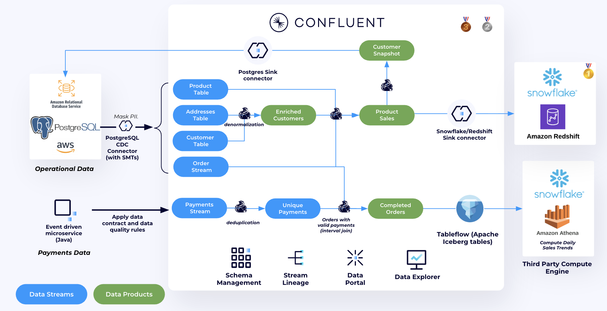

# Online Retailer Stream Processing Demo using Confluent for Apache Flink

This repository showcases a demo for an online retailer that leverages Confluent Cloud to process sales orders in real-time, compute sales trends, and pre-process data for advanced analytics in Amazon Athena and a datawarehouse of your choice (Snowflake or Amazon Redshift).

It shows how to harness the power of a Data Streaming Platform (DSP) to clean and govern data at the time it is created, and deliver fresh trustworthy data to your data warehouse and data lake to maximize the ROI.

This demo showcases how an online retailer can leverage Confluent to implement real-time analytics across three critical use cases: ***Customer360***, ***Product Sales Analysis*** and ***Daily Sales Trend Analysis***. The solution demonstrates the power of real-time data streaming to enhance operational efficiency and decision-making. Below is the high-level architecture diagram:



You can choose to deploy the demo with with either Snowflake or Amazon Redshift. We use Terraform to deploy all the necessary resources. The script deploys the following:

1. Confluent Cloud Infrastructure components:
   1. Environment
   2. Cluster
   3. Topics and Schemas
   4. RBAC role-bindings
   5. Debezium CDC Connector and Data Quality Rules.
2. AWS Infrastructure components:
   1. Redshift Cluster
   > Note: only if Amazon Redshift is selected as a data warehouse
   2. Amazon RDS for PostgreSQL Database - holds information about Product, Orders and Customers
   3. AWS KMS Symmetric key - used for Client Side Field Level Encryption
   4. Two Amazon ECS Services
      * DB Feeder to populate Postgres DB
      * Payments Java Application
3. Snowflake Infrastructure components:
   > Note: only if Snowflake is selected as a data warehouse
   1. Database and Schema
   2. User with 2048 Public and Private key and the associated Role

```sh
├── build                                 <-- Directory that holds Docker and build files
│   ├── Dockerfile.workshop               <-- Workshop container definition
│   ├── docker-compose.*.yml              <-- Docker compose files for different platforms
│   └── env.template                      <-- Environment variables template
├── code                                  <-- Directory that holds demo code
│   ├── payments-app                      <-- Payments App code and dockerfile
│   └── postgresql-data-feeder            <-- DB Feeder code and dockerfile
├── terraform                             <-- Directory that holds terraform scripts
├── LAB1                                  <-- Directory that holds LAB1 instructions and screenshots
├── LAB2                                  <-- Directory that holds LAB2 instructions and screenshots
├── run-workshop.sh                       <-- Workshop entry script for Mac/Linux
├── run-workshop.bat                      <-- Workshop entry script for Windows
└── README.md
```

## Demo Video

This [video](https://www.confluent.io/resources/demo/shift-left-dsp-demo/) showcases how to run the demo. To deploy the demo follow this repo.

## General Requirements

* **Confluent Cloud API Keys** - [Cloud resource management API Keys](https://docs.confluent.io/cloud/current/security/authenticate/workload-identities/service-accounts/api-keys/overview.html#resource-scopes) with `Organisation Admin` permissions are needed by Terraform to deploy the necessary Confluent resources.
* **AWS account** - This demo runs on AWS
* **Snowflake Account** (optional) -  Sign-up to Snowflake [here](https://signup.snowflake.com/).
* **Docker Desktop** - Make sure Docker is installed locally. If not installed, follow [this](https://docs.docker.com/desktop/)

**The easiest way to run this workshop is using our pre-built Docker environment** that includes all required tools and works on **any platform** (Windows, Mac, Linux).

## Setup

> [!NOTE]
> **Estimated time: 25 mins**

### Step 1: Clone the Repository

```sh
git clone https://github.com/confluentinc/online-retailer-flink-demo.git
cd online-retailer-flink-demo
```

### Step 2: Configure Terraform

#### Add Email and Confluent API Values

1. Replace email placeholder value with your preferred email account

   ```tf
   email = "<YOUR_EMAIL>"
   ```

2. Replace these placeholders with your Confluent Cloud API Key and Secret:

   ```tf
   confluent_cloud_api_key = "<CONFLUENT_CLOUD_API_KEY>"
   confluent_cloud_api_secret = "<CONFLUENT_CLOUD_API_SECRET>"
   ```

#### Choose Your Data Warehouse

Decide whether to deploy the demo with Redshift or Snowflake, then follow the corresponding instructions below.

<details>
<summary>Click to expand Amazon Redshift instructions</summary>

1. Update `terraform.tfvars` file by setting the `data_warehouse` variable to `"redshift"`. Remove any Snowflake-related variables from the file.
   > Note: The `data_warehouse` variable only accepts one of two values: `"redshift"` or `"snowflake"`.

2. Run the following script to provision demo infrastructure

</details>

<details>
<summary>Click to expand Snowflake instructions</summary>

1. Update the `terraform.tfvars` file by setting the `data_warehouse` variable to `"snowflake"`.
      > Note: The `data_warehouse` variable only accepts one of two values: `"redshift"` or `"snowflake"`.

2. Fill out Snowflake variables:

      ```tf
      # The following three variables are only needed if data_warehouse is set to "snowflake"
      snowflake_account  = "<SNOWFLAKE_ACCOUNT_NUMBER>" #GET THIS FROM SNOWFLAKE Home Page --> Admin --> Accounts --> Copy the first part of the URL before .snowflake, it should look like this <organization_id-account_name>
      snowflake_username = "<SNOWFLAKE_USERNAME>"
      snowflake_password = "<SNOWFLAKE_PASSWORD>"
      ```

3. Update the `providers.tf` file by uncommenting the following blocks at the end of the file:

   ```tf
   provider "snowflake" {
      alias = "snowflake"
      account  = var.data_warehouse == "snowflake" ? var.snowflake_account : "na"
      user     = var.data_warehouse == "snowflake" ? var.snowflake_username : "na"
      password = var.data_warehouse == "snowflake" ? var.snowflake_password : "na"
   }

   module "snowflake" {
      source = "./modules/snowflake"
      count  = var.data_warehouse == "snowflake" ? 1 : 0  # Only deploy module if Snowflake is selected
      providers = {
         snowflake = snowflake.snowflake
      }
      # Pass the variables required for Snowflake resources
      snowflake_account  = var.snowflake_account
      snowflake_username = var.snowflake_username
      snowflake_password = var.snowflake_password
      public_key_no_headers = local.public_key_no_headers
   }
   ```

</details>

### Step 3: Start Docker Environment

Start the containerized workshop environment for your platform:

**Mac/Linux:**

```sh
./run-workshop.sh
```

**Windows:**

```sh
run-workshop.bat
```

This will:

* ✅ Build a container with all required tools (Terraform, AWS CLI, Confluent CLI, PostgreSQL Client)
* ✅ Mount your workshop files and existing AWS credentials
* ✅ Start an interactive shell inside the container
* ✅ Work identically across Windows, Mac, and Linux

> [!TIP]
> 📖 **Build File Organization**
>
> Build files are located in the `build/` directory.

### Step 3: Configure AWS (inside container)

Inside the container, configure your AWS credentials:

1. First test to see if your AWS credentials are already pulled in from your host machine

```sh
aws sts get-caller-identity
```

2. Run this command if you need to configure your AWS credentials

```sh
aws configure
```

### Step 4: Spin up Cloud Resources with Terraform

1. Navigate to the terraform directory in your docker container

```sh
cd terraform
```

2. Initialize, validate, and apply your terraform script

```sh
./demo-provision.sh
```

> [!NOTE]
> **20-Minute Build Time**
>
> It may take up to 20 minutes for terraform to spin up all of the required cloud resources.

## Demo

> [!NOTE]
> **Estimated time: 20 minutes**

There are two options for demonstration. One is to walk through the different technical use case demonstrations and the other is to walk through an end-to-end demonstration of "shifting left" which takes a more integrated approach. For the shiftleft approach go [HERE](./Shiftleft/README.md).

Otherwise, we will now build **three discrete use case demonstrations spread across two labs**. Follow the individual labs listed below:

* [**LAB1 – Product Sales and Customer360 Aggregation**](./LAB1/LAB1-README.md):
Use Confluent Cloud for Apache Flink to clean and aggregate product sales data, then sink the results to Snowflake or Redshift. Additionally, create a derived data product for a customer snapshot and send the result back to an operational database.

* [**LAB2 – Daily Sales Trends**](./LAB2/LAB2-README.md):
Use Confluent Cloud for Apache Flink for payment validation and to compute daily sales trends. The results are stored in a topic with Tableflow enabled, which materializes the topic as Iceberg data. We then use Amazon Athena for further analysis.

## Topics

**➡️ Next topic:** [LAB1: Product Sales and Customer360 Aggregation](./LAB1/LAB1-README.md)

## Clean-up

Once you are finished with this demo, remember to destroy the resources you created, to avoid incurring charges. You can always spin it up again anytime you want.

Before tearing down the infrastructure, delete the Postgres Sink and Snowflake/Redshift connectors, as they were created outside of Terraform and won't be automatically removed:
Run the below for all connectors created outside terraform:

```sh
confluent connect cluster delete <CONNECTOR_ID> --cluster <CLUSTER_ID> --environment <ENVIRONMENT_ID> --force
```

To destroy all the resources created run the command below from the `terraform` directory:

```sh
./demo-destroy.sh
```

> [!WARNING]
> **Run `demo-destroy.sh` Script**
>
> If you run terraform destroy instead of the provided shell script, the ECR repositories in AWS **will not** be deleted.
