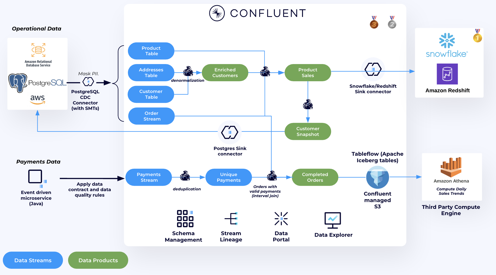

#  Online Retailer Stream Processing Demo using Confluent for Apache Flink

This repository showcases a demo for an online retailer that leverages Confluent Cloud to process sales orders in real-time, compute sales trends, and pre-process data for advanced analytics in Amazon Athena and a datawarehouse of your choice (Snowflake or Amazon Redshift).

It shows how to harness the power of a Data Streaming Platform (DSP) to clean and govern data at the time it is created, and deliver fresh trustworthy data to your data warehouse and data lake to maximize the ROI.

This demo showcases how an online retailer can leverage Confluent to implement real-time analytics across three critical use cases: ***Customer360***, ***Product Sales Analysis*** and ***Daily Sales Trend Analysis***. The solution demonstrates the power of real-time data streaming to enhance operational efficiency and decision-making. Below is the high-level architecture diagram:



You can choose to deploy the demo with with either Snowflake or Amazon Redshift. We use Terraform to deploy all the necessary resources. The script deploys the following:


## Demo Video

This [video](https://www.confluent.io/resources/demo/shift-left-dsp-demo/) showcases how to run the demo. To deploy the demo follow this repo.


## General Requirements

* **Confluent Cloud API Keys** - [Cloud resource management API Keys](https://docs.confluent.io/cloud/current/security/authenticate/workload-identities/service-accounts/api-keys/overview.html#resource-scopes) with Organisation Admin permissions are needed by Terraform to deploy the necessary Confluent resources.
* **Terraform (v1.9.5+)** - The demo resources are automatically created using [Terraform](https://www.terraform.io). Provide your cloud provider credentials so Terraform can create and manage resources.
* **AWS account** - This demo runs on AWS
* **Snowflake Account** -  Sign-up to Snowflake [here](https://signup.snowflake.com/).
* **Docker Desktop** - Required. Terraform builds/pushes images and runs DB init via Docker. Install from [Docker Desktop](https://docs.docker.com/desktop/).
* **Confluent CLI** - Used by the generated destroy script to remove items created outside Terraform. Install with `brew install confluent` or the Windows installer.

<details>
<summary>Installing pre-reqs on MAC</summary>
Run the following to install local dependencies on your laptop.

```
brew install git terraform confluent-cli docker
```

Configure AWS credentials (any supported method works; environment variables or shared config/credentials files). If you prefer AWS CLI:

```
aws configure
```

Or export credentials as environment variables (alternative to aws configure):

```
export AWS_ACCESS_KEY_ID="YOUR_KEY_ID"
export AWS_SECRET_ACCESS_KEY="YOUR_SECRET"
export AWS_SESSION_TOKEN="YOUR_SESSION_TOKEN"   # only if using temporary creds
```


</details>

<details>
<summary>Installing pre-reqs on Windows</summary>
Run the following in Windows Terminal or PowerShell (winget required):

```
winget install -e --id Git.Git
winget install -e --id HashiCorp.Terraform
winget install -e --id Docker.DockerDesktop
winget install -e --id Confluentinc.CLI
# Optional:
winget install -e --id Amazon.AWSCLI
```

Configure AWS credentials via AWS CLI:

```
aws configure
```

Or set environment variables in PowerShell (alternative to aws configure):

```
$env:AWS_ACCESS_KEY_ID="YOUR_KEY_ID"
$env:AWS_SECRET_ACCESS_KEY="YOUR_SECRET"
$env:AWS_SESSION_TOKEN="YOUR_SESSION_TOKEN"   # only if using temporary creds
```

</details>
## Setup

> Estimated time: 25 mins

1. Clone the repo: 
   ```
   git clone https://github.com/confluentinc/online-retailer-flink-demo.git
   ```
2. Change directory to demo repository and terraform directory.

   ```
   cd online-retailer-flink-demo/terraform
   ```
3. Decide whether to deploy the demo with Redshift or Snowflake, then follow the corresponding instructions below.
   

<details>
<summary>Click to expand Amazon Redshift instructions</summary>

4. Update the ```terraform.tfvars``` file by setting the ```data_warehouse``` variable to ```"redshift"```. Remove any Snowflake-related variables from the file.
   >Note: The ```data_warehouse``` variable only accepts one of two values: ```"redshift"``` or ```"snowflake"```.
   
5. Run Terraform to provision the demo infrastructure

   ```
   terraform init
   terraform apply --auto-approve
   ```

</details>

<details>
<summary>Click to expand Snowflake instructions</summary>

4. Update the ```terraform.tfvars``` file by setting:
   1. The ```data_warehouse``` variable to ```"snowflake"```.
      >Note: The ```data_warehouse``` variable only accepts one of two values: ```"redshift"``` or ```"snowflake"```.
   2. And Snowflake Variables:
      ```
      snowflake_account="<SNOWFLAKE_ACCOUNT_NUMBER>" #GET THIS FROM SNOWFLAKE Home Page --> Admin --> Accounts --> Copy the first part of the URL before .snowflake, it should look like this <organization_id-account_name>
      snowflake_username="<SNOWFLAKE_USENAME>"
      snowflake_password="<SNOWFLAKE_PASSWORD>"
      ```
   
5. Update the ```providers.tf``` file and Uncomment the following blocks at the end of the file:
   ```
   provider "snowflake" {
   alias = "snowflake"
   account  = var.data_warehouse == "snowflake" ? var.snowflake_account : "na"
   user     = var.data_warehouse == "snowflake" ? var.snowflake_username : "na"
   password = var.data_warehouse == "snowflake" ? var.snowflake_password : "na"
   }

   module "snowflake" {
   source = "./modules/snowflake"
   count  = var.data_warehouse == "snowflake" ? 1 : 0  # Only deploy module if Snowflake is selected
   providers = {
      snowflake = snowflake.snowflake
   }
   # Pass the variables required for Snowflake resources
   snowflake_account  = var.snowflake_account
   snowflake_username = var.snowflake_username
   snowflake_password = var.snowflake_password
   public_key_no_headers = local.public_key_no_headers
   }
   ```
6. Run Terraform to provision the demo infrastructure

   ```
   terraform init
   terraform apply --auto-approve
   ```

</details>


>Note: The terraform script will take around 15 minutes to deploy.

## Demo
> Estimated time: 20 minutes

There are two options for demonstration. One is to walk through the different technical use case demonstrations and the other is to walk through an end-to-end demonstration of "shifting left" which takes a more integrated approach. For the shiftleft approach go [HERE](./Shiftleft/README.md). 

Otherwise, we will now build **three discrete use case demonstrations spread across two labs**. Follow the individual labs listed below:

   - [**LAB1 – Product Sales and Customer360 Aggregation**](./LAB1/LAB1-README.md):  
   Use Confluent Cloud for Apache Flink to clean and aggregate product sales data, then sink the results to Snowflake or Redshift. Additionally, create a derived data product for a customer snapshot and send the result back to an operational database.

   - [**LAB2 – Daily Sales Trends**](./LAB2/LAB2-README.md):  
   Use Confluent Cloud for Apache Flink for payment validation and to compute daily sales trends. The results are stored in a topic with Tableflow enabled, which materializes the topic as Iceberg data. We then use Amazon Athena for further analysis.

   - [**LAB3 - Integration with Snowflake**](./LAB3/LAB3-README.md):
   Use Snowflake to integrate with Amazon S3 using AWS IAM Roles to pull in metadata and data in Snowflake. Perform analysis similar to what was done in Lab 2 with Amazon Athena, only this time via Snowflake and Glue Data Catalog for further analysis.


## Topics

**Next topic:** [LAB1: Product Sales and Customer360 Aggregation](./LAB1/LAB1-README.md)

## Clean-up
Once you are finished with this demo, remember to destroy the resources you created, to avoid incurring charges. You can always spin it up again anytime you want.

Before tearing down the infrastructure, delete the Postgres Sink and Snowflake/Redshift connectors, as they were created outside of Terraform and won't be automatically removed:
Run the below for all connectors created outside terraform:

```
confluent connect cluster delete <CONNECTOR_ID> --cluster <CLUSTER_ID> --environment <ENVIRONMENT_ID> --force
```

To destroy all the resources created run the appropriate script from the ```terraform``` directory:

macOS/Linux:
```
chmod +x ./demo-destroy.sh
./demo-destroy.sh
```

Windows (CMD):
```
demo-destroy.bat
```
