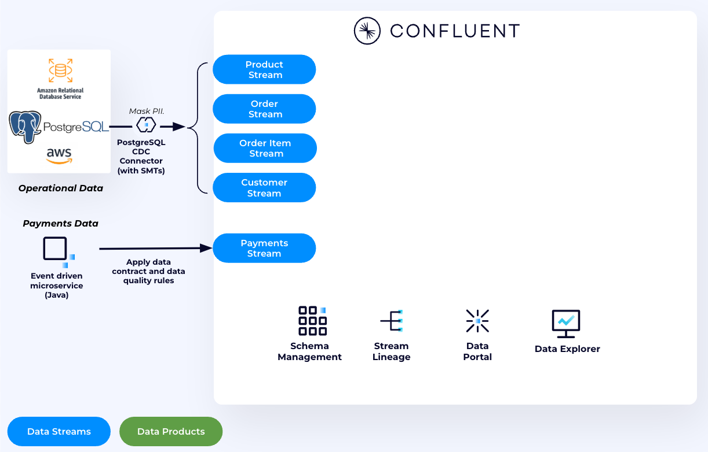
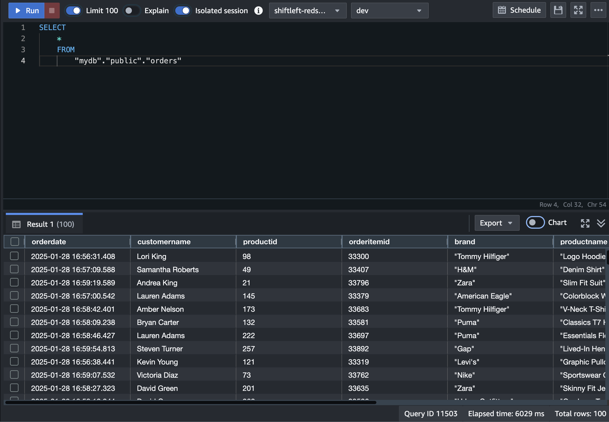

## Shift Left End to End Narrative
In this specific demo use case we will be walking through an end-to-end example of what shifting left data curation and quality to optimize the value of your data lake, wharehouse, or lake house while also getting benefits in operational systems.  This walk through does not depend on use cases 1-4 and is intended to be a self contained narrative.

### Scenario

The scenario is of a retailer moving from a legacy commerce system based on postgres.  Ultimately they are moving to an event driven architectural with MongoDB as the operational database but have already started building new customer experiencs on top of MongoDB.

Their entire stack is deployed on AWS and the analytics and AI team is making heavy use of Redshift on in AWS and the data science team is using Redshift.

They are facing  the following problems

- Duplicate records are landing in redshift from orders and payments
  - This is causing inaccurate reports and needs to be fixed
- They are also seeing bad orders in redshift.
  - This isn’t causing any problems with the commerce site since they know how to handle default based on operational conditions
- PII needs to be protected and properly encrypted so only appropriate personnel and processes can access it
  - Within in the domain PII protection is happening but in order to share it with other analytics team it needs to be encrypted
- All these issue present the same problems for other potential consumers as well
  - A new machine learning model that acts in real-time for next best offer
  - Their new customer experience based on MongoDB
  - New fullfillment process that wants to be able to send goods directly from stores depending on a given scenario
- Each consumer could try and fix these problems separately but yeah... this is a bad idea

The following sources are coming into Confluent Cloud

- E-commerce site backed by postgres
- Customers,  products, orders coming from connectors
- Separately a payment processing service is emitting payment events upon successful completion of payments

   

### Walkthrough

1. The data coming from postgres is raw normalized table data.  In isolation the Order stream means nothing so anyone who wants to use this data would need to understand the schema and join it together themselves.  Lets use Flink to make a sensical Order data product so this only needs to be done one time.

   First lets take a look what the raw order data looks like

   ```
   SELECT * FROM `shiftleft.public.orders`
   ```
   
   Clearly we need to join this with order items, products, and customers to have a complete picture of what a given order represents.

   We saw there is an ```orderdate``` field and rather than using wall clock time we want to use event time for the flink table, enabling Flink to use it for accurate time-based processing and watermarking:

    ```
    ALTER TABLE `<CONFLUENT_ENVIRONEMNT_NAME>`.`<CONFLUENT_CLUSTER_NAME>`.`shiftleft.public.orders` MODIFY WATERMARK FOR `orderdate` AS `orderdate`;
    ```

   To perform a temporal join with ```products``` table, the ```products``` table needs to have a ```PRIMARY KEY```. Which is not defined at the moment. Create a new table that has the same schema as ```products``` table but with a PRIMARY KEY constraint

    ```
    CREATE TABLE `products_with_pk` (
        `productid` INT NOT NULL,
        `brand` VARCHAR(2147483647) NOT NULL,
        `productname` VARCHAR(2147483647) NOT NULL,
        `category` VARCHAR(2147483647) NOT NULL,
        `description` VARCHAR(2147483647),
        `color` VARCHAR(2147483647),
        `size` VARCHAR(2147483647),
        `price` INT NOT NULL,
        `__deleted` VARCHAR(2147483647),
        PRIMARY KEY (`productid`) NOT ENFORCED
    );
    ```

    ```
    SET 'client.statement-name' = 'products-with-pk-materializer';
    INSERT INTO `products_with_pk`
    SELECT  `productid`,
        `brand`,
        `productname`,
        `category`,
        `description`,
        `color`,
        `size`,
        CAST(price AS INT) AS price,
        `__deleted`
    FROM `shiftleft.public.products`;
    ```
    
    Ok lets now create a target Flink table produce the joined output of these 4 streams

    ```
    CREATE TABLE enriched_orders (
        orderdate TIMESTAMP_LTZ(3) NOT NULL,
        orderid INT NOT NULL,
        customername STRING NOT NULL,
        customerid INT NOT NULL,
        productid INT NOT NULL,
        orderitemid INT NOT NULL,
        brand STRING NOT NULL,
        productname STRING NOT NULL,
        price INT NOT NULL,
        quantity INT NOT NULL,
        total_amount INT NOT NULL
    );
    ```

    ```
    SET 'sql.state-ttl' = '7 DAYS';
    SET 'client.statement-name' = 'dp-orders-materializer';
    INSERT INTO enriched_orders 
    SELECT 
        o.orderdate,
        o.orderid,
        cu.customername,
        cu.customerid,
        p.productid,
        oi.orderitemid,
        p.brand,
        p.productname,
        p.price, 
        oi.quantity, 
        oi.quantity * p.price AS total_amount 
    FROM 
        `shiftleft.public.orders` o
    JOIN 
        `shiftleft.public.order_items` oi ON oi.orderid = o.orderid
    JOIN 
        `shiftleft.public.customers` cu ON o.customerid= cu.customerid
    JOIN 
        `products_with_pk` FOR SYSTEM_TIME AS OF o.orderdate AS p ON p.productid = oi.productid
    WHERE 
        p.productname <> '' 
        AND p.price > 0;
     ```

2. So we now have a joined and enriched stream of orders but what about enforcing data quality?  Recall that we are seeing duplicate coming from orders on occassions.  This can occur becasue someone inadvertently submits the same order multiple times.  It can also occurr in the case of a database failure and transactions being read twice by the postgres CDC connector.  For a downstream consumers thats not in the domain they won't know why duplicates occur and in some cases what appears to be a duplicate reocrd is actually correct behavior.  Lets fix this at the source instead of making everyone discover the problem and trying to deduplicate it themselves.

   1. First lets observe this new table in the [data portal](https://confluent.cloud/data-portal/discover).
   2. Now click on the Actions button and select **Deduplicate topic**
   3. Select `orderid` and `customerid` for fields to duplicate
   4. Call the Table `orders`
   5. Click `Show SQL` and show that this is just Flink SQL underneath the hood and you could of course write your own deuplication, or edit this.  Obviously in production this would go into git and everything would be deployed via CI/CD.  But we are just going to run it from here and the flink statement will spin up in the same compute pool.
   6. Go to the flink statements to see that its running like all the rest.
3. We now have a new orders table that is enirched and deduplicated.  But if someone is looking for a a cleansed data set how do they know which of the three topics with "orders" in it is the right one?  To make this a data product we need to apply metadata and should ensure that it has a data contract that both describes (and enforces) schema and field data formatting.
   1. Navigate to the orders topic.
   2. Add a  `Description`, `DataProduct`, and `Owner`
   3. No doubt you would have some business metadata dictated by a governance team but we will skip for excpediancey
   4.  Lets take a look at the `Data contracts`.  We have a schema, and the data contract itself does not have metadata associated with it.  In practice you would probaly want to embed the metadata I just manually added in the UI which goes into the streaming catalog into the data contract so it too is under soruce control and is a material asset that can be viewed in a wholistic data contract.  
   5.  Under `Rules` we don't have any but in practice for a data contract you would want to try and have a rich set of rules to ensure bad data does not end up in the data product AND the consumer understands exactly what they will be getting.  We will demonstrate and example with `payments`.
   5. Go back to the data portal and you can see that it shows up as a `DataProduct`
4. Lets go examine the `payments` topic.
   1. Eyeball the data so people can see what it looks like.  In some cases it has been discovered that a payment goes through that does not have a confirmation code.  If our business rule is that a payment is not considered to be a valid record outside of the domain without a valid confirmation then we should have a rule in the contract that handles this.  
   2. Go to `Data contract` and then click on the `Rules` tab.   You can see we aready have a rule to do this.
   3. Click on the `validateConfimrationCode`  You can see that rules stipulates that the field must exsit and be an 8 character long uppercase alphanumeric sequence.  If this is not the case the payment record will be dropped but written to a DLQ topic of error-payments.
   4. Examine the `error-payments`. You can see that messages in here are bad and have a `confirmation_code` of `0`.  More bad data we have stopped from landing in consumers
   5. I mentioned earlier that this topic also has duplicates that are sometimes emitted but rather than going through but you have already seen deduplcaion.
5.  You may have noticed the credit card nummber is showing in clear text which isn't good so lets add a rule that encrypts all fields that are marked PII and mark the credit card field PII so that unencrypted PII doesn't land in redshift or anywhere else.
    1. In the `payments` Topic UI, select `Data Contracts` then click `Evolve`. Tag `cc_number` field as `PII`.
    2. Click **Rules** and then **+ Add rules** button. Configure as the following:
       * Category: `Data Encryption Rule`
       * Rule name: `Encrypt_PII`
       * Encrypt fields with: `PII`
       * using: The key added by Terraform (probably called CSFLE_Key)
  
    Then click **Add** and **Save**

    Our rule instructs the serailizer to ecrypt any field marked PII to be encrypted before being written into this topic

    

    3. Restart the ECS Service for the changes to take effect immediately. Run ```terraform output``` to get the ECS command that should be used to restart the service. The command should look like this:
    ```
       aws ecs update-service --cluster <ECS_CLUSTER_NAME> --service payment-app-service --force-new-deployment
    ```
    4. Go back to the `payments` Topic UI, you can see that the Credit number is now encrypted.

    

    This data is ready for sharing! You can tag it as a DataProduct althought in prcactive we woould no doubt have some sort of transformation and enrichments and more rules.

6. Now let's ingest our data product topics to the data wharehouse you have.

<details>
<summary>Click to expand Amazon Redshift instructions</summary>

We will sink data to Amazon Redshift using the Confluent Cloud Redshift Sink Connector. 

1. In the [Connectors UI](https://confluent.cloud/go/connectors), add a new Redshift Sink Connector.
2. Choose ```orders``` and ```payments``` topic and click **Continue**
3.   Enter Confluent Cluster credentials, you can use API Keys generated by Terraform
     1.   In CMD run ```terraform output resource-ids``` you will find the API Keys in a section that looks like this:
   
        ```
            Service Accounts and their Kafka API Keys (API Keys inherit the permissions granted to the owner):
                shiftleft-app-manager-d217a8e3:                     sa-*****
                shiftleft-app-manager-d217a8e3's Kafka API Key:     "SYAKE*****"
                shiftleft-app-manager-d217a8e3's Kafka API Secret:  "rn7Y392xM49c******"
        ```
4.  Enter Redshift details
    1.  **AWS Redshift Domian**: Get it by running ```terraform output redshift-output```
    2.  **Connection user**: ```admin```
    3.  **Connection password**: ```Admin123456!```
    4.  **Database name**: ```mydb```
    
    

    >**NOTE: It's not recommended to use ADMIN user for data ingestion. We are using it here for demo purposes only.**


5.  Choose:
    * ```AVRO``` as **Input Kafka record value format**.
    *  Set **Auto create table** to `True`.
    *  Then follow the the wizard to create the connector.
  
6.  In the [Amazon Redshift Query V2 Editor page](https://console.aws.amazon.com/sqlworkbench/home), select the Cluster and enter the connection parameters to establish a connection with the database.
   
    
   
7.   Run the follwing SQL Statement to preview the new table.
        > Note: The connector will take less than a minute to run, **but the data will be available for querying in Snowflake after 3-5 minutes.**
    
        ```
            SELECT
            *
            FROM
                "mydb"."public"."orders";
        ```

        

</details>


<details>
<summary>Click to expand Snowflake instructions</summary>
NOT UPDATES
We will sink data to Snowflake using the Confluent Cloud Snowflake Sink Connector. 

1. In the [Connectors UI](https://confluent.cloud/go/connectors), add a new Snowflake Sink Connector.
2. Choose ```low_stock_alerts``` topic and click **Continue**
3. Enter Confluent Cluster credentials, you can use API Keys generated by Terraform
     1.   In CMD run ```terraform output resource-ids``` you will find the API Keys in a section that looks like this:
            ```
                Service Accounts and their Kafka API Keys (API Keys inherit the permissions granted to the owner):
                    shiftleft-app-manager-d217a8e3:                     sa-*****
                    shiftleft-app-manager-d217a8e3's Kafka API Key:     "SYAKE*****"
                    shiftleft-app-manager-d217a8e3's Kafka API Secret:  "rn7Y392xM49c******"
            ```
4.  Enter Snowflake details
    1.  **Snowflake locator URL**: Get it under Admin --> Accounts in (Snowflake Console)[https://app.snowflake.com/]. It should look like this: *https://<snowflake_locator>.<cloud_region>.aws.snowflakecomputing.com*
    2.  **Connection username**: ```confluent```
    3.  **Private Key**: In CMD run ```terraform output resource-ids``` and copy the PrivateKey from there.
    4.  **Snowflake role**: `ACCOUNTADMIN`
    5.  **Database name**: ```PRODUCTION```
    6.  **Schema name**: ```PUBLIC```
    
    

    >**NOTE: It's not recommended to use ACCOUNTADMIN role for data ingestion. We are using it here for demo purposes only.**


18. Choose:
    * ```AVRO``` as **Input Kafka record value format**.
    *  ```SNOWPIPE_STREMAING``` as **Snowflake Connection**.
    *  Set **Enable Schemitization** to `True`. Doing this will allow the connector to infer schema from Schema registry and write the data to Snowflake with the correct schema. 
    *  Then follow the the wizard to create the connector.
  
    

18. In Snowflake UI, go to Worksheets and run the follwing SQL Statement to preview the new table.
    > Note: The connector will take less than a minute to run, **but the data will be available for querying in Snowflake after 3-5 minutes.**
    ```
    SELECT * FROM PRODUCTION.PUBLIC.LOW_STOCK_ALERTS
    ```
    

</details>


