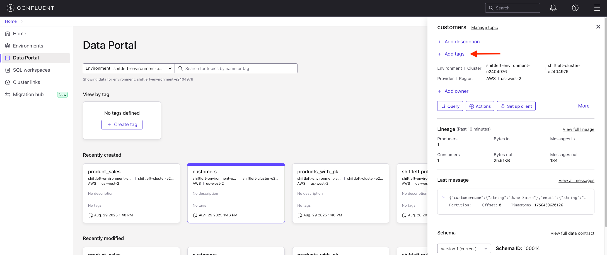
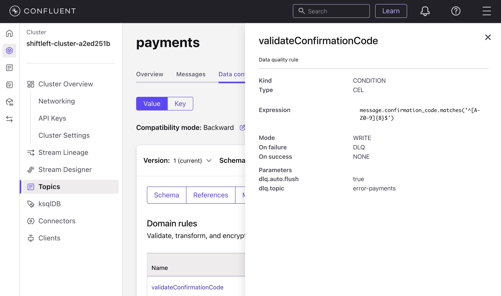
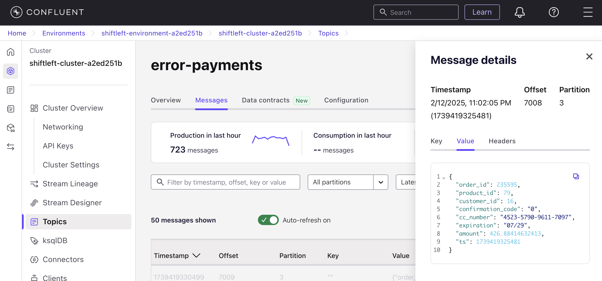
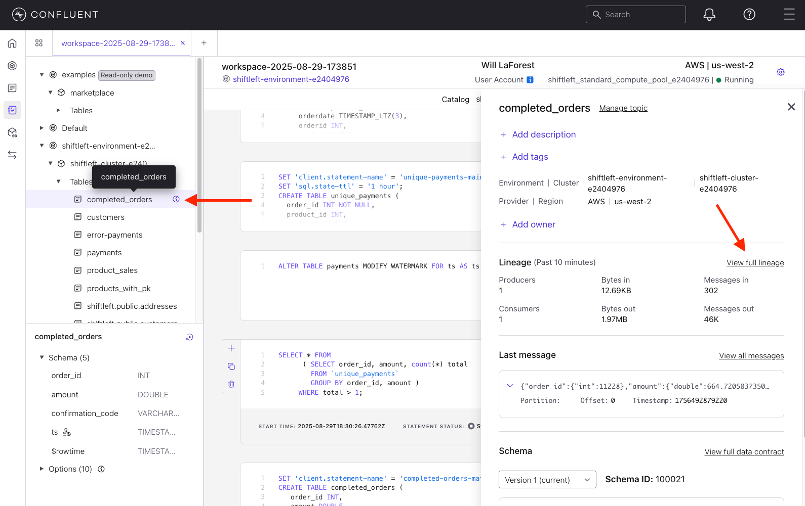
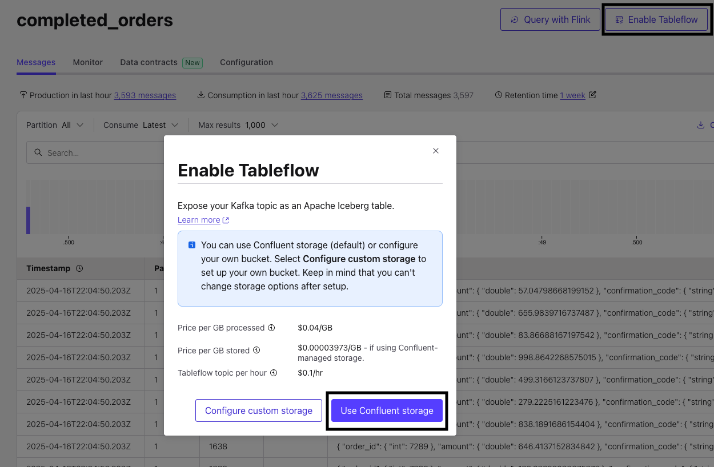
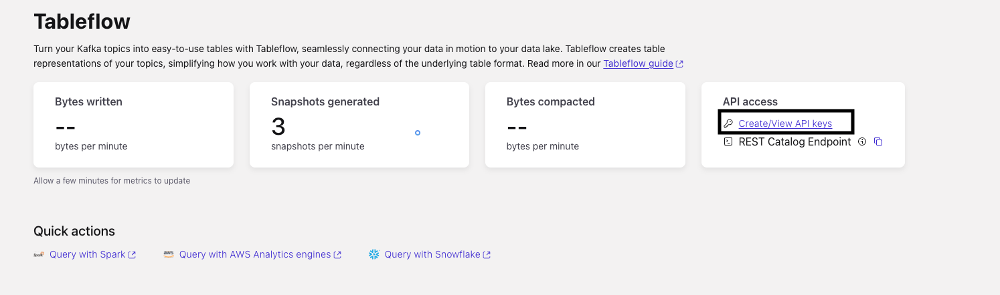
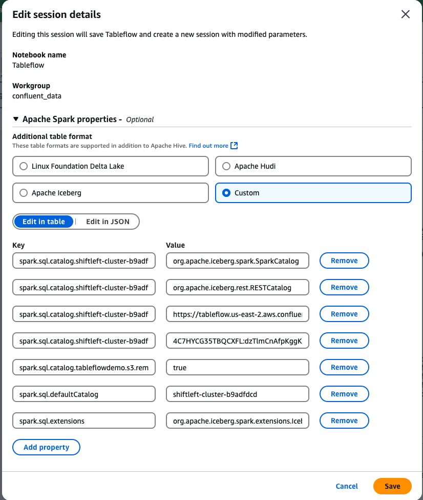

## Shift Left End to End Demonstration

This is an end-to-end demo walkthrough of shifting left where we will be curating and enforcing data quality prior to it landing in downstream analytical technologies like lakehouses while also getting benefits in operational systems. This walk through does not depend on lab 1 and lab 2 but uses much of the same queries and is intended to give you the flavor of creating universal data products.

### Scenario

The scenario is of a retailer moving from a legacy commerce system based on Postgres to an event driven architectural with MongoDB as the operational database.  They have already started building new customer experiences on top of MongoDB.

Their entire stack is deployed on AWS and the analytics and AI team is making heavy use of Redshift.

They are facing  the following problems

- Duplicate records are landing in redshift
  - This is causing inaccurate reports and needs to be fixed
- They are also seeing bad payments data with seemingly invalid field values in redshift.
  - This isn’t causing any problems with the commerce site since they know how to handle defaults based on operational conditions
- PII needs to be protected and properly encrypted so only appropriate personnel and processes can access it
  - Within in the domain PII protection is happening but in order to share it with other analytics team it needs to be encrypted
- All these issue present the same problems for other potential consumers as well
  - A new machine learning model that acts in real-time for next best offer
  - Their new customer experience based on MongoDB
  - New fulfillment process that wants to be able to send goods directly from stores depending on a given scenario
- Each consumer could try and fix these problems separately but yeah... this is a bad idea

The following sources are coming into Confluent Cloud
<!-- TODO: Update the image below to reflect the latest data sources and architecture. -->

 

- E-commerce site backed by Postgres
	- customers, products, orders, order items, and addresses table data is captured through an off the shelf CDC (change data capture) connector.  
- Separately a payment processing service is emitting payment events upon successful completion of payments

### Walkthrough

1.  First lets take a look at the raw order data as it lands in Confluent kafka topics from the CDC connector.  Any data in Confluent cloud topics with a schema is automatically visible and usable from Flink and vice versa so we will start there.


    The data coming from Postgres is raw normalized table data.  In isolation, this raw orderstream doesn't mean much so every consumer who wants to use this data would need to understand the schema and join it with the other tables to make sense of it. Lets use Flink to make a enriched data product so this only needs to be done one time.

    ```
    SELECT * FROM `shiftleft.public.orders`
    ```  
   
   
    We need to join this with **order items**, **products**, and **customers** to have a complete picture of what a given order represents.

1.  As opposed to static snapshots in time, when joining streams of data you need to consider the temporal aspect and [tell Flink how to interpret the time of record](https://docs.confluent.io/cloud/current/flink/concepts/timely-stream-processing.html).  By default Confluent Cloud's Flink will use the Kafka record time but we want it to use the ```orderdate``` field which is when the order actually occurred in the source system.  We set that with the following SQL 

    ```SQL
    ALTER TABLE `<CONFLUENT_ENVIRONEMNT_NAME>`.`<CONFLUENT_CLUSTER_NAME>`.`shiftleft.public.orders` MODIFY WATERMARK FOR `orderdate` AS `orderdate`;
    ```

1.  To perform the join with the ```products``` stream [using the version of the product at the specific time of the order](https://docs.confluent.io/cloud/current/flink/reference/queries/joins.html#temporal-joins) we need to define a ```PRIMARY KEY```.  Lets create a new table that has a similar schema as ```products``` table but with a ```PRIMARY KEY``` constraint

    ```sql
    CREATE TABLE `products_with_pk` (
	   `productid` INT NOT NULL,
	   `brand` VARCHAR(2147483647) NOT NULL,
	   `productname` VARCHAR(2147483647) NOT NULL,
	   `category` VARCHAR(2147483647) NOT NULL,
	   `description` VARCHAR(2147483647),
	   `color` VARCHAR(2147483647),
	   `size` VARCHAR(2147483647),
	   `price` INT NOT NULL,
	   `__deleted` VARCHAR(2147483647),
	   PRIMARY KEY (`productid`) NOT ENFORCED
    );
    ```

    We will run a Flink statement to populate this new table with the primary key from the original product stream.

    ```sql
    SET 'client.statement-name' = 'products-with-pk-materializer';
    INSERT INTO `products_with_pk`
      SELECT  
        `productid`,
	     `brand`,
	     `productname`,
	     `category`,
	     `description`,
	     `color`,
	     `size`,
	     CAST(price AS INT) AS price,
	     `__deleted`
      FROM `shiftleft.public.products`;
    ```

1.  Build data products used across the demo.

    First, create `customers` by joining customers with addresses to produce denormalized customer profiles.

    ```sql
    SET 'client.statement-name' = 'customer-materializer';
    CREATE TABLE customers (
      customerid INT,
      customername STRING,
      email STRING,
      segment STRING,
      shipping_address ROW<street STRING, city STRING, state STRING, postalcode STRING, country STRING>,
      billing_address ROW<street STRING, city STRING, state STRING, postalcode STRING, country STRING>,
      event_time TIMESTAMP_LTZ(3),
      WATERMARK FOR event_time AS event_time - INTERVAL '5' SECOND,
      PRIMARY KEY (customerid) NOT ENFORCED
    )
    AS
    SELECT
      c.customerid,
      c.customername,
      c.email,
      c.segment,
      ROW(sa.street, sa.city, sa.state, sa.postalcode, sa.country) AS shipping_address,
      ROW(ba.street, ba.city, ba.state, ba.postalcode, ba.country) AS billing_address,
      c.`$rowtime` AS event_time
    FROM `shiftleft.public.customers` c
    LEFT JOIN `shiftleft.public.addresses` sa ON c.shipping_address_id = sa.addressid AND (sa.__deleted IS NULL OR sa.__deleted <> 'true')
    LEFT JOIN `shiftleft.public.addresses` ba ON c.billing_address_id = ba.addressid AND (ba.__deleted IS NULL OR ba.__deleted <> 'true')
    WHERE c.__deleted IS NULL OR c.__deleted <> 'true';
    ```

    Next, create `product_sales`, a curated product-level fact by joining orders, order items, products, and enriched customers using temporal joins.

    ```sql
    SET 'sql.state-ttl' = '1 DAYS';
    SET 'client.statement-name' = 'product-sales-materializer';
    CREATE TABLE product_sales (
         orderdate TIMESTAMP_LTZ(3),
         orderid INT,
         productid INT,
         orderitemid INT,
         brand STRING,
         productname STRING,
         price INT,
         customerid INT,
         customername STRING,
         shipping_address_city STRING,
         shipping_address_state STRING,
         billing_address_state STRING,
         quantity INT,
         total_amount INT,
         WATERMARK FOR orderdate AS orderdate - INTERVAL '5' SECOND
     )
     AS
     SELECT 
         o.orderdate,
         o.orderid,
         p.productid,
         oi.orderitemid,
         p.brand,
         p.productname,
         p.price,
         c.customerid,
         c.customername,
         c.shipping_address.city as shipping_address_city,
         c.shipping_address.`state` as shipping_address_state,
         c.billing_address.`state` as billing_address_state,
         oi.quantity, 
         oi.quantity * p.price AS total_amount 
     FROM 
         `shiftleft.public.orders` o
     JOIN 
         `shiftleft.public.order_items` oi ON oi.orderid = o.orderid
     JOIN 
         `products_with_pk` FOR SYSTEM_TIME AS OF o.orderdate AS p ON p.productid = oi.productid
     JOIN 
         `customers` FOR SYSTEM_TIME AS OF o.orderdate AS c ON c.customerid = o.customerid
     WHERE 
         p.productname <> '' 
         AND p.price > 0;
    ```
    
1.  We now have two data streams that is properly joind and enirched and can serve as the basis of a data product.  To be real data products they need rich data contracts and metadata associated with them so lets take a quick look at theses aspects.  Metadata is important for someone looking at a data product to understand what they will be getting but they also help someone find the data products in the first place.  If I'm looking for customer data how do I know if `customers` or `shiftleft.public.customers` is right topic?  How do I know what data products exist?

    Navigate to the `customers` topic through the ***Data portal***. Click the **Add tags** link

    

    Add the tag `DataProduct`.  Since we don't have any DataProducts yet it will prompt you to create it.  Optionally you can give it a description and an owner.  In practice you would also add business metadata like domain, POC, SLO, provence, etc. You will see a link for that called **+ Add business metadata**

    Lets take a look at the `Data contract` by clicking on **View full data contract**.  We have a schema, and the data contract itself does not have metadata associated with it.  In practice you would probably want to embed the metadata we just manually added in the UI into the data contract directly and place it all under source control.
    
    Under `Rules` we currently don't have any but in practice for a data contract you would want to try and have a rich set of rules to ensure bad data does not end up in the data product AND the consumer understands exactly what they will be getting.  We will demonstrate an example with the `payments` data.
   
    Go back to the data portal and you can see that `customers` shows up as a **DataProduct**.  Go ahead and tag `product_sales` as a **DataProduct** as well.

1.  Lets go examine the `payments` topic in the kafka cluster.  Recall that in some cases it has been discovered that a payment goes through but when it lands in Redshift it has an invalid confirmation code.  If our business rule is that a payment is not considered to be a valid record outside of the domain without a valid confirmation then we should have a rule in the contract that enforces this.

    Go to `Data contract` and then click on the `Rules` tab.  You can see we aready have a rule to do this.
   
    Click on the `validateConfimrationCode`  You can see that rules stipulates that the field must exist and be an 8 character long uppercase alphanumeric sequence.  If this is not the case the payment record will not be dropped but written to a DLQ topic of error-payments.

    
    
    Examine the `error-payments` topic. You can see that messages in here are bad and have a `confirmation_code` of `0`.  More bad data we have stopped from landing in consumers

    

1.  The other issue with `payments` is that we sometimes have duplicates that are being emitted.  Let's detect duplicates and permanently maintain a deduplicated table with Flink so downstream consumers have a clean source.

    ```sql
    SELECT * FROM 
      ( SELECT order_id, amount, count(*) total 
        FROM `payments`
        GROUP BY order_id, amount )
     WHERE total > 1;
    ```

    Create a `unique_payments` table keeping one record per `order_id` and align watermarks to `ts`:

    ```sql
    SET 'client.statement-name' = 'unique-payments-maintenance';
    SET 'sql.state-ttl' = '1 hour';
    CREATE TABLE unique_payments (
      order_id INT NOT NULL,
      product_id INT,
      customer_id INT,
      confirmation_code STRING,
      cc_number STRING,
      expiration STRING,
      amount DOUBLE,
      ts TIMESTAMP_LTZ(3),
      WATERMARK FOR ts AS ts - INTERVAL '5' SECOND
    ) AS
    SELECT
      COALESCE(order_id, 0) AS order_id,
      product_id,
      customer_id,
      confirmation_code,
      cc_number,
      expiration,
      amount,
      ts
    FROM (
      SELECT *, ROW_NUMBER() OVER (PARTITION BY order_id ORDER BY ts ASC) AS rownum
      FROM payments
    )
    WHERE rownum = 1;
    ```

    ```sql
    ALTER TABLE payments MODIFY WATERMARK FOR ts AS ts;
    ```

1. Go ahead verify that this new stream does not have duplicates by running

   ```sql
    SELECT * FROM 
      ( SELECT order_id, amount, count(*) total 
        FROM `unique_payments`
        GROUP BY order_id, amount )
     WHERE total > 1;
   ```

1.  You may have noticed the credit card nummber is showing in clear text which isn't good so lets add a rule that encrypts all fields that are marked PII and mark the credit card field PII so that unencrypted PII doesn't land in redshift or anywhere else.

    In the `payments` Topic UI, select `Data Contracts` then click `Evolve`. Tag `cc_number` field as `PII`.

    Click **Rules** and then **Add rules** button. Configure as the following:
       * Category: `Data Encryption Rule`
       * Rule name: `Encrypt_PII`
       * Encrypt fields with: `PII`
       * using: The key added by Terraform (probably called CSFLE_Key)
  
       Then click **Add** and **Save**

       Our rule instructs the serailizer to ecrypt any field marked PII to be encrypted before being written into this topic

       

    Restart the ECS Service where the payments services is running for the changes to take effect immediately. Run ```terraform output``` to get the ECS command that should be used to restart the service. The command should look like this:
    ```
       aws ecs update-service --cluster <ECS_CLUSTER_NAME> --service payment-app-service --force-new-deployment
    ```
    
    Go back to the `payments` topic UI, you can see that the Credit number is now encrypted.  Sometimes it can take time for the ECS cluster to actually role and if so you can go to the next step and come back later to verify

    


1.  Lets create a reliable view of completed orders using an interval join between `unique_payments` and orders where a valid payment arrives within 96 hours of the order.

    ```sql
    SET 'client.statement-name' = 'completed-orders-materializer';
    CREATE TABLE completed_orders (
       order_id INT,
       amount DOUBLE,
       confirmation_code STRING,
       ts TIMESTAMP_LTZ(3),
       WATERMARK FOR ts AS ts - INTERVAL '5' SECOND
    ) AS
    SELECT
       pymt.order_id,
       pymt.amount,
       pymt.confirmation_code,
       pymt.ts
    FROM unique_payments pymt, `shiftleft.public.orders` ord
    WHERE pymt.order_id = ord.orderid
    AND orderdate BETWEEN pymt.ts - INTERVAL '96' HOUR AND pymt.ts;
    ```

1.  Lets take a look at the streaming lineage of these real-time pipelines.  Start by clicking on completed_orders in the explorer panel on the left, then clicking on the **i** icon, then click **View Full Lineage**

    

    Play around with streaming lineage.  If you have been working through this demo over a long period of time change the window of time in the upper left hand.  Try clicking and hovering overs nodes and links.  

1.  Let's provide our data products to an analytical engine.  In this case we will use Amazon Athena.  To do this we will leverage Confluent Cloud's Tableflow feature. When Tableflow is enabled on a topic, the topic is materialized as an Iceberg Table and is available for any Query engine. 

##### Setting up Tableflow

1. First enable Tableflow on the topic.  Go to the `product_sales` topic and click on **Enable Tableflow**, then **Use Confluent Storage**.

   


1. In Tableflow UI, copy the **REST Catalog Endpoint** to text editor we will use it later.
1. In the same page click **Create/View API keys**

   

1. In the API keys page click on **+ Add API Key**, then **Service Account** and choose your service account created by the Terraform script (run `terraform output resource-ids` and check the Service account name under **Service Accounts and their Kafka API Keys** section) the service account should start with prefix. Click **Next**

1. Choose **Tableflow**, then **Next**.

1. Give it a name and click **Create API Key**.

1. Copy the Key and Secret and click **Complete**


##### Query with Athena

>**NOTE: After enabling Tableflow, it may take up to 15 minutes for the data to become available for analysis in Amazon Athena.**

1. In Amazon Athena UI, create a new Spark Notebook and configure it as follows:

   

   You can click **Edit in JSON** and copy the following Spark properties configuration to the Athena Notebook. Replace:

   * `<KAFKA_CLUSTER_NAME>` with your Confluent Cluster name. It should start with your prefix
   * `<TABLEFLOW_ENDPOINT>` that you copied from previous section
   * `<TABLEFLOW_API_KEY>:<TABLEFLOW_SECRET>` with Tableflow API key and secret created in the previous section

   ```
   {
   "spark.sql.catalog.<KAFKA_CLUSTER_NAME>": "org.apache.iceberg.spark.SparkCatalog",
   "spark.sql.catalog.<KAFKA_CLUSTER_NAME>.catalog-impl": "org.apache.iceberg.rest.RESTCatalog",
   "spark.sql.catalog.<KAFKA_CLUSTER_NAME>.uri": "<TABLEFLOW_ENDPOINT>",
   "spark.sql.catalog.<KAFKA_CLUSTER_NAME>.credential": "<TABLEFLOW_API_KEY>:<TABLEFLOW_SECRET>",
   "spark.sql.catalog.tableflowdemo.s3.remote-signing-enabled": "true",
   "spark.sql.defaultCatalog": "<KAFKA_CLUSTER_NAME>",
   "spark.sql.extensions": "org.apache.iceberg.spark.extensions.IcebergSparkSessionExtensions"
   }

   ```


1. `product_sales` data can now be queried in Athena. In the notebook run this query to SHOW available tables:
   ```sql
   %%sql
   SHOW TABLES in `<Confluent_Cluster_ID>`;
   ```

   Next preview `product_sales` table:

   ```sql
   %%sql
   SELECT * FROM `<Confluent_Cluster_ID>`.`product_sales`;
   ```

This demonstrates shift-left governed data flowing directly to the lakehouse as optimized Iceberg tables without bespoke pipelines.
    
