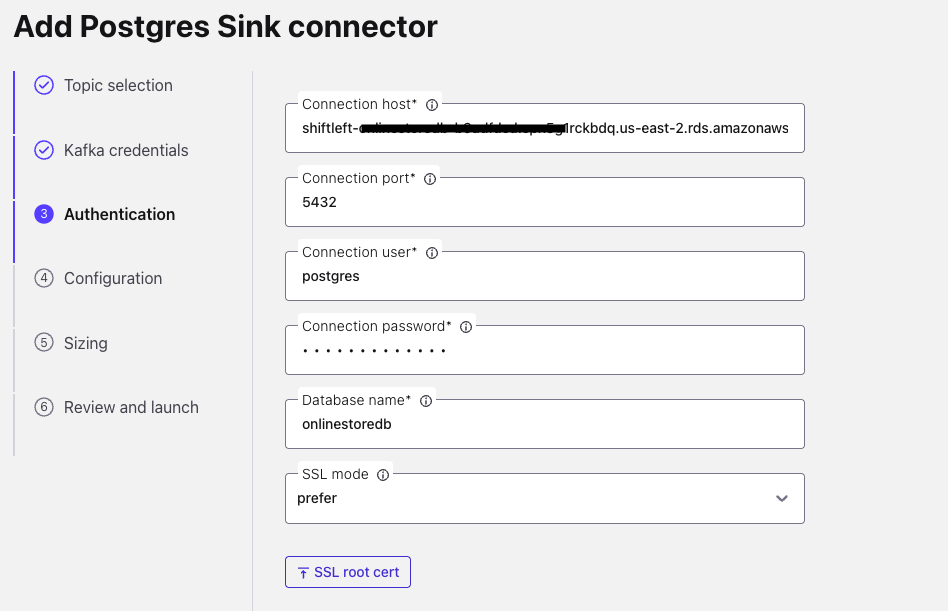
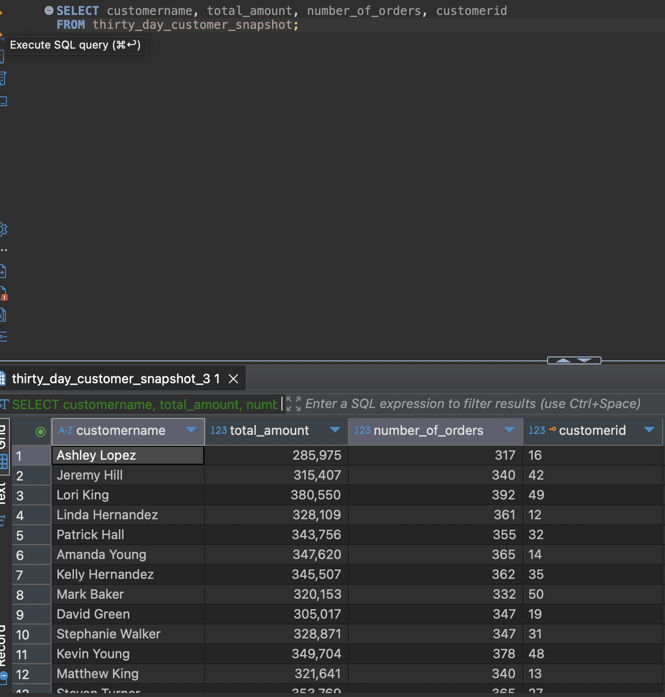

## Product Sales Aggregation

In this use case, we build a core data product called `enriched_customers` by joining two input streams — `customers` and `addresses` — from our operational database to create a unified customer profile. This enriched data is then used to create two derived data products.

The first is `product_sales`, which joins `enriched_customers`, `products`, `order_items`, and `orders` to generate a detailed view of product-level order data. This output is sent to a data warehouse for analytics.

Then from `product_sales` we will create `thirty_day_customer_snapshot` view that provides daily aggregated metrics per customer. This data product will be written back to the operational PostgreSQL database.

 


### De-normalization - preparing Customer data

First we need to denormalise customer information.

Let's preview Customer data:

```SQL
SELECT * FROM `shiftleft.public.customers`;
```
Notice that Customer data includes references to the address table. To create our customer data product, we will denormalize the customer information by joining it with the address table.

```sql
SET 'client.statement-name' = 'enriched-customer-materializer';
CREATE TABLE enriched_customers (
  customerid INT,
  customername STRING,
  email STRING,
  segment STRING,
  shipping_address ROW<
    street STRING,
    city STRING,
    state STRING,
    postalcode STRING,
    country STRING
  >,
  billing_address ROW<
    street STRING,
    city STRING,
    state STRING,
    postalcode STRING,
    country STRING
  >,
  event_time TIMESTAMP(3),
  WATERMARK FOR event_time AS event_time - INTERVAL '5' SECOND,
  PRIMARY KEY (customerid) NOT ENFORCED
)
AS
  SELECT
  c.customerid,
  c.customername,
  c.email,
  c.segment,
  ROW(
    sa.street,
    sa.city,
    sa.state,
    sa.postalcode,
    sa.country
  ) AS shipping_address,
  ROW(
    ba.street,
    ba.city,
    ba.state,
    ba.postalcode,
    ba.country
  ) AS billing_address,

  c.`$rowtime` AS event_time

FROM `shiftleft.public.customers` c

LEFT JOIN `shiftleft.public.addresses` sa
  ON c.shipping_address_id = sa.addressid
  AND (sa.__deleted IS NULL OR sa.__deleted <> 'true')

LEFT JOIN `shiftleft.public.addresses` ba
  ON c.billing_address_id = ba.addressid
  AND (ba.__deleted IS NULL OR ba.__deleted <> 'true')

WHERE c.__deleted IS NULL OR c.__deleted <> 'true';

```

The new data product holds a single entry for each customer and the key is `customerid`.


### 2a: Product Sales Data Product

1. Flink jobs can measure time using either the system clock (processing time), or timestamps in the events (event time). For the ```orders``` table, notice that each order has ```orderdate```, this is a timestamp for each order created. 
   
   ```sql
    SHOW CREATE TABLE `shiftleft.public.orders`;
   ```
2. We want to set the ```orderdate``` field as the event time for the table, enabling Flink to use it for accurate time-based processing and watermarking:

    ```sql
    ALTER TABLE `<CONFLUENT_ENVIRONEMNT_NAME>`.`<CONFLUENT_CLUSTER_NAME>`.`shiftleft.public.orders` MODIFY WATERMARK FOR `orderdate` AS `orderdate`;
    ```

3. To perform a temporal join with ```products``` table, the ```products``` table needs to have a ```PRIMARY KEY```. Which is not defined at the moment. Create a new table that has the same schema as ```products``` table but with a PRIMARY KEY constraint

    ```sql
    CREATE TABLE `products_with_pk` (
        `productid` INT NOT NULL,
        `brand` VARCHAR(2147483647) NOT NULL,
        `productname` VARCHAR(2147483647) NOT NULL,
        `category` VARCHAR(2147483647) NOT NULL,
        `description` VARCHAR(2147483647),
        `color` VARCHAR(2147483647),
        `size` VARCHAR(2147483647),
        `price` INT NOT NULL,
        `__deleted` VARCHAR(2147483647),
        PRIMARY KEY (`productid`) NOT ENFORCED
    );
    ```

    ```sql
    SET 'client.statement-name' = 'products-with-pk-materializer';
    INSERT INTO `products_with_pk`
    SELECT  `productid`,
        `brand`,
        `productname`,
        `category`,
        `description`,
        `color`,
        `size`,
        CAST(price AS INT) AS price,
        `__deleted`
    FROM `shiftleft.public.products`;
    ```

4. Join all relevant tables to gain insights into each order's contents, including product details, brand, quantity purchased, and the total amount for each order item, along with customer information. The query applies filters to ensure that only valid products with non-empty names and positive prices are included in the result set.

    This analysis is useful for understanding product sales trends, calculating revenue, and generating reports on order compositions.


   Create a new Apache Flink table ```product_sales``` to represent the new data product.
   
   ```sql
   SET 'sql.state-ttl' = '1 DAYS';
   SET 'client.statement-name' = 'product-sales-materializer';
   CREATE TABLE product_sales (
        orderdate TIMESTAMP_LTZ(3),
        orderid INT,
        productid INT,
        orderitemid INT,
        brand STRING,
        productname STRING,
        price INT,
        customerid INT,
        customername STRING,
        shipping_address ROW<
            street STRING,
            city STRING,
            state STRING,
            postalcode STRING,
            country STRING
        >,
        billing_address ROW<
            street STRING,
            city STRING,
            state STRING,
            postalcode STRING,
            country STRING
        >,
        quantity INT,
        total_amount INT,
        WATERMARK FOR orderdate AS orderdate - INTERVAL '5' SECOND
    )
    AS
    SELECT 
        o.orderdate,
        o.orderid,
        p.productid,
        oi.orderitemid,
        p.brand,
        p.productname,
        p.price,
        c.customerid,
        c.customername,
        c.shipping_address,
        c.billing_address,
        oi.quantity, 
        oi.quantity * p.price AS total_amount 
    FROM 
        `shiftleft.public.orders` o
    JOIN 
        `shiftleft.public.order_items` oi ON oi.orderid = o.orderid
    JOIN 
        `products_with_pk` FOR SYSTEM_TIME AS OF o.orderdate AS p ON p.productid = oi.productid
    JOIN 
        `enriched_customers` FOR SYSTEM_TIME AS OF o.orderdate AS c ON c.customerid = o.customerid
    WHERE 
        p.productname <> '' 
        AND p.price > 0;
   ```
    The join uses the ```FOR SYSTEM_TIME AS OF``` keyword, making it a temporal join. Temporal joins are more efficient than regular joins because they use the time-based nature of the data, enriching each order with product information available at the order's creation time. If product details change later, the join result remains unchanged, reflecting the original order context. Additionally, temporal joins are preferable as regular joins would require Flink to keep the state indefinitely.

5. Now let's sink the new data product to our data warehourse. Update the same Connector and add the new topic `product_sales`. Here is an example of the Snoflake connector, do the same if you are using Redshift. After adding the topic, click **Save changes** then **Apply changes**.
   
   


<details>
<summary>Query from Redshift</summary>

1. In the [Amazon Redshift Query V2 Editor page](console.aws.amazon.com/sqlworkbench/home), run the follwing SQL Statement to preview the new table.
    ```
    
    SELECT
        *
    FROM
        "mydb"."public"."PRODUCT_SALES";

    ```
     

</details>


<details>
<summary>Query from Snowflake </summary>

1. In Snowflake UI, go to Worksheets and run the follwing SQL Statement to preview the new table.
    ```
    SELECT * FROM PRODUCTION.PUBLIC.PRODUCT_SALES
    ```
     

</details>


### 2b: Customer 360 Snapshot

Using the `product_sales` data product, we create a new data product to support the Customer Services team: `thirty_day_customer_snapshot`. This product aggregates the past 30 days of activity for each customer, summarizing the total number of orders and total revenue generated. It provides a quick snapshot of customer behavior over the last month, enabling faster insights and support.

Here is the SQL:

```sql
SET 'client.statement-name' = 'customer-snapshot-materializer';
CREATE TABLE thirty_day_customer_snapshot (
  customerid INT,
  customername STRING, 
  total_amount INT,
  number_of_orders BIGINT,
  updated_at TIMESTAMP, 
  PRIMARY KEY (customerid) NOT ENFORCED
)
AS 
WITH agg_per_customer_30d AS (
  SELECT 
    customerid,
    customername,
    SUM(total_amount) OVER w AS total_amount, 
    COUNT(DISTINCT orderid) OVER w AS number_of_orders,
    orderdate
  FROM product_sales
  WINDOW w AS (
    PARTITION BY customerid 
    ORDER BY orderdate
    RANGE BETWEEN INTERVAL '30' DAY PRECEDING AND CURRENT ROW
  )
) 
SELECT 
  COALESCE(customerid, 0) AS customerid,
  customername,
  total_amount,
  number_of_orders,
  orderdate AS updated_at
FROM agg_per_customer_30d;

``` 

The above query creates the `thirty_day_customer_snapshot` table, which aggregates customer data over the last 30 days. It calculates the total amount spent and the number of distinct orders placed by each customer, updating the snapshot with the most recent order date. The table provides valuable insights into customer behavior by summarizing key metrics for each customer within a rolling 30-day window.

### Sinking Data Products back to the Operational DB

After creating the new data product for the Customer Services team, we’ll sink this data into their existing PostgreSQL database, which was provisioned via Terraform. This is achieved using the Confluent Cloud PostgreSQL Sink Connector.


1. In the [Connectors UI](https://confluent.cloud/go/connectors), add a new Postgres Sink Connector.
2. Choose ```thirty_day_customer_snapshot``` topic and click **Continue**
3.   Enter Confluent Cluster credentials, you can use API Keys generated by Terraform
     1.   In CMD run ```terraform output resource-ids``` you will find the API Keys in a section that looks like this:
   
        ```
            Service Accounts and their Kafka API Keys (API Keys inherit the permissions granted to the owner):
                shiftleft-app-manager-d217a8e3:                     sa-*****
                shiftleft-app-manager-d217a8e3's Kafka API Key:     "SYAKE*****"
                shiftleft-app-manager-d217a8e3's Kafka API Secret:  "rn7Y392xM49c******"
        ```
4.  Enter Postgre details
    1.  **Connection Host**: Get it by running ```terraform output resource-ids``` and then copy the value of ```RDS Endpoint```.
    2.  **Connection port**: ```5432```
    3.  **Connection user**: ```postgres``` (change if you chnaged in variables file)
    4.  **Connection password**: ```Admin123456!!``` (change if you chnaged in variables file)
    5.  **Database name**: ```onlinestoredb```
    
    

    >**NOTE: It's not recommended to use ADMIN user for data ingestion. We are using it here for demo purposes only.**


5.  Choose:
    * ```AVRO``` as **Input Kafka record value format**.
    *  Set **Insert mode** to `UPSERT`.
    * (ADVANCED CONFIGURATION)```AVRO``` as **Input Kafka record key format**.
    * (ADVANCED CONFIGURATION) Set **PK mode** to ```record_key```
6. Then follow the the wizard to create the connector.

#### [OPTIONAL] Validate that data is in Postgres

Using a SQL client connect to the Postgres DB.

1.  **Connection Host**: Get it by running ```terraform output resource-ids``` and then copy the value of ```RDS Endpoint```.
2.  **Connection port**: ```5432```
3.  **Connection user**: ```postgres``` (change if you chnaged in variables file)
4.  **Connection password**: ```Admin123456!!``` (change if you chnaged in variables file)
5.  **Database name**: ```onlinestoredb```

Run

```sql
SELECT customername, total_amount, number_of_orders, customerid
FROM thirty_day_customer_snapshot;
```
 


## Topics

**Next topic:** [Usecase 3 - Daily Sales Trends](../Usecase3/USECASE3-README.md)

**Previous topic:** [Usecase 1: Low inventory stock alerts](../Usecase1/USECASE1-README.md)