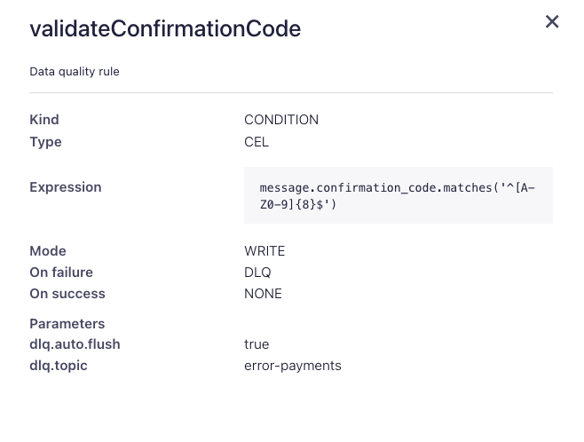
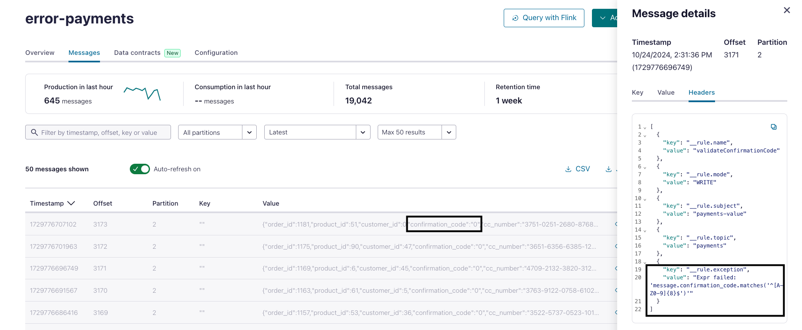
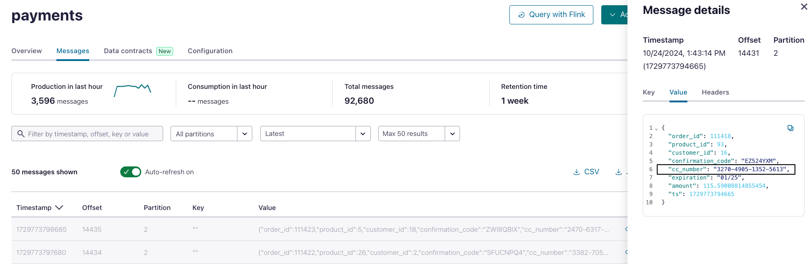
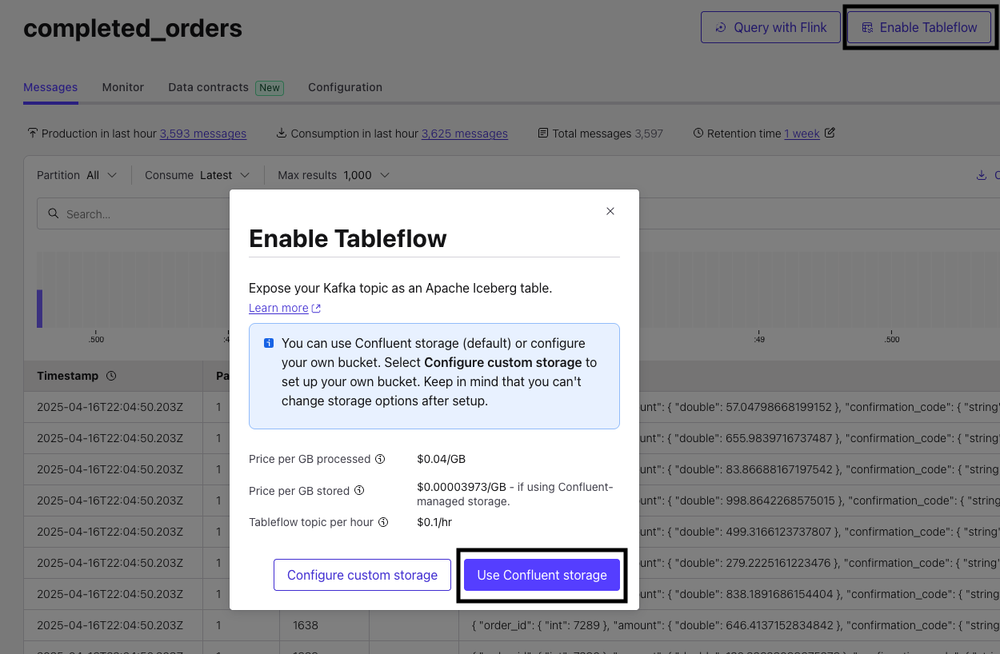
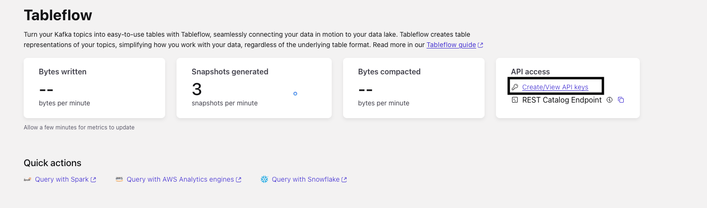
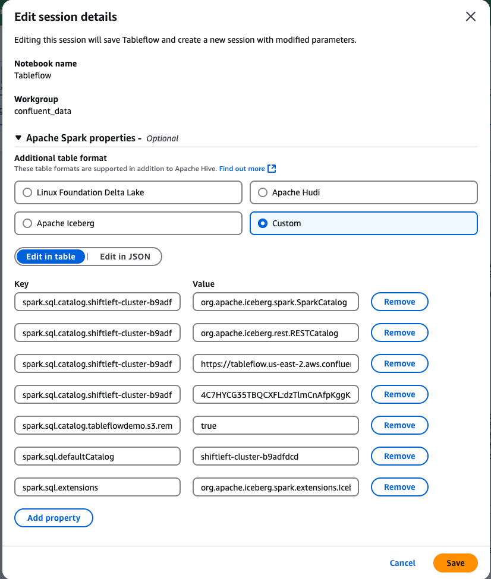

## Daily Sales Trends

In this use case, we utilize Confluent Cloud and Apache Flink to validate payments and create completed orders, creating a valuable data product that could be used to analyse daily sales trends to empower sales teams to make informed business decisions. 

While such analyses are typically conducted within a Lakehouse—as demonstrated in use cases 1 and 2. Confluent offers multiple integration options to seamlessly bring data streams into Lakehouses. This includes a suite of connectors that read data from Confluent and write to various engines. Another option is [Tableflow](https://www.confluent.io/product/tableflow/) .

Tableflow simplifies the process of transferring data from Confluent into a data lake, warehouse, or analytics engine. It enables users to convert Kafka topics and their schemas into Apache Iceberg tables with zero effort, significantly reducing the engineering time, compute resources, and costs associated with traditional data pipelines. This efficiency is achieved by leveraging Confluent's Kora Storage Layer and a new metadata materializer that works with Confluent Schema Registry to manage schema mapping and evolution.

Since sales team in our fictitious company store all their data in Iceberg format. Instead of sending data to S3 and transforming it there, we’ll leverage Tableflow, which allows Confluent to handle the heavy lifting of data movement, conversion, and compaction. With Tableflow enabled, data stored in a Confluent topic, is ready for analytics in Iceberg format.


But before doing this, let's make sure that the data is reliable and protected first.

### **[OPTIONAL] Data Contracts in Confluent Cloud**

Analytics teams are focused on general sales trends, so they don't need access to PII. Instead of relying on central teams to write ETL scripts for data encryption and quality, we’re shifting this process left. Central governance teams set data protection and quality rules, which are pushed to the client for enforcement— the beauty of this is that there is not need for code changes on the client side - **IT JUST WORKS**.

##### **Using Confluent Cloud Data Quality Rules**

We want to make sure that any data produced adheres to a specific format. In our case, we want to make sure that any payment event generated needs to have a valide `Confimation Code`. This check is done by using [Data Quality Rules](https://docs.confluent.io/cloud/current/sr/fundamentals/data-contracts.html#data-quality-rules), these rules are set in Confluent Schema registry, and pushed to the clients, where they are enforced. No need to change any code.

The rules were already created by Terraform, there is no need to do anything here except validate that it is working.

1. In the [`payments`](https://confluent.cloud/go/topics) Topic UI, select **Data Contracts**. Under **Rules** notice that there is a rule already created.
   
   The rule basically says that `confirmation_code` field value should follow this regex expression `^[A-Z0-9]{8}$`. Any event that doesnt match, will be sent to a dead letter queue topic named `error-payments`.

   

2. To validate that it is working go to the DLQ topic and inspect the message headers there.
   



##### **Data Protection using Confluent Cloud Client Side Field Level Encryption**

[Client Side Field Level Encryption(CSFLE)](https://docs.confluent.io/cloud/current/security/encrypt/csfle/client-side.html) in Confluent Cloud works by setting the rules in Confluent Schema registry, these rules are then pushed to the clients, where they are enforced. The symmetric key is created in providor and the client should have necessary permissi the providor and the client should have permission to use the key to encrypt the data.

1. In the `payments` topic we notice that, the topic contains credit card information in unencrypted form.
    

This field should be encrypted, the Symmetric Key was already created by the Terraform in AWS KMS. The key ARN was also immported to Confluent by Terraform. We just need to create the rule in Confluent
   
2. In the [`payments`](    
   https://confluent.cloud/go/topics) Topic UI, select **Data Contracts** then click **Evolve**. Tag `cc_number` field as `PII`.
   
2. Click **Rules** and then **+ Add rules** button. Configure as the following:
   * Category: Data Encryption Rule
   * Rule name: `Encrypt_PII`
   * Encrypt fields with: `PII`
   * using: The key added by Terraform (probably called CSFLE_Key)
  
    Then click **Add** and **Save**

    Our rule instructs the serailizer to ecrypt any field in this topic that is tagged as PII

    
4. Restart the ECS Service for the changes to take effect immediately. Run ```terraform output``` to get the ECS command that should be used to restart the service. The command should look like this:
   ```
   aws ecs update-service --cluster <ECS_CLUSTER_NAME> --service payment-app-service --force-new-deployment
   ```
5. Go back to the `payments` Topic UI, you can see that the Credit number is now encrypted.

    


### **Analyzing Daily Sales Trends using Confluent Cloud for Apache Flink**

We have a separate topic for payment information, an order is considered complete once a valid payment is received. To accurately track daily sales trends, we join the ```orders``` and ```payments``` data.

#### **Payments deduplication**

However, before joining both streams together we need to make sure that there are no duplicates in `payments` data coming in.

1. Check if there are any duplicates in `payments` table
   ```sql
   SELECT * FROM
   ( SELECT order_id, amount, count(*) total 
    FROM `payments`
    GROUP BY order_id, amount )
   WHERE total > 1;
   ```
   This query shows all `order_id`s with multiple payments coming in. Since the output returns results, this indicates that the there are duplicicates in the `payments` table.

2. To fix this run the following query in a new Flink cell
   ```sql
   SET 'client.statement-name' = 'unique-payments-maintenance';
   SET 'sql.state-ttl' = '1 hour';
   
   CREATE TABLE unique_payments
   AS SELECT 
     order_id, 
     product_id, 
     customer_id, 
     confirmation_code,
     cc_number,
     expiration,
     `amount`,
     `ts`
   FROM (
      SELECT * ,
             ROW_NUMBER() OVER (PARTITION BY order_id ORDER BY `$rowtime` ASC) AS rownum
      FROM payments
         )
   WHERE rownum = 1;
   ```
   This query creates the `unique_payments` table, ensuring only the latest recorded payment for each `order_id` is retained. It uses `ROW_NUMBER()` to order payments by event time (`$rowtime`) and filters for the earliest entry per order. This removes any duplicate entries.

3. Let's validate that the new `unique_payments` does not comtain any duplicates
   ```sql
   SELECT order_id, COUNT(*) AS count_total FROM `unique_payments` GROUP BY order_id;
   ```
   Every `order_id` will have a `count_total` of `1`, ensuring no duplicates exist in the new table. You will not find any `order_id` with a value greater than `1`.

#### **Using Interval joins to filter out invalid orders**

Now let's filter out invalid orders (orders with no payment recieved within 96 hours). To achieve this we will use Flink Interval joins.


1. Create a new table that will hold all completed orders and filter out orders with no valid payment recieved within `96` hours of the order being placed.
   ```sql
   SET 'client.statement-name' = 'completed-orders-materializer';
   CREATE TABLE completed_orders (
      order_id INT,
      amount DOUBLE,
      confirmation_code STRING,
      ts TIMESTAMP_LTZ(3),
      WATERMARK FOR ts AS ts - INTERVAL '5' SECOND
   ) AS
   SELECT 
      pymt.order_id,
      pymt.amount, 
      pymt.confirmation_code, 
      pymt.ts
   FROM unique_payments pymt, `shiftleft.public.orders` ord 
   WHERE pymt.order_id = ord.orderid
   AND orderdate BETWEEN pymt.ts - INTERVAL '96' HOUR AND pymt.ts;
   ```

#### **Analyzing Sales Trends using Amazon Athena**

This data can be made available seamlessly to your Data lake query engines using Confluent Cloud Tableflow feature. When Tableflow is enabled on a topic, the topic is materialized as an Iceberg Table and is available for any Query engine. In this demo, we use Amazon Athena, you can use any Engine that supports Iceberg Rest Catalog.

##### Setting up Tableflow

1. First enable Tableflow on the topic. In the topic UI, click on **Enable Tableflow**, then **Use Confluent Storage**.

   


2. In Tableflow UI, copy the **REST Catalog Endpoint** to text editor we will use it later. 
3. In the same page click **Create/View API keys** 

   

4. In the API keys page click on **+ Add API Key**, then **Service Account** and choose your service account created by the Terraform script (run `terraform output resource-ids` and check the Service account name under **Service Accounts and their Kafka API Keys** section) the service account should start with prefix. Click **Next**

5. Choose **Tableflow**, then **Next**.

6. Give it a name and click **Create API Key**.

7. Copy the Key and Secret and click **Complete**


##### Query with Athena

>**NOTE: After enabling Tableflow, it may take up to 15 minutes for the data to become available for analysis in Amazon Athena.**

1. In Amazon Athena UI, create a new Spark Notebook and configure it as follows:
   

   You can click **Edit in JSON** and copy the following Spark properties configuration to the Athena Notebook. Replace:

   * `<KAFKA_CLUSTER_NAME>` with your Confluent Cluster name. It should start with your prefix
   * `<TABLEFLOW_ENDPOINT>` that you copied from previous section
   * `<TABLEFLOW_API_KEY>:<TABLEFLOW_SECRET>` with Tableflow API key and secret created in the previous section

   ```
   {
   "spark.sql.catalog.<KAFKA_CLUSTER_NAME>": "org.apache.iceberg.spark.SparkCatalog",
   "spark.sql.catalog.<KAFKA_CLUSTER_NAME>.catalog-impl": "org.apache.iceberg.rest.RESTCatalog",
   "spark.sql.catalog.<KAFKA_CLUSTER_NAME>.uri": "<TABLEFLOW_ENDPOINT>",
   "spark.sql.catalog.<KAFKA_CLUSTER_NAME>.credential": "<TABLEFLOW_API_KEY>:<TABLEFLOW_SECRET>",
   "spark.sql.catalog.tableflowdemo.s3.remote-signing-enabled": "true",
   "spark.sql.defaultCatalog": "<KAFKA_CLUSTER_NAME>",
   "spark.sql.extensions": "org.apache.iceberg.spark.extensions.IcebergSparkSessionExtensions"
   }

   ``` 


2. `completed_orders` data can now be queried in Athena. In the notebook run this query to SHOW available tables:
   ```sql
   %%sql
   SHOW TABLES in `<Confluent_Cluster_ID>`;
   ```

   Next preview `reveue_summary` table:

   ```sql
   %%sql
   SELECT * FROM `<Confluent_Cluster_ID>`.`completed_orders`;
   ```

4. Now we can start analyzing daily sales trends in Athena. 
   > NOTE: For demo puposes we will do hourly windows

   In a new cell copy the follwoing SQL

   ```sql
   %%sql
   SELECT
   date_trunc('hour', ts) AS window_start,
   date_trunc('hour', ts) + INTERVAL '1' hour AS window_end,
   COUNT(*) AS total_orders,
   SUM(amount) AS total_revenue
   FROM `<Confluent_Cluster_ID>`.completed_orders
   GROUP BY date_trunc('hour', ts)
   ORDER BY window_start;
   ```
That's it we were able analyse the data in Athena.

## Topics

**Next topic:** [Cleanup](../README.md#clean-up)

**Previous topic:** [Usecase 2 - Product Sales and Customer360 Aggregation](../Usecase1/USECASE1-README.md)

