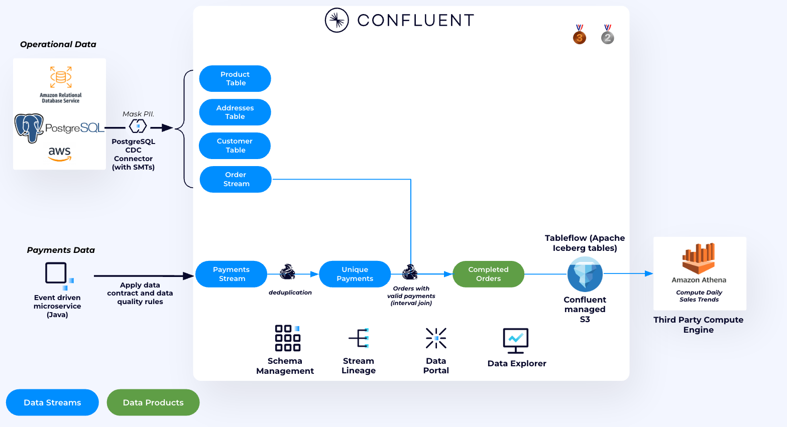
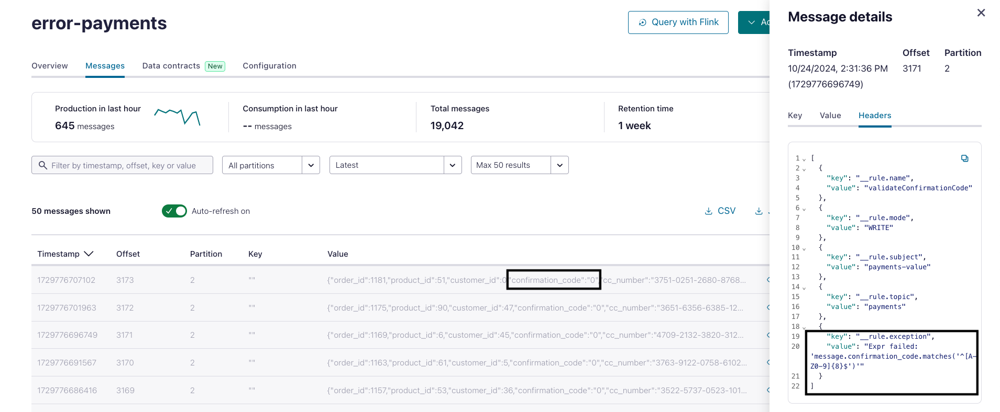
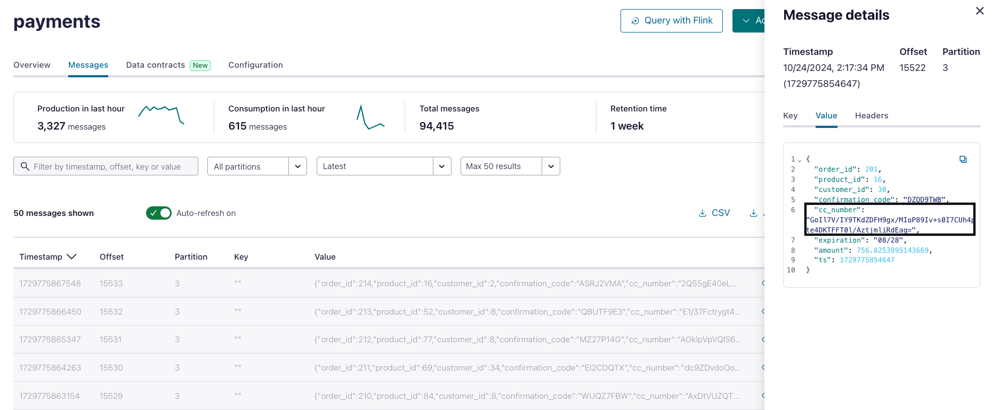

## Daily Sales Trends

In this use case, we leverage Confluent Cloud with Apache Flink to validate payments and analyze daily sales trends. The resulting data product will be stored in a topic with [Tableflow](https://www.confluent.io/product/tableflow/) enabled.



Tableflow simplifies the process of getting data from Confluent into a data lake, warehouse, or analytics engine. It allows users to convert Kafka topics and their schemas into Apache Iceberg tables with ZERO effort, reducing the engineering time, compute resources, and cost associated with traditional data pipelines. This is achieved by leveraging Confluent's Kora Storage Layer and a new metadata materializer that works with Confluent Schema Registry to handle schema mapping and evolution.

But before doing this, let's make sure that the data is reliable and protected first.

### **[OPTIONAL] Data Contracts in Confluent Cloud**

Analytics teams are focused on general sales trends, so they don't need access to PII. Instead of relying on central teams to write ETL scripts for data encryption and quality, we’re shifting this process left. Central governance teams set data protection and quality rules, which are pushed to the client for enforcement— the beauty of this is that there is not need for code changes on the client side - **IT JUST WORKS**.

##### **Using Confluent Cloud Data Quality Rules**

We want to make sure that any data produced adheres to a specific format. In our case, we want to make sure that any payment event generated needs to have a valide `Confimation Code`. This check is done by using [Data Quality Rules](https://docs.confluent.io/cloud/current/sr/fundamentals/data-contracts.html#data-quality-rules), these rules are set in Confluent Schema registry, and pushed to the clients, where they are enforced. No need to change any code.

The rules were already created by Terraform, there is no need to do anything here except validate that it is working.

1. In the [`payments`](https://confluent.cloud/go/topics) Topic UI, select **Data Contracts**. Under **Rules** notice that there is a rule already created.
   
   The rule basically says that `confirmation_code` field value should follow this regex expression `^[A-Z0-9]{8}$`. Any event that doesnt match, will be sent to a dead letter queue topic named `error-payments`.

   

2. To validate that it is working go to the DLQ topic and inspect the message headers there.
   



##### **Data Protection using Confluent Cloud Client Side Field Level Encryption**

>**REMOVE THIS BEFORE MOVING TO A PUBLIC REPO** 
>
>NOTE: Currently Flink and Tableflow do not support topics that contain encrypted fields in them. **DO NOT DEMO THIS SECTION, UNTIL FLINK ADDS PASSTHROUGH SUPPORT TO TOPICS WITH ENCRYPTED FIELDS - ETA Q4 2024**

[Client Side Field Level Encryption(CSFLE)](https://docs.confluent.io/cloud/current/security/encrypt/csfle/client-side.html) in Confluent Cloud works by setting the rules in Confluent Schema registry, these rules are then pushed to the clients, where they are enforced. The symmetric key is created in providor and the client should have necessary permissi the providor and the client should have permission to use the key to encrypt the data.

1. In the `payments` topic we notice that, the topic contains credit card information in unencrypted form.
    

This field should be encrypted, the Symmetric Key was already created by the Terraform in AWS KMS. The key ARN was also immported to Confluent by Terraform. We just need to create the rule in Confluent
   
2. In the [`payments`](    
   https://confluent.cloud/go/topics) Topic UI, select **Data Contracts** then click **Evolve**. Tag `cc_number` field as `PII`.
   
2. Click **Rules** and then **+ Add rules** button. Configure as the following:
   * Category: Data Encryption Rule
   * Rule name: `Encrypt_PII`
   * Encrypt fields with: `PII`
   * using: The key added by Terraform
  
    Then click **Add** and **Save**

    Here what we basically did is that we said, ecrypt any field in this topic that is tagged as PII

    
4. Restart the ECS Service for the changes to take effect immediately. Run ```terraform output``` to get the ECS command that should be used to restart the service. The command should look like this:
   ```
   aws ecs update-service --cluster <ECS_CLUSTER_NAME> --service payment-app-service --force-new-deployment
   ```
5. Go back to the `payments` Topic UI, you can see that the Credit number is now encrypted.

    


### **Analyzing Daily Sales Trends using Confluent Cloud for Apache Flink**


We have a separate topic for payment information, an order is considered complete once a valid payment is received. To accurately track daily sales trends, we join the ```orders``` and ```payments``` data.


1. Create a new table that will hold all completed orders.
   ```
    CREATE TABLE completed_orders (
        order_id INT,
        amount DOUBLE,
        confirmation_code STRING,
        ts TIMESTAMP_LTZ(3),
        WATERMARK FOR ts AS ts - INTERVAL '5' SECOND
    );
   ```
2. Enrich the payment data by joining it with customer and order information. This will provide a complete view of each transaction:
   ```
   INSERT INTO completed_orders
    SELECT 
        pymt.order_id,
        pymt.amount, 
        pymt.confirmation_code, 
        pymt.ts
        
    FROM 
        payments pymt
    JOIN 
        `shiftleft.public.orders` ord ON pymt.order_id = ord.orderid
   ```

3. Create a ```revenue_summary``` table. This table will hold aggregated revenue data, helping to track and visualize sales over specific time intervals:
   ```
   CREATE TABLE revenue_summary (
        window_start TIMESTAMP(3),
        window_end TIMESTAMP(3),
        total_revenue DECIMAL(10, 2)
    );

   ```

4. Finally, we calculate the total revenue within fixed 5-second windows by summing the amount from completed_orders. This is done using the TUMBLE function, which groups data into 5-second intervals, providing a clear view of sales trends over time:
   >Note: The 5-second window is done for demo puposes you can change to the interval to 1 HOUR.

    ```
    INSERT INTO revenue_summary
    SELECT 
        window_start, 
        window_end, 
        SUM(amount) AS total_revenue
    FROM 
        TABLE(
            TUMBLE(TABLE completed_orders, DESCRIPTOR($rowtime), INTERVAL '5' SECONDS)
        )
    GROUP BY 
        window_start, 
        window_end;

    ```

5. Preview the final output:
    ```
     SELECT * FROM revenue_summary
    ```

#### **Data Lake Integration using Confluent Cloud Tableflow and Amazon Athena**

>**REMOVE THIS BEFORE MOVING TO A PUBLIC REPO** 
>
>NOTE: To complete this part Tableflow needs to be enabled on the cluster. Please reachout to the Tableflow PM to enable it on the cluster created by this Terraform script.

This data can be made available seamlessly to your Data lake query engines using Confluent Cloud Tableflow feature. When Tableflow is enabled on the cluster, all topics in the cluster are materialized as Iceberg Tables and are available for any Query engine. In this demo, we use Amazon Athena, you can use any Engine that supports Iceberg Rest Catalog.

1. First get the Tableflow access details from the Data Portal UI.
   

2. In Amazon Athena UI, create a new Spark Notebook and configure it as follows:
   

3. `revenue_summary` data can now be queried in Athena. In the notebook run this query to SHOW available tables:
   ```
   %sql
   SHOW TABLES in `<Confluent_Cluster_ID>`
   ```

   Next preview `reveue_summary` table:

   ```
   %%sql
   SELECT * FROM `<Confluent_Cluster_ID>`.`revenue_summary`;
   ```

   That's it we are now able to query the data in Athena.
## Next

[Cleanup](../README.md#clean-up)

