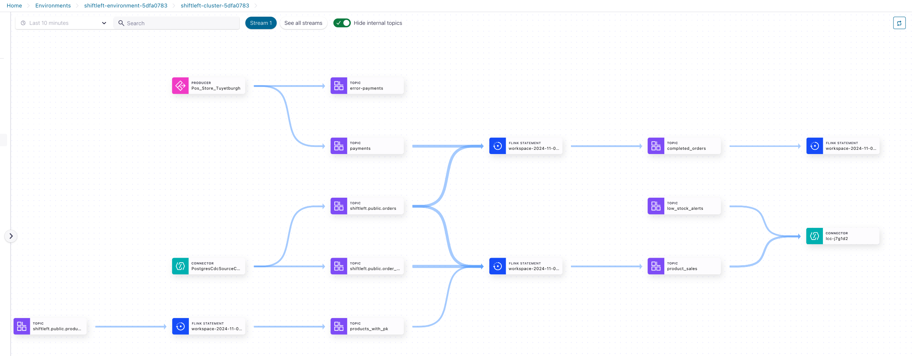
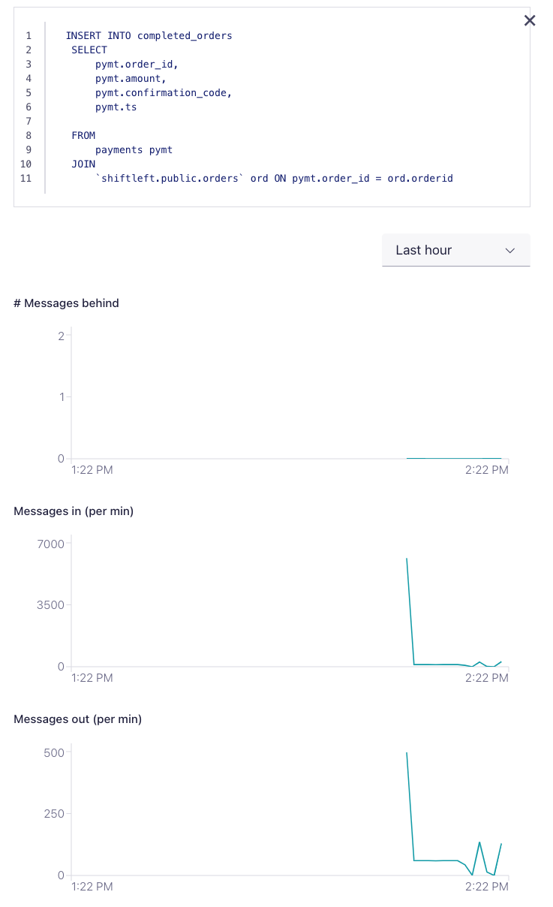
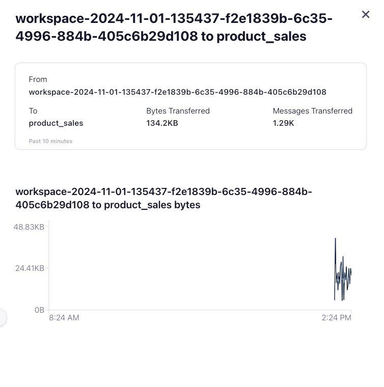

## Monitoring Data Pipelines

Now let's see how these long-running data pipelines can be monitored. First let's checkout what we have built.

1. In the [Conflluent Cloud Cluster UI](https://confluent.cloud/go/clusters), choose the **Environment** and **Cluster** then click on **Stream Lineage** from the left had pane.
   

2. Click on one of the Flink statements, a new windows will open that shows:
   * The SQL Statement
   * Statement properties
   * Flink metrics to help you monitor the data pipeline - **# Messages behind**, **Messages in (per min)** and **Messages out (per min)** 
  

3. Return to the diagram, and click on an edge to get a description of the flow between the given nodes.
   

## Topics

**Next topic:** [Cleanup](../README.md#clean-up)

**Previous topic:** [Usecase 3 - Daily Sales Trends](../Usecase3/USECASE3-README.md)

